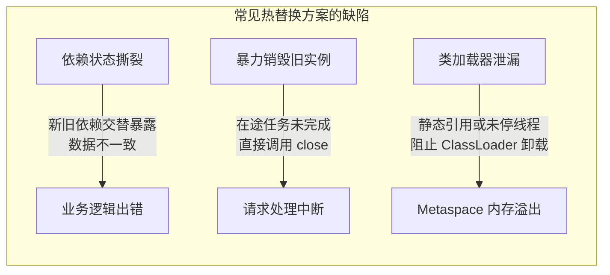
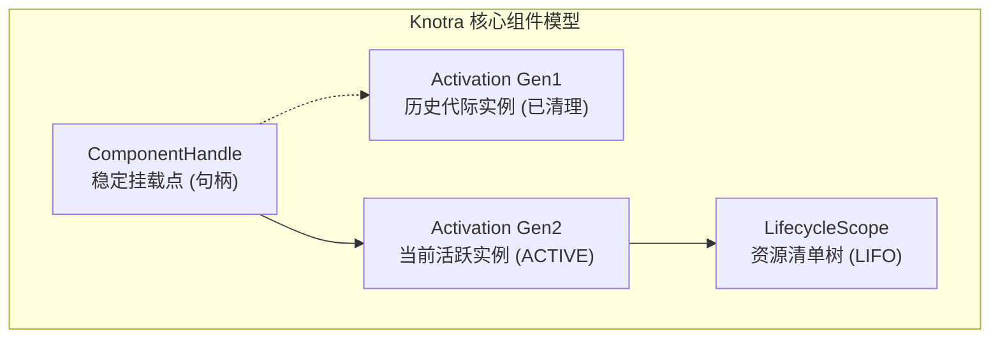
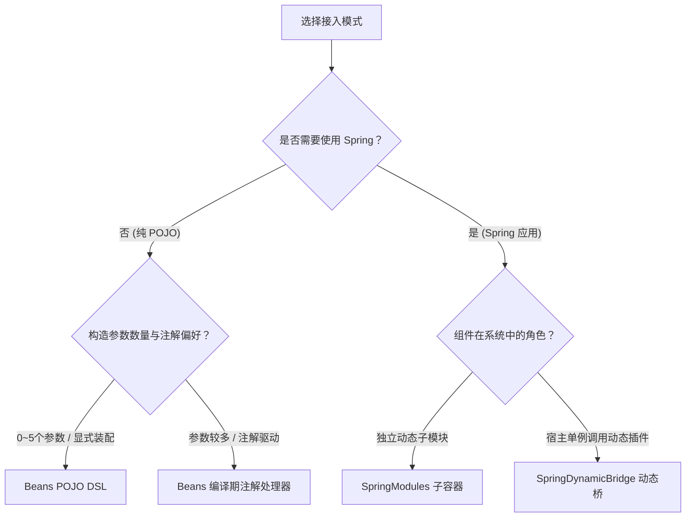

# Knotra

**应用不重启，组件可替换。**

Knotra 是一个面向 Java 21+ 的 JVM 动态组件运行时。应用启动后仍可以热替换业务实现、升级插件、局部重启或按上下文切换服务，同时在底层保证依赖绑定代际一致、在途请求安全排空与资源确定性释放。


> **项目状态**：`0.1.0-SNAPSHOT`。依赖 Java 21+ 与 Maven 3.9+。

---

## 为什么需要动态组件运行时

把一段新字节码加载进 JVM 并不难，真正的难点在于热替换发生时的运行时一致性：



Knotra 将组件生命周期、依赖代际和资源归属作为一等运行时对象管理，以此保障系统一致性：

- **初始化隔离**：新组件在完全启动并验证通过前，对外部调用方彻底不可见；若启动异常则整批回滚。
- **在途任务安全排空（Drain）**：旧组件被替换时，自动停止接入新流量，并等待已接受的方法调用或异步任务完成后再执行释放。
- **依赖代际强一致（Generation Pinned）**：消费方组件在启动时绑定固定的依赖代际；当底层服务替换时，消费方自动按新依赖原子重建，杜绝跨代混合调用。
- **确定性资源清理（LIFO）**：组件创建的连接、线程池和监听器由作用域托管，销毁时按后进先出严格逆序释放；释放失败保留现场并支持重试。

---

## 极速上手

### 引入依赖

通过 BOM 统一管理模块版本，普通应用引入 `knotra-starter`：

```xml
<dependencyManagement>
  <dependencies>
    <dependency>
      <groupId>io.knotra</groupId>
      <artifactId>knotra-bom</artifactId>
      <version>0.1.0-SNAPSHOT</version>
      <type>pom</type>
      <scope>import</scope>
    </dependency>
  </dependencies>
</dependencyManagement>

<dependencies>
  <dependency>
    <groupId>io.knotra</groupId>
    <artifactId>knotra-starter</artifactId>
  </dependency>
</dependencies>
```

### 编写业务类

业务类保持纯粹的 POJO 结构，无需继承或实现任何 Knotra 框架类型：

```java
public interface Greeting {
    String greet(String name);
}

public final class Greeter {
    private final Greeting greeting;

    public Greeter(Greeting greeting) {
        this.greeting = greeting;
    }

    public String sayHello(String name) {
        return greeting.greet(name);
    }
}
```

### 装配与热替换

在装配层声明服务契约并挂载组件。重点观察 `replace` 触发的原子切换与 `whenSettled` 的收敛等待：

```java
import io.knotra.*;
import io.knotra.beans.*;

public class QuickStart {
    static final CapabilityKey<Greeting> GREETING =
            CapabilityKey.of("app.greeting", Greeting.class);

    public static void main(String[] args) {
        try (KnotraRuntime runtime = KnotraRuntime.create()) {

            // 发布初始服务提供者
            Provided<Greeting> greeting = runtime.provide(
                    GREETING, name -> "v1: 你好, " + name);

            // 装配并挂载消费方组件
            BeanDefinition<NoConfig, Greeter> greeterDef = Beans.component("greeter")
                    .with(Beans.required(GREETING))
                    .create(Greeter::new)
                    .initializer(g -> System.out.println(g.sayHello("Knotra")))
                    .build();

            ComponentHandle<NoConfig> greeterHandle = Beans.mount(runtime, greeterDef);
            greeterHandle.requireActive();

            // 在运行时热替换底层实现
            System.out.println(">>> 正在热替换 Greeting 实现...");
            Provided<Greeting> v2 = greeting.replace(name -> "v2: Bonjour, " + name);

            // 等待依赖传播收敛，消费方自动以新依赖重新激活
            v2.whenSettled().toCompletableFuture().join();
            greeterHandle.requireActive();
        }
    }
}
```

执行后控制台输出：

```text
v1: 你好, Knotra
>>> 正在热替换 Greeting 实现...
v2: Bonjour, Knotra
```

`replace` 方法在一个原子事务内撤销旧注册并发布新值，方法同步返回新的 `Provided<T>` 句柄。下游消费方的重载由内核虚拟线程异步驱动，调用方通过 `whenSettled()` 即可精确等待依赖收敛就绪。

---

## 核心运行模型



- **`CapabilityKey<T>`（能力契约）**：由唯一字符串名称与精确 Java `Class<T>` 组成的服务身份凭据。
- **`ComponentHandle<C>`（组件挂载点）**：跨多次代际切换保持唯一的逻辑句柄，负责查询状态、重配置与发起销毁。
- **`Activation`（运行代际）**：组件的一次物理运行实例，拥有固定的依赖绑定集和专属的资源作用域。
- **`Context`（上下文隔离域）**：管理能力可见性的树状作用域，子上下文可遮蔽父上下文的注册，用于多租户与环境隔离。
- **`LifecycleScope`（资源作用域）**：严格按后进先出释放资源的管理树，清理异常时保留现场供重试。
- **`DynamicCapability<T>`（动态调用租约）**：支持无状态方法调用的动态代理，底层替换服务时调用方无需重启。

---

## 技术路径选择

根据技术栈与系统架构，选择最匹配的装配路径：



### 文档导航

- [Beans 与 Spring 集成指南](<docs/Knotra Beans 与 Spring 集成指南.md>)：POJO 构造器装配、编译期注解处理器、Spring 子容器与宿主动态桥接。
- [API 与集成指南](<docs/Knotra API 与集成指南.md>)：核心运行时、事务、依赖传播、事件总线、PF4J 插件与声明式期望树。
- [实战案例：动态物流路由系统](<docs/Knotra 实战案例：动态物流路由系统.md>)：从普通业务对象到 PF4J 插件动态加载、排空与类加载器回收的端到端演练。
- [插件工程化手册](<docs/Knotra 插件工程化手册.md>)：多模块 Maven 结构设计、Provided 依赖边界、SPI 导出与卸载防护。
- [线程模型与生产实践](<docs/Knotra 线程模型与生产实践.md>)：虚拟线程调度、阻塞边界、线程上下文类加载器（TCCL）切换与可观测性接入。
- [测试指南](<docs/Knotra 测试指南.md>)：代际断言套路、清理失败重试测试与类加载器垃圾回收验证。
- [FAQ 与排障指南](<docs/Knotra FAQ 与排障指南.md>)：组件状态机、诊断码全景与常见疑难场景处置。

---

## 模块分工

| 模块名 | 职责与定位 | 编译依赖 |
|---|---|---|
| `knotra-bom` | 版本统一对齐 BOM | 无 |
| `knotra-starter` | 普通应用聚合依赖（Core + Beans） | Core、Beans |
| `knotra-core` | 运行时内核（上下文、能力、事务、生命周期、快照） | 无外部运行时依赖 |
| `knotra-beans` | POJO 构造器注入与生命周期适配 DSL | Core |
| `knotra-beans-processor` | 编译期注解处理器（SOURCE 级别零反射生成） | Core、Beans |
| `knotra-events` | 类型化、可排空的进程内事件总线（5 种分发模式） | Core |
| `knotra-spring` | Spring 子容器与宿主动态代理桥 | Core、Spring Context |
| `knotra-spring-starter` | Spring 应用聚合依赖 | Starter、Spring |
| `knotra-pf4j-spi` | 插件导出的标准化 SPI 接口 | Core、PF4J provided |
| `knotra-pf4j` | PF4J JAR 加载、目录管理、排空与类加载器防护 | Core、SPI、PF4J、ASM |
| `knotra-loader` | 声明式期望树对比与原子收敛（Reconcile） | Core |
| `knotra-pf4j-loader` | PF4J 与 Loader 的官方解析桥接 | Loader、PF4J |
| `knotra-pf4j-starter` | 插件化应用聚合依赖 | PF4J Loader |

---

## 构建与验证

```bash
mvn clean verify
```

全工程包含 325 项严苛测试，覆盖真实 PF4J 插件构建与卸载、Spring 动态子容器重载、并发排空竞态、动态调用租约防撕裂以及 ClassLoader GC 回收验证。
