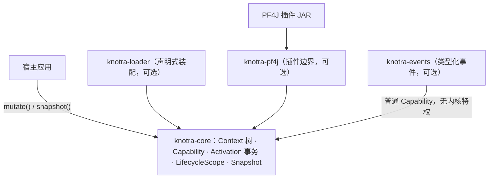

# Knotra

**应用不重启，组件可替换。** Knotra 是一个 JVM 模块化运行时，解决一个具体问题：应用启动之后，组成它的组件还要变化——替换实现、升级插件、局部重启、按租户切换，而且不能靠重启进程解决。


> **项目状态**：`0.1.0-SNAPSHOT`，尚未发布到 Maven Central。核心、事件、PF4J 适配器、Loader 均已实现并有完整测试覆盖。0.x 阶段不提供跨版本兼容承诺（包括 API、诊断码、SPI 与快照结构）；1.0 发布前会公布版本稳定性政策。

## 为什么需要它

把一个新 JAR 加载进 JVM 很容易，难的是加载之后的事：

- 新组件还没初始化完时，不该被其他组件看见；
- 旧组件还有人引用时，要等在途任务收尾再关闭，而不是立刻掐断；
- 组件启动到一半，它依赖的服务被替换了，这次启动应当作废重来，而不是带着过期状态继续跑；
- 插件卸载时清理失败，要保留现场、可以重试，而不是被标记成成功。

这些问题靠“注册表 + `start()/stop()`”拼不出来：普通查找只能回答“现在能不能拿到对象”，回答不了“谁绑定的是哪一次注册”“旧的运行收尾了没有”。Knotra 把这些关系作为运行时的一等结构来管理。

## 核心能力

- **事务化结构变更**：挂载、提供、撤销要么整体提交，要么整体拒绝，不存在“改了一半”的运行时状态。
- **依赖代际追踪**：运行时记录每个组件绑定的是哪一次服务注册；提供方替换时，消费方自动收尾并按新注册重启。
- **可逆生命周期**：组件打开的连接、订阅、后台任务登记在 `LifecycleScope`，销毁按逆序回收，失败的条目可单独重试。
- **真实的插件卸载**：PF4J 插件卸载前先排空在途挂载、按依赖顺序清理；清理失败保留现场可重试，最终让插件 ClassLoader 可被回收。
- **声明式期望状态**：Loader 把“我想要一棵这样的组件树”与当前状态协调，失败批次整体回滚。
- **可观测性内建**：不可变 Snapshot 不持有任何运行中的对象，诊断码是稳定枚举，适合直接接告警。

## 与常见方案对比

| 方案 | 它解决 | 剩下要自己解决 |
|---|---|---|
| 手写注册表 / ServiceLoader | 对象查找与基本替换 | 依赖代际、旧运行收尾、事务可见性、清理顺序 |
| PF4J 单独使用 | JAR 加载、插件生命周期 | 消费方重激活、收尾顺序、配置类型边界、失败卸载的重试语义 |
| OSGi | 完整的模块化规范与服务动态性 | 引入整套 OSGi 体系；Knotra 不是 OSGi 实现，只聚焦动态组合这一层 |
| Spring 等 DI 容器 | 静态装配、作用域管理 | 运行中结构变更不是一等模型，热替换与 ClassLoader 回收不在核心承诺 |
| **Knotra** | 运行期组件替换、依赖重激活、资源可逆、插件真卸载 | DI/AOP、插件市场、分布式协调等明确不做（见[非目标](#非目标)） |

## 快速开始

当前版本需在本地 reactor 内引用，或先 `mvn install` 到本机 Maven 缓存：

```xml
<dependency>
  <groupId>io.knotra</groupId>
  <artifactId>knotra-core</artifactId>
  <version>0.1.0-SNAPSHOT</version>
</dependency>
```

一个最小的完整例子：定义一个服务合约、一个消费它的组件，然后替换提供方，观察组件自动重启。

```java
import io.knotra.*;
import java.util.concurrent.TimeUnit;

public class Demo {
    public interface Greeting { String greet(String name); }

    static final CapabilityKey<Greeting> GREETING =
            CapabilityKey.of("app.greeting", Greeting.class);

    // 消费方：声明 REQUIRED 依赖，每次启动绑定当前这一代提供方
    static final class GreetingFactory implements ComponentFactory<NoConfig> {
        @Override public String factoryId() { return "greeter"; }

        @Override public Component<NoConfig> create() {
            return new Component<>() {
                @Override public ComponentDescriptor descriptor() {
                    return ComponentDescriptor.of("greeter",
                            CapabilityRequirement.required(GREETING));
                }

                @Override public void start(ActivationContext context, NoConfig config) {
                    Greeting greeting = context.require(GREETING);
                    System.out.println("greeter bound to: " + greeting.greet("world"));
                }
            };
        }
    }

    public static void main(String[] args) throws Exception {
        try (KnotraRuntime runtime = KnotraRuntime.create()) {
            // 1. 发布 v1 提供方
            MutationResult<RegistrationHandle> v1 = runtime.mutate(tx ->
                    tx.provide(runtime.rootContext(), GREETING,
                            name -> "v1: hello " + name));

            // 2. 挂载消费方，等待它完成第一次启动
            MutationResult<ComponentHandle<NoConfig>> mounted = runtime.mutate(tx ->
                    tx.mount(runtime.rootContext(), "greeter",
                            new GreetingFactory(), NoConfig.INSTANCE));
            mounted.value().whenSettled().toCompletableFuture().get(10, TimeUnit.SECONDS);

            // 3. 替换提供方：消费方自动收尾旧运行，再绑定 v2 重新启动
            runtime.mutate(tx -> {
                tx.revoke(v1.value());
                return tx.provide(runtime.rootContext(), GREETING,
                        name -> "v2: bonjour " + name);
            });
            mounted.value().whenSettled().toCompletableFuture().get(10, TimeUnit.SECONDS);
        }
    }
}
```

控制台输出：

```text
greeter bound to: v1: hello world
greeter bound to: v2: bonjour world
```

第二行没有任何手动重启代码——这就是 Knotra 的核心价值。完整场景（插件 JAR 从 v1 升级到 v2、旧任务收尾、ClassLoader 回收）见[实战案例](<docs/Knotra 实战案例：动态物流路由系统.md>)。

## 架构总览



可选模块按需引入：最小宿主只需要 `knotra-core`；需要事件加 `knotra-events`；需要插件加 `knotra-pf4j` 与 SPI；需要声明式装配加 `knotra-loader`。

## 一分钟理解模型

| 概念 | 是什么 |
|---|---|
| `Context` | 可见范围。一棵树，子 Context 能看到父 Context 发布的服务，也可以发布自己的实现遮蔽父级 |
| `Capability` | 类型化的服务合约。运行时按“哪一次注册”追踪依赖，而不是按对象相等 |
| `ComponentHandle` | 稳定的挂载点。逻辑身份不变，每次启动产生一次新的运行 |
| `Activation` | 一次可回滚的运行。先绑定依赖、再执行启动代码，成功后才对外可见，失败自动撤销 |
| `LifecycleScope` | 资源清单。组件打开的连接、订阅、后台任务都登记在这里，销毁时按逆序回收，失败的条目可以重试 |

替换一个服务时，运行时会自动找到绑定旧注册的组件：旧运行先收尾，然后按新注册重新启动。新组件在启动成功前对别人不可见，启动失败就整体回滚，不会留下半成品。

## 术语表

| 术语 | 含义 |
|---|---|
| 宿主（host） | 嵌入 Knotra 的那个常驻 JVM 应用。它创建 `KnotraRuntime`、发起结构事务、决定何时关闭——通常就是你的 main 程序或 Spring Boot 应用 |
| artifact / 插件 JAR | 同一个东西：被 PF4J 适配器管理的一个插件 JAR。运行时 `artifactId` 来自插件描述符的 `Plugin-Id` |
| PF4J | 轻量 Java 插件框架，负责插件 JAR 的加载与生命周期。Knotra 的 `knotra-pf4j` 只把它当作 artifact 边界 |
| OSGi | Java 最早的模块化运行时规范，体系完整但重量级。Knotra 不是 OSGi 实现，只做动态组合这一层 |
| Activation（激活） | 组件按某一代依赖绑定的一次运行。依赖或配置变化会产生新的 Activation |
| generation（代际） | Runtime 结构的全局版本号，每次成功事务递增 |
| settle（收敛） | 一次过渡完成并稳定到某个状态；`whenSettled()` 等待的就是它 |
| BindingSet（绑定集） | 组件一次 Activation 固定绑定的那组注册，按注册身份追踪 |
| drain（排空） | 卸载前等待在途工作收尾、按依赖顺序清理资源的过程 |

## 文档

- 想看完整故事：[实战案例：动态物流路由系统](<docs/Knotra 实战案例：动态物流路由系统.md>)——仓库级能力覆盖、依赖重激活、插件排空卸载。
- 要写代码：[API 与集成指南](<docs/Knotra API 与集成指南.md>)——公开 API、模块依赖、宿主事务、EventBus、PF4J 与 Loader 接入。
- 想弄懂语义：[运行时设计文档](<docs/Knotra 运行时设计文档.md>)——Context、Capability、Activation、LifecycleScope、依赖图和失败恢复的详细语义。
- 遇到问题排障：[FAQ 与排障指南](<docs/Knotra FAQ 与排障指南.md>)——按症状组织的排查流程，附状态速查与全部诊断码对照表。
- 要做插件 JAR：[插件工程化手册](<docs/Knotra 插件工程化手册.md>)——从空 Maven 工程到可加载插件 JAR 的完整步骤。
- 要上生产：[线程模型与生产实践](<docs/Knotra 线程模型与生产实践.md>)——回调线程、阻塞边界、Spring 共存、监控接线与容量边界。
- 要写测试：[测试指南](<docs/Knotra 测试指南.md>)——依赖替换、清理失败、drain 竞态、ClassLoader 回收怎么测。

## 模块

| 模块 | 职责 | 运行时依赖 | 测试 |
|---|---|---|---|
| `knotra-core` | Runtime 内核：Context、Capability、ComponentHandle、Activation、LifecycleScope、Snapshot | 无 | 96 |
| `knotra-events` | 作为普通 Capability 发布的类型化 EventBus | `knotra-core` | 44 |
| `knotra-pf4j-spi` | 由 PF4J artifact 实现的共享提供方 SPI | `knotra-core`、PF4J（provided 作用域） | - |
| `knotra-pf4j` | PF4J artifact 适配器：加载/启动、类型化受控挂载、只读工厂目录、drain、卸载、ClassLoader 防护 | `knotra-core`、`knotra-pf4j-spi`、PF4J、ASM | 37 |
| `knotra-loader` | 基于 Core 的声明式期望状态收敛 | `knotra-core` | 36 |
| `knotra-integration-tests` | 跨模块真实测试样例验证（仅测试，不发布） | 所有模块（测试作用域） | 14 |

## 深入设计

以下每节回答一个具体问题：先说清这东西解决什么，再给用法，最后点出关键规则。完整语义在链接的文档里，不在首页堆满。

### 核心模型

运行时由五层组成：

1. **Context** 定义可见性。Context 是树中的一个节点；每个 Context 可以看到发布在自身及其祖先中的 Capability，子 Context 可以遮蔽父 Context 中的 Capability，直到子注册被撤销。
2. **Capability** 是类型化的命名值（`CapabilityKey<T>`）。注册由注册身份标识，而不是由对象相等性标识；即使用相等的值替换提供方，也会为消费方产生新的绑定代际。
3. **ComponentHandle** 是稳定的逻辑挂载点。`ComponentHandle` 拥有一个挂载 ID（`contextId + mountId`），并跨多次重新激活保持不变；该句柄的每次启动都会创建新的 `Activation`。
4. **Activation** 是组件的一次事务化执行。依赖需求会被解析为固定的 `BindingSet`；用户 `start()` 代码在协调器锁外执行，暂存注册只有在验证成功后才原子发布。过期候选会被回滚，并基于最新代际重试，而不是报告为业务失败。
5. **LifecycleScope** 拥有可逆资源。LifecycleScope 按 LIFO 顺序组成树（必要时使用显式并行组）；释放是异步且聚合的，清理失败的条目会保持可重试，并可通过 `ComponentHandle.retry()` 重试。

组件预先声明依赖需求，并在启动时收到 `ActivationContext`：

```java
public interface Component<C> {
    ComponentDescriptor descriptor();

    void start(ActivationContext context, C config) throws Exception;
}
```

`REQUIRED` 绑定会在所绑定的注册变化时重新激活消费方；`OPTIONAL` 绑定也属于同一个 `BindingSet`，因此可选提供方出现或消失同样会产生新的 Activation。Capability 合约类型在 Runtime 生命周期内按名称固定。

### 宿主事务

宿主不会通过共享可变对象修改 Runtime。结构调整通过短事务完成；事务被拒绝时不会发布任何内容：

```java
try (KnotraRuntime runtime = KnotraRuntime.create()) {
    CapabilityKey<Shell> SHELL = CapabilityKey.of("app.shell", Shell.class);

    MutationResult<ComponentHandle<AppConfig>> result = runtime.mutate(tx ->
            tx.mount(runtime.rootContext(), "app", new AppComponentFactory(), new AppConfig()));
    if (!result.committed()) {
        throw new IllegalStateException(result.diagnostics().toString());
    }
    ComponentHandle<AppConfig> app = result.value();
    app.whenSettled().toCompletableFuture().get(10, TimeUnit.SECONDS);

    // 宿主提供的 capability 通过同一个事务接口撤销
    MutationResult<RegistrationHandle> shell =
            runtime.mutate(tx -> tx.provide(runtime.rootContext(), SHELL, defaultShell()));
    runtime.mutate(tx -> {
        tx.revoke(shell.value());
        return null;
    });
}
```

读取通过 `RuntimeContext`（`require`、`find`、`info`）和 `RuntimeSnapshot` 完成；二者都不会暴露存活的组件实例、资源、释放器、`Throwable`、`Class` 或 `ClassLoader`。

### 事件

组件之间怎么通信？Knotra 的答案是一个事件组件。它不是内核的特权部件，和路由规则、HTTP 客户端一样，是个普通的可挂载组件。

先挂载事件总线，之后 `EventBus` 就成了一个可以 require 的普通能力：

```java
MutationResult<ComponentHandle<NoConfig>> bus = runtime.mutate(tx ->
        tx.mount(runtime.rootContext(), "event-bus",
                new EventBusFactory(), NoConfig.INSTANCE));
bus.value().whenSettled().toCompletableFuture().get(10, TimeUnit.SECONDS);
```

然后消费方订阅事件。看两处：依赖要在 descriptor 里声明（和依赖任何其他能力一样）；订阅是资源，交给 lifecycle 托管——组件停止时，运行时会先等在途事件处理完，再关闭订阅：

```java
EventBus bus = context.require(EventCapabilities.EVENT_BUS);
EventDefinition<JobFinished> JOB_FINISHED =
        EventDefinition.serial(EventKey.of(JobFinished.class));

EventSubscription subscription = bus.onSerial(JOB_FINISHED, event -> {
    persist(event);
    return CompletableFuture.completedFuture(true);   // 返回 stage，分发链保持异步
});
context.lifecycle().manageAsync("job-listener", subscription::closeAsync);
```

两条规则先记住：事件的身份是精确的 JVM `Class`，两个插件里同名的类是两个不同事件；关闭是收尾式的——`closeAsync()` 等已接受的事件处理完、拒绝新事件，不丢在途的，也不假装成功。

### PF4J Artifact 边界

这一节回答一个问题：插件 JAR 里的组件，怎么进入运行时？

分工是这样的：PF4J 负责 JAR 的加载与卸载，Knotra 负责组件的挂载与清理，`knotra-pf4j` 适配器站在中间。加载插件后，适配器不直接挂载任何组件，只发布一个类型化的工厂目录；宿主从目录解析工厂，再显式挂载：

```java
try (KnotraRuntime runtime = KnotraRuntime.create();
     Pf4jArtifactAdapter adapter = Pf4jArtifactAdapter.create(
             Path.of("plugins"), runtime, Set.of("com.example.contract"))) {

    adapter.loadArtifact(Path.of("plugins/tool-1.0.0.jar")).join();

    ArtifactFactoryHandle<ToolConfig> factory =
            adapter.resolver().resolve("tool", ToolConfig.class).orElseThrow();
    ComponentHandle<ToolConfig> tool =
            factory.mount(runtime.rootContext(), "tool", new ToolConfig());

    adapter.unloadArtifact("tool-plugin").join();   // 先排空这个插件拥有的挂载
}
```

为什么要经过工厂目录这一层？为了边界。不带配置类型的查询只能看到元数据（工厂名、配置类型名），不能挂载；想挂载，必须给出正确的配置类型。类型不对，解析时就失败；就算用 raw cast 硬塞，组件启动前还会被再拦一次。

卸载是这一节真正值钱的语义。`unloadArtifact` 的顺序是：停止新挂载 → 等在途挂载收尾 → 按"下游先走"清理这个插件创建的全部组件 → 停止并卸载 PF4J 插件 → 释放 ClassLoader。中途失败则进入 `DRAIN_FAILED`，保留现场，修复后 `retryDrain` 从断点继续。适配器不会伪造一次成功的卸载。

怎么从零打出一个能被加载的插件 JAR，见[插件工程化手册](<docs/Knotra 插件工程化手册.md>)。

### Loader

前面都是"宿主手动挂载"。组件多了以后，手动管理很脆弱：哪个组件该在哪个范围、用哪个版本、配什么参数，散落在调用代码里。Loader 解决这个问题：描述一棵期望的组件树，它把运行时收敛成这棵树。

```java
FactoryRef ref = FactoryRef.of("tool", "1.0.0");
ComponentFactoryResolver classpath = ClasspathComponentFactoryResolver.builder()
        .add(ref, new ToolComponentFactory())
        .build();

try (KnotraLoader loader = KnotraLoader.over(runtime, runtime.rootContext(), classpath)) {
    ReconcileResult result = loader.reconcile(ComponentTree.of(
            ComponentEntry.of("tools/tool", ref, new ToolConfig())));
    if (!result.converged()) {
        result.diagnostics().forEach(d -> log.warn("{}: {}", d.path(), d.message()));
    }
}
```

`reconcile` 做三件事：树上多的，新增；树上少的，递归释放；配置或实现版本变了的，替换。任何一步失败，整批回滚，不会留半个挂载。路径就是归属：每个条目路径对应一个专属子 Context（名字取最后一段），mountId 是完整路径；嵌套路径要求父条目存在，兄弟条目共享同一个父 Context。

插件工厂怎么接进 Loader（typed bridge）属于进阶内容，完整代码见[API 与集成指南](<docs/Knotra API 与集成指南.md>)。

### Snapshot 与诊断

运行中的系统必须能被观察。Knotra 的答案是不可变快照：随时调用 `runtime.snapshot()`，拿到当前结构的完整拷贝——有哪些 Context 和组件、每个组件绑定的是哪一次注册、哪些清理失败了、诊断码是什么。适配器和 Loader 各有自己的快照，规则相同。

关键设计是快照只含数据，不引用任何活对象。拿着一份快照，不会阻止已卸载插件的 ClassLoader 被回收。诊断码是稳定枚举（`MISSING_CAPABILITY`、`CLEANUP_FAILED` 等），直接按码接告警，不要匹配消息文本。

### ClassLoader 合约

插件卸载之后，JVM 什么时候真正回收它的类？条件只有一个：没有人再引用它的 ClassLoader。Knotra 用四条规则保证运行时自己是干净的：

- `knotra-core` 和 `knotra-loader` 完全不知道 PF4J 的存在，这条边界由构建工具强制。
- 合约类型（`io.knotra`、`io.knotra.pf4j.spi`、`org.pf4j` 等）永远从宿主加载；插件私有的同名类不算同一个类型。
- 卸载成功和加载失败回滚，都会让插件 ClassLoader 变为弱可达，两条路径都有 GC 测试断言。
- 最后一段责任在业务代码：宿主自己保存了插件对象的话，运行时无能为力。

## 非目标

以下事情 Knotra 明确不做，避免预期错位：

- 不提供通用 DI 容器、AOP、代理拦截或 Spring 兼容层。
- 不自研插件仓库、插件市场、版本解析 UI 或远程安装协议。
- 不做分布式协调、跨进程一致性或多 JVM 热替换。
- 不做安全隔离：无插件权限模型、代码签名校验或资源配额，只应加载可信来源的插件 JAR。
- Loader 不监听文件系统；期望状态由调用方显式提交。
- 配置没有全局文件格式；每个工厂通过 `ConfigSchema` 归一化自己的配置。
- 不提供 Cordis 兼容 API 或旧版本共存迁移。

## 限制

- `stop()` 或 `unload()` 失败的 PF4J 插件会留下 `DRAIN_FAILED` 或残余诊断，必须重试；最坏情况下需要重启 JVM 恢复。适配器不会伪造成功的卸载。
- ClassLoader 回收在测试中通过弱引用和显式 GC 验证；生产环境中的回收仍取决于没有其他对象持有该 ClassLoader。
- Artifact 类型化挂载拒绝 null 配置；工厂声明没有配置时使用 `NoConfig.INSTANCE`。

## 构建与验证

```bash
mvn clean verify
```

Maven reactor 会按依赖顺序构建，不需要先执行 `mvn install`。`mvn clean verify` 会运行 227 项测试（Core 96、Events 44、PF4J 适配器 37、Loader 36、跨模块集成 14）。集成模块会构建真实的 PF4J 样例 jar，并只通过公开 API 验证：没有内部强制转换，没有 `Thread.sleep`，没有生产代码后门。

## 贡献

- 需要 Java 21+ 和 Maven 3.9+；提交前请确保 `mvn clean verify` 全绿。
- 模块依赖边界由 Maven Enforcer 和架构回归测试强制，改动前请先读[运行时设计文档](<docs/Knotra 运行时设计文档.md>)。
- 行为变更需要同步更新文档与测试；文档与代码在同一仓库，保持一致是合并前提。

## 设计来源

Knotra 的设计参考了 Cordis 运行时模型中的思想；Knotra 是具有自身合约与语义的独立实现。
