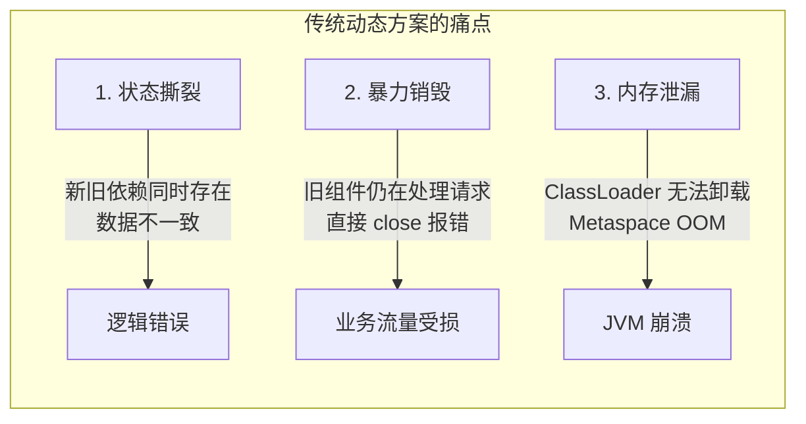
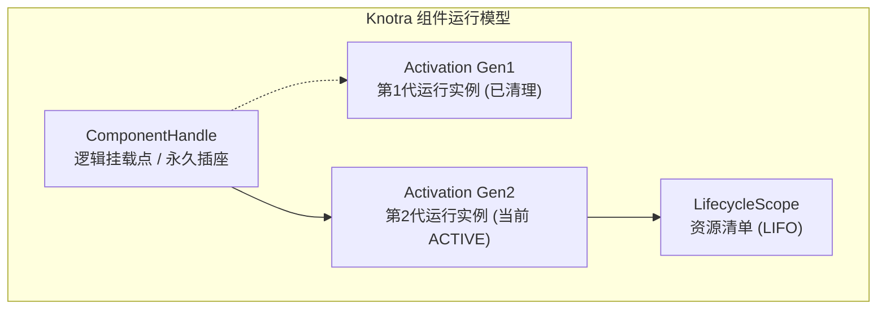
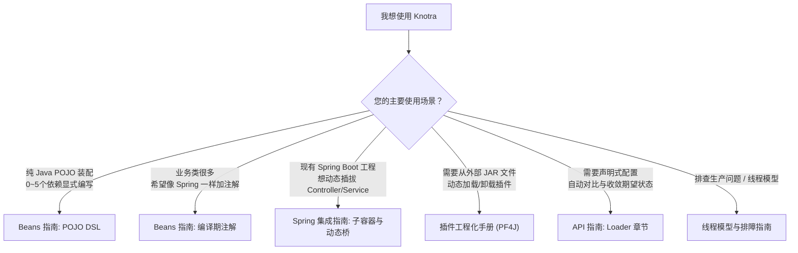

# Knotra (诺轨)

**应用不重启，组件可替换。**

Knotra 是一个面向现代 Java 21+ 的 **JVM 动态组件运行时**。它让你的应用在**不重启 JVM** 的前提下，能够安全地**热替换业务实现、升级插件、局部重启或按租户/Context 切换服务**，同时从底层严格保证**依赖绑定代际一致性、在途任务安全排空（Drain）与资源确定性清理（LIFO）**。


> **项目状态**：`0.1.0-SNAPSHOT`，正在活跃迭代中。要求 **Java 21+** 与 **Maven 3.9+**。

---

## 为什么需要 Knotra？它解决了什么痛点？

在传统的 Java / Spring 应用中，想要在运行时动态替换某块业务逻辑（例如：动态规则引擎、支付渠道插件、多租户定制算法），通常面临三大难题：



Knotra 专门为此而生，它在 JVM 内部建立了严格的**动态运行时秩序**：
1. **启动前不可见**：新组件完全初始化成功之前，对外部调用方彻底隐藏。
2. **在途任务安全排空（Drain）**：旧组件被替换时，等待正在执行的方法或异步任务安全完成，再执行清理。
3. **依赖代际严格一致（Generation Pinned）**：组件启动时固化依赖版本；底层依赖替换时，消费方自动安全重载，绝不发生“上半段用旧依赖、下半段用新依赖”的状态撕裂。
4. **确定性资源清理（LIFO）**：严格按照启动相反顺序释放资源；清理失败保留现场并支持幂等重试。

---

## 5 分钟极速上手（Hello World）

### 1. 引入依赖

配置 BOM 与 `knotra-starter`（包含 Core 核心与 Beans 装配支持）：

```xml
<dependencyManagement>
  <dependencies>
    <dependency>
      <groupId>io.knotra</groupId>
      <artifactId>knotra-bom</artifactId>
      <version>0.1.0-SNAPSHOT</version>
      <type>pom</type>
      <scope>import</scope>
    </dependency>
  </dependencies>
</dependencyManagement>

<dependencies>
  <dependency>
    <groupId>io.knotra</groupId>
    <artifactId>knotra-starter</artifactId>
  </dependency>
</dependencies>
```

### 2. 编写纯粹的业务类（无需继承任何框架类）

```java
// 1. 服务接口
public interface Greeting {
    String greet(String name);
}

// 2. 业务消费方（纯普通 Java 类）
public final class Greeter {
    private final Greeting greeting;

    public Greeter(Greeting greeting) {
        this.greeting = greeting;
    }

    public String sayHello(String name) {
        return greeting.greet(name);
    }
}
```

### 3. 用 Knotra 组装并在运行时热替换

```java
import io.knotra.*;
import io.knotra.beans.*;

public class QuickStart {
    // 声明服务契约 Key
    static final CapabilityKey<Greeting> GREETING =
            CapabilityKey.of("app.greeting", Greeting.class);

    public static void main(String[] args) {
        // 创建 Knotra 运行时
        try (KnotraRuntime runtime = KnotraRuntime.create()) {

            // 步骤 1：发布 V1 版本的 Greeting 实现
            Provided<Greeting> greeting = runtime.provide(
                    GREETING, name -> "v1: 你好, " + name);

            // 步骤 2：装配并挂载 Greeter 组件（自动注入 GREETING 依赖）
            BeanDefinition<NoConfig, Greeter> greeterDef = Beans.component("greeter")
                    .with(Beans.required(GREETING))
                    .create(Greeter::new)
                    .initializer(g -> System.out.println(g.sayHello("Knotra")))
                    .build();

            ComponentHandle<NoConfig> greeterHandle = Beans.mount(runtime, greeterDef);
            greeterHandle.requireActive(); // 输出: v1: 你好, Knotra

            // 步骤 3：运行时热替换为 V2 版本
            System.out.println(">>> 正在热替换 Greeting 为 V2 实现...");
            Provided<Greeting> v2 = greeting.replace(name -> "v2: Bonjour, " + name);

            // 等待异步收敛完成，Greeter 自动以新依赖重新激活
            v2.whenSettled().toCompletableFuture().join();
            greeterHandle.requireActive(); // 输出: v2: Bonjour, Knotra
        }
    }
}
```

运行输出：
```text
v1: 你好, Knotra
>>> 正在热替换 Greeting 为 V2 实现...
v2: Bonjour, Knotra
```

---

## 4 个核心心智模型



| 概念 | 通俗类比 | 职责说明 |
|---|---|---|
| **`CapabilityKey<T>`** | **服务契约（插头规格）** | 用稳定名称 + Java `Class<T>` 唯一标识一项服务能力。 |
| **`ComponentHandle<C>`** | **挂载点（固定插座）** | 组件在运行时中的永久身份，名字不变，跨多次热替换保持稳定。 |
| **`Activation`** | **运行实例（当前灯泡）** | 组件的某一代物理实例。依赖变化时，旧 Activation 销毁，新 Activation 创建。 |
| **`Context`** | **可见范围（房间插座箱）** | 支持父子层级与多租户遮蔽（子 Context 可以覆盖父 Context 的注册）。 |
| **`LifecycleScope`** | **资源管家（LIFO 清理树）** | 记录该代实例创建的所有连接、线程与钩子，销毁时按后进先出严格释放。 |
| **`DynamicCapability<T>`** | **智能动态代理** | 调用时自动路由到最新 Provider，消费方无需随 Provider 替换而重启。 |

---

## 学习路径与导航矩阵

根据您的技术栈和目标场景，选择最适合的阅读路径：



### 完整文档索引

- [Knotra Beans 与 Spring 集成指南](<docs/Knotra Beans 与 Spring 集成指南.md>)：
  - **POJO 装配**：手写类型安全 DSL、生命周期控制。
  - **编译期注解**：`@KnotraBean`、`@KnotraRequire` 零反射生成 Factory。
  - **Spring 集成**：Spring Child Context 动态子容器与 `SpringDynamicBridge` 宿主代理。
- [Knotra API 与集成指南](<docs/Knotra API 与集成指南.md>)：Core、Events 事件总线、PF4J 插件、Loader 期望树收敛全景手册。
- [动态物流路由系统实战案例](<docs/Knotra 实战案例：动态物流路由系统.md>)：从普通 POJO 到 PF4J 插件热升级、任务排空与 ClassLoader 安全回收的完整端到端演练。
- [Knotra 插件工程化手册](<docs/Knotra 插件工程化手册.md>)：从零搭建 Maven 插件工程、导出 Factory SPI、排空与卸载规范。
- [线程模型与生产实践](<docs/Knotra 线程模型与生产实践.md>)：虚拟线程调度、阻塞边界、TCCL 类加载器切换与优雅停机。
- [Knotra 测试指南](<docs/Knotra 测试指南.md>)：单元测试套路、并发替换测试、清理失败重试与 ClassLoader GC 验证。
- [FAQ 与排障指南](<docs/Knotra FAQ 与排障指南.md>)：状态机速查、诊断码对照表与常见疑难解法。

---

## 模块分工一览

| 模块 | 职责与定位 | 典型使用场景 |
|---|---|---|
| `knotra-bom` | 版本统一对齐 BOM | 所有项目 `dependencyManagement` 引入 |
| `knotra-starter` | 极简聚合依赖（Core + Beans） | 普通 Java 应用首选 |
| `knotra-core` | 运行时内核（Context、Capability、事务、生命周期、快照） | 核心容器，无任何外部运行时依赖 |
| `knotra-beans` | POJO 构造器注入与生命周期适配 DSL | 业务装配层 |
| `knotra-beans-processor` | 编译期注解处理器（SOURCE 级别，零反射） | 替代手写 DSL，注解驱动 |
| `knotra-events` | 类型化、可安全排空的进程内事件总线（5 种模式） | 模块间事件解耦 |
| `knotra-spring` | Spring Child Context 子容器与 `SpringDynamicBridge` | Spring / Spring Boot 应用 |
| `knotra-spring-starter` | Spring 应用聚合依赖 | Spring 应用引入 |
| `knotra-pf4j-spi` | 插件导出的标准化 SPI 接口 | 插件工程 `provided` 依赖 |
| `knotra-pf4j` | PF4J JAR 加载、目录管理、排空与 ClassLoader 防护 | 宿主插件管理器 |
| `knotra-loader` | 声明式期望树对比与原子收敛（Reconcile） | 动态配置驱动的组件系统 |
| `knotra-pf4j-loader` | PF4J 与 Loader 的官方桥接适配器 | 结合插件与声明式期望树 |
| `knotra-pf4j-starter` | 插件化应用聚合依赖 | 插件化系统引入 |

---

## 构建与测试

```bash
# 全工程编译与自动化验证 (包含 325 项测试)
mvn clean verify
```

测试集涵盖真实 PF4J 插件 JAR 加载卸载、Spring 动态子容器回滚、并发排空竞态、动态调用租约防撕裂以及 ClassLoader GC 回收验证。
