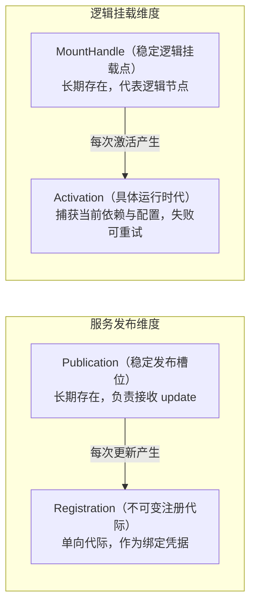
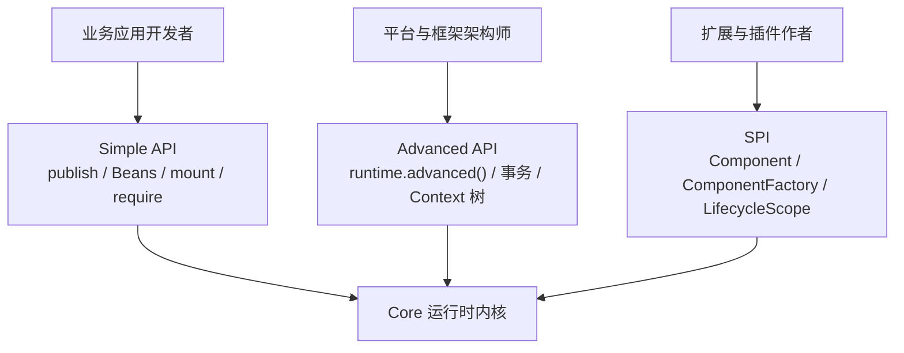

# API 与内核架构指南

本指南面向框架与平台架构师，深入剖析 Knotra 的架构分层、内核领域模型、代际绑定机制以及高级结构事务。

---

## 核心领域模型与架构哲学

在构建 JVM 动态组件运行时时，核心难题在于**如何调和“长期稳定的服务访问”与“单向演进的不可变代际”之间的矛盾**。Knotra 通过以下四对核心抽象清晰界定了生命周期边界：



### 1. Publication（发布槽位）vs Registration（注册代际）
* **Publication**：一个 Context 内长期存在的**稳定逻辑槽位**（如 CCTV-1 频道）。业务调用方只与 Publication 打交道，槽位身份在整个运行期间保持不变。
* **Registration**：某一特定时刻已提交的**具体能力代际**（如当前播放的第 1 集）。当通过 `publication.update(...)` 升级能力时，内核不会去修改旧的 Registration，而是生成全新的不可变代际；被替换的旧代际失效，等待在途调用排空后平滑退场。

### 2. MountHandle（挂载点）vs Activation（激活代）
* **MountHandle**：一个组件附加在运行时树上的**稳定逻辑位置**（如墙上的电源插座）。挂载点的身份在多次重启、重配置或依赖更新中保持不变。
* **Activation**：挂载点在某一确定代际下的**一次具体启动尝试与实例**。每次激活都会精准捕获启动时的配置与依赖绑定集合；启动或清理失败只会影响当前 Activation，挂载点本身依然存在并可随时重试。

### 3. 操作级收敛（Settlement）vs 节点过渡（Transition）
* **操作级收敛（Settlement）**：由 `Publication`、`Registration` 以及结构事务返回，递归覆盖本次操作触发的**受管子树与影响集**，确保变更在全局拓扑中平稳收敛。
* **挂载点自身过渡（Mount Transition）**：`MountHandle.whenSettled()` 仅等待该挂载点自身的状态过渡（返回 `ComponentState`），不等待其拥有的子节点。这种设计允许父挂载点率先进入 ACTIVE 状态，从而让子节点能够及时消费父节点输出的能力，彻底杜绝父子节点互相等待导致的死锁。

---

## API 三层分层体系



1. **Simple API（业务层）**：开箱即用。使用 `Class<T>` 作为默认能力标识，通过 `Publication<T>` 进行发布与更新，使用 Fluent Beans DSL 挂载组件，通过 `MountHandle` 管理生命周期。
2. **Advanced API（平台层）**：结构控制。通过 `runtime.advanced()` 进入，提供多操作原子结构事务、显式代际 `Registration<T>`、多租户 Context 树隔离与无引用的全量纯数据快照（`RuntimeSnapshot`）。
3. **SPI（扩展层）**：底层插件开发。直接实现 `Component<C>` 与 `ComponentFactory<C>`，通过 `ActivationContext` 注册受控生命周期资源。

---

## Advanced API 深度实战

所有底层事务、原始注册、Context 树与快照均通过 `runtime.advanced()` 进入：

```java
AdvancedRuntime advanced = runtime.advanced();
```

### 1. 多操作原子结构事务

当需要**一次性原子提交多个结构变更**（例如同时撤销旧服务并注册两个新服务）时，使用结构事务：

```java
TransactionReceipt<StagedRegistration<Message>> receipt =
        runtime.advanced().transact(transaction -> {
            // 1. 撤销旧代际
            transaction.revoke(previousStaged);
            // 2. 在子 Context 中注册新能力
            ContextHandle child = transaction.childContext(runtime.root(), "tenant-a");
            return transaction.provide(child, Message.class, new CommittedMessage("v2"));
        });

StagedRegistration<Message> staged = receipt.value();
SettlementReport report = receipt.awaitSettled(Duration.ofSeconds(10));
```

完整示例见 [TransactionExample.java](../knotra-docs-examples/src/test/java/io/knotra/docs/TransactionExample.java)。

`StagedRegistration<T>` 的生命周期规则：
* 在事务记录阶段携带强类型信息。
* 事务提交成功后，作为只读不透明句柄供后续事务执行 `tx.revoke(staged)`。
* 提交失败时随事务自动失效，绝不会静默升级为已提交的 `Registration`。

### 2. Context 树与能力遮蔽（多租户与灰度）

Knotra 支持树状的 Context 层次结构。子 Context 可以继承父 Context 的能力，也可以注册同名能力实现**局部遮蔽（Shadowing）**：

```java
// 1. 创建子 Context
ContextHandle tenantA = runtime.advanced()
        .transact(tx -> tx.childContext(runtime.root(), "tenant-a"))
        .value();

// 2. 在子 Context 下发布特定租户的实现
runtime.publish(tenantA, Message.class, new TenantMessage("A"))
        .awaitSettled(Duration.ofSeconds(10));

// 3. 租户视角读取到的是专属实现，根上下文仍保持全局实现
Message message = tenantA.view().require(Message.class);
```

当释放子 Context 时，其中发布的所有槽位自动进入 `DISPLACED` 状态，不会污染全局根上下文。

### 3. 全量纯数据快照（RuntimeSnapshot）

平台监控或控制台可以通过快照查看运行时内部全景：

```java
RuntimeSnapshot snapshot = runtime.advanced().snapshot();

snapshot.mounts().forEach(mount -> {
    System.out.printf("挂载点: %s, 组件: %s, 状态: %s%n",
            mount.mountId(), mount.componentId(), mount.state());
});
```

**内存安全保证**：`RuntimeSnapshot` 为完全去引用的纯数据 DTO，内部不持有任何业务组件实例、异常对象或 `ClassLoader` 引用。持有快照绝不会阻碍插件的 GC 回收。

---

## 进程内事件总线（knotra-events）

`knotra-events` 提供了类型化、支持在途排空的事件分发机制：

```java
try (KnotraRuntime runtime = KnotraRuntime.create()) {
    MountHandle bus = runtime.mount("event-bus", new EventBusFactory());
    bus.requireActive(Duration.ofSeconds(10));

    EventBus eventBus = runtime.root().view().require(EventCapabilities.EVENT_BUS);
    EventDefinition.Sync<OrderCreated> definition =
            EventDefinition.sync(OrderCreated.class);

    // 订阅事件
    EventSubscription subscription = eventBus.subscribe(
            definition, event -> processOrder(event.orderId()));

    try (subscription) {
        // 分发事件
        eventBus.dispatch(definition, new OrderCreated("ORDER-1001"));
    }
}
```

### 五种事件分发模式

| 模式 | 语义与行为 |
|---|---|
| **Sync** | 在调用方线程内按订阅顺序依次执行。 |
| **Parallel** | 同一次分发的所有监听器并发执行，统一等待收敛。 |
| **Serial** | 异步监听器按顺序串行执行，前一个完成后才触发下一个。 |
| **Bail** | 责任链模式：首个返回非空结果的监听器立即中止后续链路。 |
| **Waterfall** | 流水线模式：前一个监听器的返回值作为下一个监听器的输入。 |

---

## SPI：原生底层组件实现

面向 Knotra 扩展开发者。业务代码应优先使用 Beans DSL 或 Spring 适配器。

原生组件通过实现 `MountFactory` 与 `Component<C>` 接入生命周期：

```java
final class ToolBoxFactory implements MountFactory {
    @Override
    public String factoryId() {
        return "tool-box";
    }

    @Override
    public Component<NoConfig> create() {
        return new Component<>() {
            private final ComponentDescriptor descriptor = ComponentDescriptor.named(
                    "tool-box", CapabilityRequirement.required(Tool.class));

            @Override
            public ComponentDescriptor descriptor() {
                return descriptor;
            }

            @Override
            public void start(ActivationContext context, NoConfig config) {
                Tool tool = context.require(Tool.class);
                context.provide(ToolBox.class, new ToolBox(tool));
                
                // 登记销毁资源：LIFO 逆序自动释放
                context.lifecycle().onClose("tool-box", tool::release);
            }
        };
    }
}
```

---

## 诊断体系与优雅停机

### 1. 纯数据失败详情（`FailureInfo`）
当挂载点启动或销毁失败时，Knotra 记录 `FailureInfo` 诊断信息。它包含受控的异常类型、信息截断和调用栈，不直接保存原始 `Throwable` 对象，防止 ClassLoader 被长期钉死在内存中。

### 2. 生产停机标准顺序
1. 入口层（网关/LB）摘流，停止接入外部新请求。
2. 关闭 Loader 与 PF4J 适配器，完成插件在途排空与卸载。
3. 关闭宿主挂载点与动态桥。
4. 调用 `runtime.closeAsync()` 并使用有界超时（如 `.get(30, TimeUnit.SECONDS)`）等待完全收敛。
5. 遇清理失败保留诊断并重试，不盲目吞掉异常。

### 3. 挂起操作快照（pendingOperations）

每个 owner 各自暴露无副作用的中止诊断入口：`runtime.advanced().pendingOperations()`、`bus.pendingOperations()`、`adapter.pendingOperations()` 与 `loader.pendingOperations()`。返回的 `PendingOperationsSnapshot` 只包含枚举、稳定文本与非负时长：每条操作由 `kind`（类别）、`targetId`（目标标识）、`waitsFor`（收敛边界）、`age` 与 `detail` 组成，`render()` 输出确定性多行文本，可直接写入日志。

快照顶层由 `closeRequested`（该 owner 是否已请求关闭）与 `omitted`（因超限被截断的操作数）组成。构造器对操作做确定性排序，最多保留 128 条，超出部分丢弃并计入 `omitted`；每个操作的 `targetId` 截断到 128 个 code point、`detail` 截断到 512 个 code point，均按 code point 边界截断，不会拆分代理对。`render()` 首行输出 `closeRequested=<boolean>`，随后每行一条操作，末行输出 `omitted=<n>`。
该快照与 `RuntimeSnapshot` 遵循同样的内存安全约束：不持有组件实例、工厂、`Throwable`、`Class` 或 `ClassLoader`，阻塞期间采样后长期持有也不会阻碍插件回收。各 owner 的快照是独立采样、各自 point-in-time，不提供全局聚合视图；空列表只说明该采样瞬间没有已知挂起操作。读取快照不改变任何状态，也不改变 `closeAsync()` 的排空语义，完成与否仍只以对应 future 的收敛为准。
