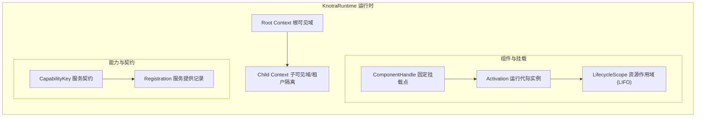
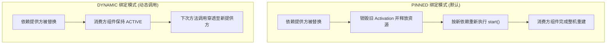
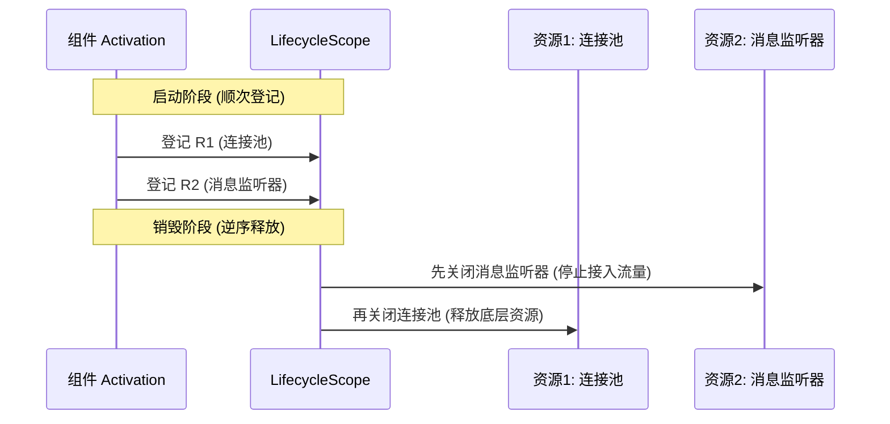
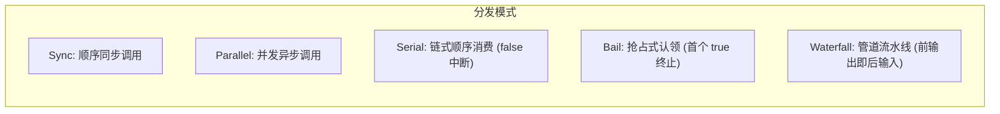

# Knotra API 与集成指南

> 面向核心框架集成与底层扩展开发者，系统阐述 Knotra 的公共 API 契约、事务机制、依赖传播与扩展模块。

---

## 内核架构全景

Knotra 的核心职责是在 JVM 运行期间安全调度组件的替换、依赖重建与资源回收。系统由三层核心结构组成：



- **上下文（Context）**：管理能力可见范围的树状层级。子上下文可以继承父上下文的能力，也可以注册同名能力以实现租户级或环境级遮蔽（Shadowing）。
- **能力（Capability）**：由唯一字符串名称与精确 Java `Class<T>` 唯一定义的服务契约。通过 `provide` 发布，通过 Requirement 声明消费。
- **组件与代际（Component & Activation）**：
  - `ComponentHandle` 是长期稳定的逻辑挂载句柄；
  - `Activation` 是某一次运行的具体物理实例，持有独立的依赖绑定集（BindingSet）和资源作用域（LifecycleScope）。

---

## 核心运行闭环

创建运行时、发布服务并处理热替换：

```java
package com.example.demo;

import io.knotra.*;

// 1. 定义服务契约接口与实现
public interface Tool {
    String run(String input);
}

public class DefaultTool implements Tool {
    @Override
    public String run(String input) {
        return "v1: " + input;
    }
}

public class AdvancedTool implements Tool {
    @Override
    public String run(String input) {
        return "v2: " + input;
    }
}

// 2. 运行闭环示例
public class ApiLifecycleDemo {
    public static final CapabilityKey<Tool> TOOL =
            CapabilityKey.of("app.tool", Tool.class);

    public static void main(String[] args) {
        try (KnotraRuntime runtime = KnotraRuntime.create()) {

            // 发布初始服务实现并获得类型化句柄
            Provided<Tool> toolProvided = runtime.provide(TOOL, new DefaultTool());

            // 运行时原子替换提供方
            Provided<Tool> v2 = toolProvided.replace(new AdvancedTool());
            v2.whenSettled().toCompletableFuture().join();

            // 验证最新提供方
            Tool currentTool = runtime.root().view().require(TOOL);
            System.out.println(currentTool.run("hello")); // 输出: v2: hello
        }
    }
}
```

`runtime.provide` 同步提交注册并返回不可变的 `Provided<T>` 句柄。调用 `replace` 会在单个结构事务内撤销旧注册并发布新注册，返回新的 `Provided<T>` 句柄，旧句柄随之失效。

---

## 原生组件与依赖绑定

底层组件均通过实现 `ComponentFactory` 接口对外交付。以下展示完整的组件定义、契约声明与挂载运行流程：

```java
package com.example.demo;

import io.knotra.*;

// 工具箱对外暴露的接口
public interface Box {
    String open();
}

public final class ToolBox implements Box {
    private final Tool tool;

    public ToolBox(Tool tool) {
        this.tool = tool;
    }

    @Override
    public String open() {
        return "ToolBox contains: " + tool.run("active");
    }
}

// 声明组件工厂
public final class ToolBoxFactory implements ComponentFactory<NoConfig> {
    public static final CapabilityKey<Tool> TOOL =
            CapabilityKey.of("app.tool", Tool.class);
    public static final CapabilityKey<Box> BOX =
            CapabilityKey.of("app.box", Box.class);

    @Override
    public Component<NoConfig> create() {
        return new Component<>() {
            @Override
            public ComponentDescriptor descriptor() {
                return ComponentDescriptor.of(
                        CapabilityRequirement.required(TOOL));
            }

            @Override
            public void start(ActivationContext context, NoConfig config) throws Exception {
                // 读取本代固定依赖
                Tool tool = context.require(TOOL);

                // 登记资源清理动作 (LIFO 释放)
                context.lifecycle().onClose("cleanup", () -> System.out.println("释放工具箱资源"));

                // 对外发布组件能力
                context.provide(BOX, new ToolBox(tool));
            }
        };
    }
}
```

挂载组件并消费能力：

```java
package com.example.demo;

import io.knotra.*;

public class MountDemo {
    public static void main(String[] args) {
        try (KnotraRuntime runtime = KnotraRuntime.create()) {
            // 先发布依赖
            runtime.provide(ToolBoxFactory.TOOL, new DefaultTool());

            // 挂载组件并等待就绪
            ComponentHandle<NoConfig> boxHandle = runtime.mount("tool-box", new ToolBoxFactory());
            boxHandle.requireActive();

            Box box = runtime.root().view().require(ToolBoxFactory.BOX);
            System.out.println(box.open());
        }
    }
}
```

---

## 依赖绑定模式对比



| 维度 | **PINNED 绑定（默认）** | **DYNAMIC 绑定（动态调用）** |
|---|---|---|
| **声明语法** | `CapabilityRequirement.required(KEY)` | `CapabilityRequirement.dynamicRequired(KEY)` |
| **获取方式** | `context.require(KEY)` | `context.subscribe(KEY)` 或动态代理 |
| **提供方替换行为** | 消费方自动重建（销毁并创建新 Activation） | 消费方保持存活，方法调用动态路由 |
| **适用对象** | 有状态对象、连接池、带有本地缓存的服务 | 无状态服务、外部网关、高频请求路由 |

---

## 结构事务（RuntimeTransaction）

多个结构变更操作需要作为一个原子单元提交时，使用结构事务：

```java
package com.example.demo;

import io.knotra.*;

public class TransactionDemo {
    public static final CapabilityKey<Tool> TOOL =
            CapabilityKey.of("app.tool", Tool.class);

    public static void main(String[] args) {
        try (KnotraRuntime runtime = KnotraRuntime.create()) {
            Provided<Tool> oldProvided = runtime.provide(TOOL, new DefaultTool());

            // 在单个结构事务中原子撤销旧注册、挂载新组件并发布新实现
            TransactionReceipt<Provided<Tool>> receipt = runtime.transact(tx -> {
                tx.revoke(oldProvided);
                tx.mount(runtime.root(), "tool-box", new ToolBoxFactory());
                return tx.provide(runtime.root(), TOOL, new AdvancedTool());
            });

            System.out.println("事务已提交，当前 generation = " + receipt.generation());
        }
    }
}
```

事务回调在调用线程执行校验与结构编制。如果存在配置不合法或依赖冲突，事务整体拒绝并抛出 `TransactionRejectedException`，绝不会产生部分提交的中间状态。

---

## 上下文隔离与租户遮蔽

上下文支持树状嵌套，常用于多租户与测试隔离：


```java
package com.example.demo;

import io.knotra.*;

public interface CurrencyService {
    double getRate();
}

public class ContextShadowDemo {
    public static final CapabilityKey<CurrencyService> CURRENCY_SERVICE =
            CapabilityKey.of("app.currency", CurrencyService.class);

    public static void main(String[] args) {
        try (KnotraRuntime runtime = KnotraRuntime.create()) {
            // 根上下文注册公共汇率
            runtime.provide(CURRENCY_SERVICE, () -> 7.0);

            // 创建子上下文
            ContextHandle usWorkspace = runtime.transact(tx ->
                    tx.childContext(runtime.root(), "us-tenant")).value();

            // 在子上下文中注册专属汇率以遮蔽根汇率
            runtime.transact(tx ->
                    tx.provide(usWorkspace, CURRENCY_SERVICE, () -> 1.0));

            // 从根上下文读取
            System.out.println("Root rate: " + runtime.root().view().require(CURRENCY_SERVICE).getRate()); // 7.0

            // 从子上下文读取
            System.out.println("US rate: " + usWorkspace.view().require(CURRENCY_SERVICE).getRate()); // 1.0

            // 递归释放子上下文及其名下所有组件
            usWorkspace.disposeAsync().toCompletableFuture().join();
        }
    }
}
```

---

## 资源作用域与生命周期（`LifecycleScope`）

每个 `Activation` 拥有独立的 `LifecycleScope`，内部登记的资源严格按照后进先出（LIFO）顺序释放：



```java
package com.example.demo;

import io.knotra.*;
import java.util.concurrent.CompletableFuture;
import java.util.concurrent.CompletionStage;

public class ResourceDemoComponent implements Component<NoConfig> {
    @Override
    public ComponentDescriptor descriptor() {
        return ComponentDescriptor.empty();
    }

    @Override
    public void start(ActivationContext context, NoConfig config) {
        // 托管同步资源 (实现 AutoCloseable)
        AutoCloseable connection = () -> System.out.println("关闭数据库连接");
        context.lifecycle().manage("connection", connection);

        // 注册普通清理回调 (Runnable)
        context.lifecycle().onClose("stop-worker", () -> System.out.println("停止后台工作线程"));

        // 托管异步资源 (返回 CompletionStage)
        AsyncCloseable consumer = () -> {
            System.out.println("开始异步排空消费者队列");
            return CompletableFuture.completedFuture(null);
        };
        context.lifecycle().manageAsync("async-consumer", consumer);
    }
}
```

---

## 动态调用租约（`DynamicCapability`）

动态依赖在调用期间通过**调用租约（Call Lease）**保证执行安全：

```java
package com.example.demo;

import io.knotra.*;
import java.util.concurrent.CompletableFuture;
import java.util.concurrent.CompletionStage;

public interface PaymentGateway {
    String charge(String orderId);
    CompletionStage<String> chargeAsync(String orderId);
}

public class DynamicLeaseDemo {
    public static final CapabilityKey<PaymentGateway> PAYMENT_GATEWAY =
            CapabilityKey.of("app.payment", PaymentGateway.class);

    public void executePayment(ActivationContext context, String orderId) {
        // 订阅动态能力
        DynamicCapability<PaymentGateway> gateway = context.subscribe(PAYMENT_GATEWAY);

        // 同步调用 (方法执行期间自动持有并释放租约)
        String receipt = gateway.call(gw -> gw.charge(orderId));
        System.out.println("Receipt: " + receipt);

        // 异步调用 (租约保持至 CompletionStage 完成)
        CompletionStage<String> asyncReceipt = gateway.callAsync(gw -> gw.chargeAsync(orderId));
        asyncReceipt.thenAccept(r -> System.out.println("Async receipt: " + r));
    }
}
```

当提供方被替换或下线时，系统先关闭准入闸门，等待全部在途租约归零后才执行旧实例的销毁清理，确保不会在方法执行中途拔出依赖。

---

## 进程内事件总线（`knotra-events`）

提供支持类型安全与排空保障的事件总线：



完整事件订阅与发布闭环：

```java
package com.example.demo;

import io.knotra.*;
import io.knotra.events.*;
import java.util.concurrent.CompletableFuture;

public record OrderCreatedEvent(String orderId, double amount) {}

public class EventBusDemo {
    public static void main(String[] args) {
        try (KnotraRuntime runtime = KnotraRuntime.create()) {

            // 1. 挂载 EventBus 组件
            runtime.mount("event-bus", new EventBusFactory()).requireActive();
            EventBus bus = runtime.root().view().require(EventCapabilities.EVENT_BUS);

            // 2. 声明事件契约 (Parallel 并发分发模式)
            EventDefinition.Parallel<OrderCreatedEvent> ORDER_CREATED =
                    EventDefinition.parallel(OrderCreatedEvent.class);

            // 3. 订阅事件
            EventSubscription sub = bus.subscribe(ORDER_CREATED, event -> {
                System.out.println("收到订单创建事件: " + event.orderId() + ", 金额: " + event.amount());
                return CompletableFuture.completedFuture(null);
            });

            // 4. 分发事件
            bus.dispatch(ORDER_CREATED, new OrderCreatedEvent("ORD-1001", 99.9))
                    .toCompletableFuture()
                    .join();

            // 5. 取消订阅
            sub.closeAsync().toCompletableFuture().join();
        }
    }
}
```

---

## PF4J 插件与声明式期望树

### 加载外部插件

```java
package com.example.demo;

import io.knotra.*;
import io.knotra.pf4j.*;
import java.nio.file.Path;
import java.util.Set;

public class Pf4jDemo {
    public static void main(String[] args) throws Exception {
        try (KnotraRuntime runtime = KnotraRuntime.create()) {

            try (Pf4jArtifactAdapter adapter = Pf4jArtifactAdapter.create(
                    Path.of("plugins"), runtime, Set.of("com.example.contract"))) {

                // 加载插件 JAR
                ArtifactSnapshot snapshot = adapter.loadArtifact(Path.of("plugins/custom-tool.jar"));

                // 从插件工厂目录中解析组件
                ArtifactFactoryHandle<NoConfig> toolFactory =
                        adapter.factories().resolve("custom-tool", NoConfig.class).orElseThrow();

                // 挂载组件
                ComponentHandle<NoConfig> handle = toolFactory.mount(runtime.root(), "tool-instance");
                handle.requireActive();

                // 卸载插件 (自动排空在途请求后卸载类加载器)
                adapter.unloadArtifact(snapshot.artifactId());
            }
        }
    }
}
```

### 声明式期望树收敛（`knotra-loader`）

```java
package com.example.demo;

import io.knotra.*;
import io.knotra.loader.*;

public class LoaderDemo {
    public static void main(String[] args) {
        try (KnotraRuntime runtime = KnotraRuntime.create()) {

            // 1. 构建工厂解析器 (Resolver)
            ComponentFactoryResolver resolver = ClasspathFactoryResolver.builder()
                    .add(FactoryRef.of("tool-box"), new ToolBoxFactory())
                    .build();

            // 2. 定义期望的组件树 (Desired ComponentTree)
            ComponentTree desiredTree = ComponentTree.of(
                    ComponentEntry.of("active-box", FactoryRef.of("tool-box"))
            );

            // 3. 挂载 Loader 并执行原子收敛
            try (KnotraLoader loader = KnotraLoader.over(runtime, runtime.root(), resolver)) {
                ReconcileResult result = loader.reconcile(desiredTree);
                result.requireConverged(); // 自动完成对比与挂载
            }
        }
    }
}
```

---

## 运行时快照与观测（`RuntimeSnapshot`）

快照为不可变纯数据传输对象，可用于健康检查与监控指标采集：

```java
package com.example.demo;

import io.knotra.*;

public class SnapshotDemo {
    public static void inspectRuntime(KnotraRuntime runtime) {
        RuntimeSnapshot snapshot = runtime.snapshot();

        snapshot.components().forEach(c -> {
            System.out.printf("组件 [%s] 状态: %s, 运行代数: %d%n",
                    c.componentId(), c.state(), c.generation());
        });

        snapshot.diagnostics().forEach(d -> {
            System.out.printf("诊断码 [%s]: %s (关联路径: %s)%n",
                    d.code(), d.message(), d.path());
        });
    }
}
```

---

## 停机关闭顺序

推荐采用从外向内的逆序释放流程：

```java
package com.example.demo;

import io.knotra.*;
import io.knotra.loader.KnotraLoader;
import io.knotra.pf4j.Pf4jArtifactAdapter;

public class ShutdownDemo {
    public static void shutdown(KnotraLoader loader, Pf4jArtifactAdapter plugins, KnotraRuntime runtime) {
        // 1. 停止 Loader 期望树调度
        if (loader != null) {
            loader.closeAsync().toCompletableFuture().join();
        }

        // 2. 排空并卸载所有 PF4J 插件
        if (plugins != null) {
            plugins.closeAsync().toCompletableFuture().join();
        }

        // 3. 关闭核心运行时及残留组件
        if (runtime != null) {
            runtime.closeAsync().toCompletableFuture().join();
        }
    }
}
```
