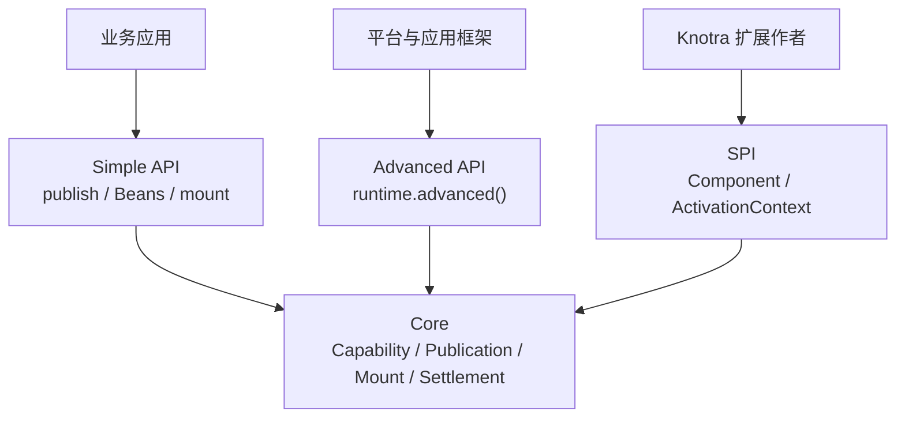

# Knotra API 与集成指南

本指南描述当前 0.1.0 API。它按 Simple API、Advanced API 和 SPI 分层：普通业务只读前三章；平台作者再读事务与 Context；Knotra 扩展作者才需要实现 Component。

相关决策见 [ADR 0001](adr/0001-publication-registration-mount-activation.md)。

## 分层总览



- Simple API 面向日常业务：默认 `Class<T>` key、稳定 `Publication<T>`、Beans DSL、`MountHandle`。
- Advanced API 面向结构控制：`Registration<T>`、raw registration、结构事务、任意 Context 和完整 snapshot。
- SPI 面向框架与插件作者：`Component<C>`、`ComponentFactory<C>`、`ActivationContext`、`LifecycleScope`。

## Simple API

### Capability 默认 key

`Class<T>` 快捷方式使用二进制名作为能力名：

```java
CapabilityKey<Greeting> key = CapabilityKey.of(Greeting.class);
System.out.println(key.name()); // Greeting.class.getName()
```

多数接口只有一个实现槽位时，`runtime.publish(Greeting.class, value)`、`Beans.required(Greeting.class)` 和 `context.require(Greeting.class)` 足够。多个槽位使用显式名称：

```java
CapabilityKey<PaymentGateway> PRIMARY =
        CapabilityKey.of("payment.primary", PaymentGateway.class);
CapabilityKey<PaymentGateway> BACKUP =
        CapabilityKey.of("payment.backup", PaymentGateway.class);
```

运行时生命周期内，同名能力绑定唯一的精确 Java 类型。不同 ClassLoader 加载出的同名 `Class` 不是同一个合约。

### Publication 与 Simple API

`Publication<T>` 是稳定逻辑槽位：

```java
PublicationChange<Greeting> first = runtime.publish(Greeting.class, new StandardGreeting());
Publication<Greeting> publication = first.publication();

PublicationChange<Greeting> second = publication.update(new FastGreeting());
```

不要长期持有第一次的 `PublicationChange<T>`。它只描述 PUBLISH、UPDATE 或 UNPUBLISH 这一次操作。并发 update 在 Publication 上线性化，每个调用者都等待自己返回的 change，不会误等后来者。

Publication 状态：

- `PUBLISHED`：槽位有当前有效发布。
- `UNPUBLISHED`：主动撤销，终态；再次 unpublish 幂等，不会自动重新发布。
- `DISPLACED`：外部替换、Context 释放或 Runtime 关闭移除了当前发布，槽位不再接受 update。

需要精确控制与撤销具体某一代时才使用 Advanced API 的 `Registration<T>`：

```java
Registration<Greeting> registration =
        runtime.advanced().register(Greeting.class, new StandardGreeting());
registration.awaitSettled(Duration.ofSeconds(10));

Registration<Greeting> replacement = registration.replace(new FastGreeting());
replacement.awaitSettled(Duration.ofSeconds(10));
replacement.revoke().awaitSettled(Duration.ofSeconds(10));
```

旧 `Registration` 被替换或撤销后失效；再次 replace 或 revoke 会抛出 `TransactionRejectedException`。

### Settlement 语义

Publication、Registration 和 Advanced 事务返回操作范围的 `Settlement`；每个操作对象独立观察自己那一次变更。异步观察使用 `whenSettled()`，同步便利方法必须优先带界：

```java
SettlementReport report = change.awaitSettled(Duration.ofSeconds(10));
```

正常完成表示“本次操作的传播和 drain 已收敛”，不表示所有下游都 ACTIVE。启动失败的挂载可能让 settlement 正常完成，并在报告中呈现为 FAILED。

两种等待范围不要混用：

- 操作 settlement 会递归等待本次操作触发的 owned children；父挂载可以先 ACTIVE，报告仍会等它新提交的子挂载收敛。
- `MountHandle.whenSettled()`、`retryAsync()`、`disposeAsync()` 和 `ConfiguredMountHandle.reconfigureAsync(...)` 返回 `CompletionStage<ComponentState>`，只描述该挂载自身的生命周期过渡，不返回 `SettlementReport`，也不等待该挂载拥有的子挂载。

`SettlementReport` 是操作范围报告：

- `hasAffectedMounts()`：本次操作是否存在受影响的挂载点。
- `hasFailedMounts()`：影响集中是否存在 FAILED 状态挂载。
- `failedMounts()`：列出失败挂载和诊断。
- `allAffectedActive()`：影响集非空且全部处于 ACTIVE 状态才为 true。
- `outcome(handleId)`：查询某个受影响挂载。
- `diagnostics()`：只包含本次相关诊断，不混入全局无关诊断。

空影响集没有受影响挂载，因此 `hasAffectedMounts()` 为 false，`hasFailedMounts()` 为 false，`allAffectedActive()` 为 false。动态代理消费方无需重建时，提供方替换的影响集可以为空。


要等待某个具体挂载 ACTIVE，使用：

```java
MountHandle handle = definition.mount(runtime);
handle.requireActive(Duration.ofSeconds(10));
```

失败抛出 `MountNotActiveException`，其中包含目标、状态和稳定诊断。`requireActive()` 不带 Duration 会无界等待，生产代码应显式传入预算。

## Beans 与挂载

Beans 负责把普通对象适配为 Activation 拥有的 Bean。普通 Bean 定义不暴露配置占位类型：

```java
BeanDefinition<Renderer> definition = Beans
        .component("renderer")
        .with(Beans.dynamic(Greeting.class))
        .create((Greeting greeting) -> new Renderer(greeting))
        .provideAs(RenderedGreeting.class, renderer -> renderer)
        .build();

MountHandle handle = definition.mount(runtime);
handle.requireActive(Duration.ofSeconds(10));
```

配置型 Bean 的配置类型公开出现在定义中：

```java
ConfiguredBeanDefinition<RenderConfig, Renderer> definition = Beans
        .component("renderer", RenderConfig.class)
        .create((RenderConfig config) -> new Renderer(config.prefix()))
        .provideAs(RenderedGreeting.class, renderer -> renderer)
        .build();

ConfiguredMountHandle<RenderConfig> handle =
        definition.mount(runtime, new RenderConfig("Hello"));
handle.reconfigureAsync(new RenderConfig("Bonjour"))
        .toCompletableFuture()
        .get(10, TimeUnit.SECONDS);
```

依赖选择：

- `required`：启动时固定一代，提供方替换触发消费方重建。
- `optional`：注入 `Optional<T>`，出现和消失都会触发重建。
- `dynamic`：注入接口代理；默认 required 只约束首次启动，激活后提供方消失不会自动停用，方法调用会失败。
- `dynamicOptional`：注入接口代理，首次启动也不要求提供方存在。
- `dynamicCapability`：注入 `DynamicCapability<T>`，用于 `call` 或 `callAsync` 固定一个 provider 租约。
- `dynamicCapabilityOptional`：同上，但不要求首次启动存在。

详细 DSL、注解处理器和 Spring 集成见 [Beans 与 Spring 集成指南](<Knotra Beans 与 Spring 集成指南.md>)。

## Advanced API

所有 raw registration、snapshot、Context 创建和结构事务都从 `runtime.advanced()` 进入：

```java
AdvancedRuntime advanced = runtime.advanced();
RuntimeSnapshot before = advanced.snapshot();
```

不要绕过 `advanced()` 直接在 README 或普通业务文档中展示内核级操作。

### 结构事务

事务回调只记录意图，返回值被包装为 `TransactionReceipt<R>`。事务内 `provide` 返回类型化 `StagedRegistration<T>`，不是已提交 `Registration<T>`：

```java
TransactionReceipt<StagedRegistration<Message>> receipt =
        runtime.advanced().transact(transaction -> transaction.provide(
                runtime.root(), Message.class, new CommittedMessage("one")));

StagedRegistration<Message> staged = receipt.value();
SettlementReport report = receipt.awaitSettled(Duration.ofSeconds(10));

runtime.advanced().revoke(staged).awaitSettled(Duration.ofSeconds(10));
```

完整可执行版本见 [TransactionExample.java](../knotra-docs-examples/src/test/java/io/knotra/docs/TransactionExample.java)。

`StagedRegistration<T>` 的规则：

- 事务记录期间提供 `key()` 与 `context()` 的静态类型信息。
- 提交失败时随事务失效。
- 提交成功后仍可作为 opaque registration handle 传给 `advanced().revoke(...)`。
- 它不会升级成 `Registration<T>`，也没有 replace 或 settlement 方法。

同一事务可以一次提交多个意图：

```java
TransactionReceipt<StagedRegistration<Message>> receipt =
        runtime.advanced().transact(transaction -> {
            transaction.revoke(previous);
            ContextHandle child = transaction.childContext(runtime.root(), "tenant-a");
            return transaction.provide(child, Message.class, new TenantMessage("a"));
        });
receipt.awaitSettled(Duration.ofSeconds(10));
```

### Context 遮蔽

Context 是能力可见性树。子 Context 可以遮蔽父 Context 的同名能力：

```java
ContextHandle tenants = runtime.advanced()
        .transact(transaction -> transaction.childContext(runtime.root(), "tenants"))
        .value();

runtime.publish(tenants, Message.class, new TenantMessage("tenant"))
        .awaitSettled(Duration.ofSeconds(10));

Message value = tenants.view().require(Message.class);
```

Publication 会记住自己的 Context，并在原 Context 中更新。释放 Context 会让其中 Publication 进入 `DISPLACED`，不会静默改为根 Context 发布。

### Snapshot

```java
RuntimeSnapshot snapshot = runtime.advanced().snapshot();

snapshot.mounts().forEach(mount -> {
    System.out.printf(
            "%s %s %s%n",
            mount.mountId(),
            mount.componentId(),
            mount.state());
});
```

`RuntimeSnapshot.mounts()` 返回 `RuntimeSnapshot.MountSnapshot`，包含 handle/mount/component/factory/context 标识、状态、目标、配置代际、当前 Activation 和依赖需求。注册快照在 `registrations()`，激活和绑定在 `activations()`。

快照是纯数据，不引用组件实例、资源、异常对象、`Class` 或 `ClassLoader`。因此持有快照不会阻止插件 loader 回收。

## 动态能力

`Beans.dynamic` 注入的是普通接口代理，每个方法独立持有 provider 租约，适合无状态调用。多个方法必须观察同一个 provider 时，注入 `DynamicCapability<T>`：

```java
BeanDefinition<ReportService> definition = Beans
        .component("report-service")
        .with(Beans.dynamicCapability(Pricing.class))
        .create((DynamicCapability<Pricing> pricing) -> new ReportService(pricing))
        .build();
```

在 ReportService 中：

```java
Snapshot snapshot = pricing.call(current ->
        new Snapshot(current.price(orderId), current.stock(orderId)));
```

`call` 的回调期间固定一个 provider；`callAsync` 将租约延续到返回的 CompletionStage 完成。`available()` 只是 advisory 检查，不能替代调用错误处理。

## 事件总线

`knotra-events` 通过普通 MountFactory 挂载：

```java
try (KnotraRuntime runtime = KnotraRuntime.create()) {
    MountHandle bus = runtime.mount("event-bus", new EventBusFactory());
    bus.requireActive(Duration.ofSeconds(10));

    EventBus eventBus = runtime.root().view().require(EventCapabilities.EVENT_BUS);
    EventDefinition.Sync<OrderCreated> definition =
            EventDefinition.sync(OrderCreated.class);

    EventSubscription subscription = eventBus.subscribe(
            definition, event -> process(event.orderId()));
    try (subscription) {
        eventBus.dispatch(definition, new OrderCreated("A1"));
    }
}
```

五种模式由 `EventDefinition` 编译期区分：

| 模式 | 语义 |
|---|---|
| Sync | 调用线程内按订阅顺序执行 |
| Parallel | 同次分发的监听并发执行并统一收敛 |
| Serial | 异步监听按顺序执行，前一个完成后下一个才开始 |
| Bail | 第一个认领结果的监听停止后续 |
| Waterfall | 顺序变换事件值并传递给下一个监听 |

总线关闭等待关闭请求观察到之前已接受的分发收敛。组件中创建的订阅应登记到 `ActivationContext.lifecycle()`，由 Activation 释放。

## PF4J artifact

PF4J 加载只发布 factory catalog，不隐式挂载组件：

```java
try (KnotraRuntime runtime = KnotraRuntime.create();
     Pf4jArtifactAdapter adapter = Pf4jArtifactAdapter.create(
             pluginsRoot, runtime, Set.of("com.example.contract"))) {

    ArtifactSnapshot artifact = adapter.loadArtifactAsync(pluginJar)
            .toCompletableFuture()
            .get(30, TimeUnit.SECONDS);

    ArtifactFactoryHandle.NoConfig factory = adapter.factories()
            .resolveNoConfig("greeting")
            .orElseThrow();
    MountHandle handle = factory.mount(runtime.root(), "greeting-main");
    handle.requireActive(Duration.ofSeconds(10));
}
```

类型化配置工厂必须先解析精确 token：

```java
ArtifactFactoryHandle.Configured<GreetingConfig> factory = adapter.factories()
        .resolve("greeting", GreetingConfig.class)
        .orElseThrow();

GreetingConfig config = factory.decodeConfig(Map.of("language", "zh"));
ConfiguredMountHandle<GreetingConfig> handle =
        factory.mount(runtime.root(), "greeting-main", config);
```

`ArtifactFactoryHandle` 根类型只暴露元数据，mount 只在 no-config 与 configured 子类型上出现，调用方无法给 plain factory 传入配置占位值。

## Loader 期望树

Loader 把全量期望树与当前状态对比并收敛：

```java
ComponentFactoryResolver resolver = ref -> resolveFromCatalog(ref);

try (KnotraLoader loader = KnotraLoader.owned(runtime, resolver)) {
    ComponentTree desired = ComponentTree.of(
            ComponentEntry.of(
                    "payment",
                    FactoryRef.of("payment-service", "1.2.0"),
                    ComponentEntry.configured(
                            "gateway",
                            FactoryRef.of("payment-gateway"),
                            Map.of("mode", "primary"))));

    ReconcileResult result = loader.reconcileAsync(desired)
            .toCompletableFuture()
            .get(30, TimeUnit.SECONDS);

    result.requireConverged();
    LoaderSnapshot snapshot = loader.snapshot();
}
```

Resolver 返回 `ResolvedFactory`。它声明 `FactoryKind.PLAIN` 或 `FactoryKind.CONFIGURED`，并提供 raw config decoder、受控挂载策略和重配置策略。Loader 不接触 PF4J manager、工厂实例或 artifact 句柄。

PF4J 桥接使用：

```java
ComponentFactoryResolver resolver = Pf4jFactoryResolver.of(adapter);
```

`ComponentEntry.of` 表示无配置，`ComponentEntry.configured` 表示 resolver 边界的 raw 配置；类型恢复只发生在 `ResolvedFactory` 的 decoder 与受控挂载边界。

## SPI：原生组件

本章只面向 Knotra 扩展和插件作者。业务代码优先使用 Beans 或 Spring 适配器。

原生组件由 `ComponentFactory<C>` 创建，返回 `Component<C>`。无公开配置契约时实现 `MountFactory`，让宿主使用 Simple mount：

```java
final class ToolBoxFactory implements MountFactory {
    @Override
    public String factoryId() {
        return "tool-box";
    }

    @Override
    public Component<NoConfig> create() {
        return new Component<>() {
            private final ComponentDescriptor descriptor = ComponentDescriptor.named(
                    "tool-box", CapabilityRequirement.required(Tool.class));

            @Override
            public ComponentDescriptor descriptor() {
                return descriptor;
            }

            @Override
            public void start(ActivationContext context, NoConfig config) {
                Tool tool = context.require(Tool.class);
                context.provide(ToolBox.class, new ToolBox(tool));
                context.lifecycle().onClose("tool-box", tool::release);
            }
        };
    }
}
```

`ComponentFactory.create()` 创建的工厂外壳可跨多次 Activation 复用，但不要在成员里缓存某次 Activation 的依赖、连接或业务实例。每次 `start` 得到新的 `ActivationContext` 和配置。

类型化配置使用 `ComponentFactory<C>`：

```java
final class CacheFactory implements ComponentFactory<CacheConfig> {
    @Override
    public CacheConfig normalizeConfig(CacheConfig config) {
        return config.normalized();
    }

    @Override
    public Component<CacheConfig> create() {
        return new CacheComponent();
    }
}

ConfiguredMountHandle<CacheConfig> handle =
        runtime.mount("cache", new CacheFactory(), new CacheConfig(128));
```

`start` 中的异常会使本次 Activation 失败并回滚；通过 `context.provide` 暂存的输出只有在 start 正常返回并验证后才可见。跨激活资源必须登记到 `context.lifecycle()`，不能由工厂手工保存。

## 诊断与失败详情

`RuntimeDiagnostic` 携带稳定诊断码、目标 ID、消息和可选 `FailureInfo`。`FailureInfo` 是有界纯 DTO：

- phase：ACTIVATION、CLEANUP 或 SETTLEMENT。
- exceptionType 与 message：稳定文本。
- causes：按策略限制数量的 cause 摘要。
- stackTrace：默认关闭，开启后按帧数和文本长度截断。
- occurredAt：时间戳。

默认策略保留 3 层 cause、最多 32 帧、每段最多 500 字符，不包含堆栈：

```java
KnotraConfig config = new KnotraConfig(
        "order-runtime",
        256,
        KnotraConfig.FailureDetailPolicy.defaults()
                .withStackTraces(true));
```

`FailureInfo` 不保存 `Throwable`、`Class` 或 `ClassLoader`。`PublicationChange` 是活动句柄，可以引用共享合约 `Class`，但不得保存插件私有 `Class` 或 loader。snapshot、report 和 failure DTO 都不能 pin 插件 loader。

## 关闭顺序

1. 停止接入新的外部请求。
2. 关闭 Loader 和 PF4J adapter，让受管子树、artifact drain 和卸载收敛。
3. 关闭宿主创建的动态桥和挂载。
4. 调用 `runtime.closeAsync()`；必须阻塞时使用有界 `get(timeout)`。
5. 对失败清理保留诊断并重试，不要为了“关闭成功”吞掉异常。

Knotra 的资源释放遵循每个 Activation 的 LIFO 顺序。失败不会伪造成功，状态和诊断保留给下一次 retry。
