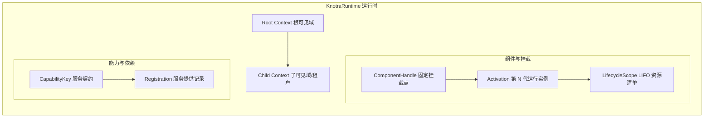
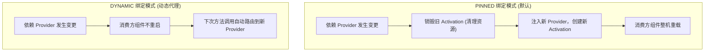
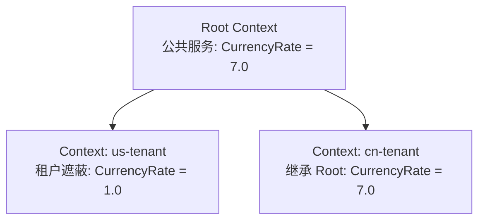
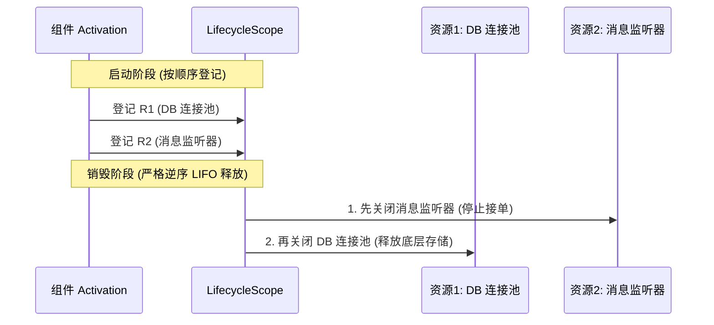
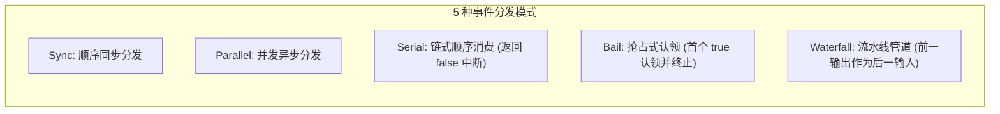

# Knotra API 与集成指南

> **面向读者**：本文系统性介绍 Knotra `0.1.0-SNAPSHOT` 的核心架构、核心 API 契约与各扩展模块（Events、PF4J、Loader）。适合希望深入理解 Knotra 运行机制、或需要基于 Core API 进行底层定制与扩展的开发者。

---

## 1. Knotra Core 架构全景

Knotra 的核心目标是：**在 JVM 运行期间安全管理组件的替换、依赖重连与资源回收**。其核心分层模型如下：



### 核心三层概念：
1. **Context（上下文可见域）**：管理服务的可见范围。子 Context 能直接访问父 Context 的服务，也能注册同名服务来**遮蔽（Shadow）**父级服务。
2. **Capability（能力/服务契约）**：由 `(名称, Java Class)` 唯一定义。通过 `runtime.provide()` 发布，组件通过声明 Requirement 消费。
3. **Component 与 Activation（组件外壳与代际实例）**：
   - `ComponentHandle` 是长期稳定的逻辑插座；
   - `Activation` 是某一次运行的具体实例，拥有独立的依赖绑定集（BindingSet）和资源清单（LifecycleScope）。

---

## 2. 最小 Core 运行闭环

### 2.1 创建运行时与定义服务契约

```java
import io.knotra.*;

// 1. 创建 Runtime（可配置最大收敛迭代次数等）
try (KnotraRuntime runtime = KnotraRuntime.create()) {

    // 2. 定义服务契约 Key
    CapabilityKey<Tool> TOOL = CapabilityKey.of("app.tool", Tool.class);

    // 3. 发布 Provider 实现，获得类型化句柄 Provided<Tool>
    Provided<Tool> toolProvided = runtime.provide(TOOL, new DefaultTool());

    // 4. 在需要时热替换 Provider
    Provided<Tool> v2 = toolProvided.replace(new AdvancedTool());
    v2.whenSettled().toCompletableFuture().join(); // 等待收敛完成
}
```

---

## 3. 组件（Component）与依赖绑定

### 3.1 手写原生 ComponentFactory

通常推荐使用 `knotra-beans` DSL，但在底层，所有组件都实现为 `ComponentFactory`：

```java
public final class ToolBoxFactory implements ComponentFactory<NoConfig> {
    @Override
    public Component<NoConfig> create() {
        return new Component<>() {
            @Override
            public ComponentDescriptor descriptor() {
                // 声明所需依赖
                return ComponentDescriptor.of(
                        CapabilityRequirement.required(TOOL));
            }

            @Override
            public void start(ActivationContext context, NoConfig config) throws Exception {
                // 1. 获取依赖
                Tool tool = context.require(TOOL);

                // 2. 登记资源清理钩子 (LIFO)
                context.lifecycle().onClose("cleanup", () -> System.out.println("释放工具箱资源"));

                // 3. 发布自身能力
                context.provide(BOX, new ToolBox(tool));
            }
        };
    }
}
```

挂载组件：
```java
ComponentHandle<NoConfig> boxHandle = runtime.mount("tool-box", new ToolBoxFactory());
boxHandle.requireActive(); // 阻塞等待直到组件成功进入 ACTIVE 状态
```

---

### 3.2 两种依赖绑定模式对比（PINNED vs DYNAMIC）



| 特性 | **PINNED 绑定（默认）** | **DYNAMIC 绑定（动态调用）** |
|---|---|---|
| **声明方式** | `CapabilityRequirement.required(KEY)` | `CapabilityRequirement.dynamicRequired(KEY)` |
| **获取方式** | `context.require(KEY)` | `context.subscribe(KEY)` 或动态代理 |
| **Provider 替换时** | **消费方自动重建**（重新执行 `start`） | **消费方保持 ACTIVE**，不发生重启 |
| **适用场景** | 普通有状态对象、连接池、带有自身初始化的模块 | 无状态服务、外部网关、高频请求路由 |

---

## 4. 结构事务（RuntimeTransaction）

当需要**原子执行多个操作**（例如：同时撤销旧服务、发布新服务、挂载新组件）时，使用结构事务：

```java
TransactionReceipt<Provided<Tool>> receipt = runtime.transact(tx -> {
    // 1. 撤销旧注册
    tx.revoke(oldProvided);
    // 2. 挂载新组件
    tx.mount(runtime.root(), "worker", workerFactory);
    // 3. 发布新服务
    return tx.provide(runtime.root(), TOOL, new AdvancedTool());
});

// 事务同步提交生效，receipt 包含生成代数与收敛 Future
System.out.println("事务已提交，当前 generation = " + receipt.generation());
```

> **事务特性**：
> - 事务在调用线程同步完成校验与结构更新，**要么全部生效，要么全部回滚**。
> - 若发生配置错误或冲突，抛出 `TransactionRejectedException`，不会留下半吊子脏状态。

---

## 5. Context 层级与多租户遮蔽（Shadowing）

Context 可以形成树状层级结构，常用于**多租户定制**或**环境隔离**：



```java
// 1. 创建子 Context
ContextHandle usWorkspace = runtime.transact(tx ->
        tx.childContext(runtime.root(), "us-tenant")).value();

// 2. 在子 Context 中注册专属实现（遮蔽根 Context 的同名服务）
usWorkspace.context().ifPresent(ctx -> {
    // 该注册仅对 usWorkspace 及其子级可见
    runtime.transact(tx -> tx.provide(ctx, CURRENCY_RATE, new UsdRateService()));
});

// 3. 释放子 Context（会自动递归释放其下所有组件与注册）
usWorkspace.disposeAsync().toCompletableFuture().join();
```

---

## 6. 资源生命周期管理（`LifecycleScope`）

每个 `Activation` 都拥有一个严格按照 **后进先出（LIFO）** 顺序释放的 `LifecycleScope`：



```java
// 登记普通资源 (AutoCloseable)
DataSource ds = context.lifecycle().manage("db-pool", createDataSource());

// 登记普通清理钩子 (Runnable)
context.lifecycle().onClose("stop-worker", worker::shutdown);

// 登记异步清理资源 (AsyncCloseable: 返回 CompletionStage)
context.lifecycle().manageAsync("async-consumer", consumer);
```

---

## 7. 动态调用租约（`DynamicCapability`）

当使用动态依赖时，Knotra 在底层通过**调用租约（Call Lease）**机制，确保旧实现不会在执行中途被暴力拔出：

```java
DynamicCapability<PaymentGateway> gateway = context.subscribe(PAYMENT_GATEWAY);

// 1. 单方法安全调用（自动获取租约并释放）
Receipt receipt = gateway.call(gw -> gw.charge(order));

// 2. 异步方法调用（租约保持到 CompletableFuture 完成）
CompletionStage<Receipt> asyncReceipt = gateway.callAsync(gw -> gw.chargeAsync(order));
```

> **租约排空（Drain）保证**：
> 当管理员替换 `PaymentGateway` 时，Knotra 会**先关闭旧实例的调用闸门**，等待所有已经开始的 `call` 任务执行完毕，然后才执行旧实例的 `close()` 清理。业务流量零报错。

---

## 8. 进程内事件总线（`knotra-events`）

`knotra-events` 提供类型化、支持安全排空的事件总线，包含 5 种分发模式：



### 使用示例：

```java
// 1. 挂载 EventBus 组件
runtime.mount("event-bus", new EventBusFactory()).requireActive();
EventBus bus = runtime.root().view().require(EventCapabilities.EVENT_BUS);

// 2. 定义事件契约
EventDefinition.Parallel<OrderCreatedEvent> ORDER_CREATED =
        EventDefinition.parallel(OrderCreatedEvent.class);

// 3. 订阅事件 (自动绑定生命周期)
EventSubscription sub = bus.subscribe(ORDER_CREATED, event -> {
    System.out.println("收到订单事件: " + event.orderId());
    return CompletableFuture.completedFuture(null);
});

// 4. 分发事件
bus.dispatch(ORDER_CREATED, new OrderCreatedEvent("ORD-1001"));
```

---

## 9. PF4J 插件与声明式 Loader

### 9.1 加载外部 JAR 插件（`knotra-pf4j`）

```java
// 1. 创建 PF4J 插件适配器
try (Pf4jArtifactAdapter adapter = Pf4jArtifactAdapter.create(
        Path.of("plugins"), runtime, Set.of("com.example.contract"))) {

    // 2. 动态加载插件 JAR
    ArtifactSnapshot snapshot = adapter.loadArtifact(Path.of("plugins/custom-tool.jar"));

    // 3. 解析并挂载插件中的组件
    ArtifactFactoryHandle<NoConfig> toolFactory =
            adapter.factories().resolve("custom-tool", NoConfig.class).orElseThrow();

    ComponentHandle<NoConfig> handle = toolFactory.mount(runtime.root(), "tool-instance");
    handle.requireActive();

    // 4. 卸载插件（自动先安全排空组件，再释放 ClassLoader）
    adapter.unloadArtifact(snapshot.artifactId());
}
```

---

### 9.2 声明式期望树自动收敛（`knotra-loader`）

Loader 类似于 Kubernetes 的 Controller 机制：您只需声明“期望运行哪些组件”，Loader 自动比对当前状态并执行增删改：

```java
// 1. 定义期望的组件树 (Desired Tree)
ComponentTree desired = ComponentTree.of(
        ComponentEntry.of("metrics", FactoryRef.of("metrics")),
        ComponentEntry.configured("tool", FactoryRef.of("tool", "1.0.0"), rawConfig)
);

// 2. 执行原子收敛 (Reconcile)
try (KnotraLoader loader = KnotraLoader.over(runtime, runtime.root(), resolver)) {
    ReconcileResult result = loader.reconcile(desired);
    result.requireConverged(); // 自动完成挂载、更新或移除
}
```

---

## 10. 运行时快照与健康诊断（`RuntimeSnapshot`）

通过快照可以无副作用地观测整个系统的运行状态：

```java
RuntimeSnapshot snapshot = runtime.snapshot();

// 查看所有组件状态
snapshot.components().forEach(c -> {
    System.out.printf("组件 [%s] 状态: %s, 运行代数: %d%n",
            c.componentId(), c.state(), c.generation());
});

// 查看诊断信息
snapshot.diagnostics().forEach(d -> {
    System.out.printf("告警码 [%s]: %s%n", d.code(), d.message());
});
```

---

## 11. 优雅关闭顺序

在关闭应用时，建议遵循**从外到内**的关闭顺序：

```java
// 1. 先关闭 Loader (停止期望树调度)
loader.closeAsync().toCompletableFuture().join();

// 2. 关闭 PF4J 插件管理器 (安全排空并卸载所有插件)
plugins.closeAsync().toCompletableFuture().join();

// 3. 最后关闭 Runtime (释放核心资源)
runtime.closeAsync().toCompletableFuture().join();
```
