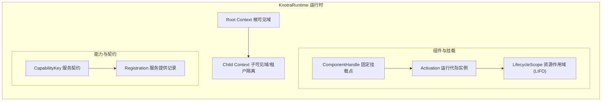
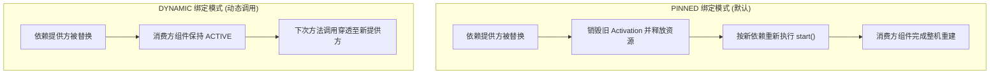
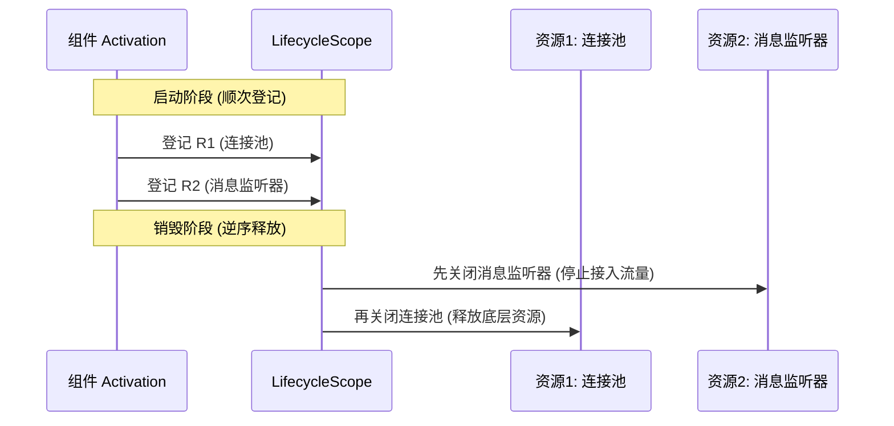
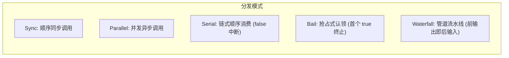

# Knotra API 与集成指南

> 面向核心框架集成与底层扩展开发者，系统阐述 Knotra 的公共 API 契约、事务机制、依赖传播与扩展模块。

---

## 内核架构全景

Knotra 的核心职责是在 JVM 运行期间安全调度组件的替换、依赖重建与资源回收。系统由三层核心结构组成：



- **上下文（Context）**：管理能力可见范围的树状层级。子上下文可以继承父上下文的能力，也可以注册同名能力以实现租户级或环境级遮蔽（Shadowing）。
- **能力（Capability）**：由唯一字符串名称与精确 Java `Class<T>` 唯一定义的服务契约。通过 `provide` 发布，通过 Requirement 声明消费。
- **组件与代际（Component & Activation）**：
  - `ComponentHandle` 是长期稳定的逻辑挂载句柄；
  - `Activation` 是某一次运行的具体物理实例，持有独立的依赖绑定集（BindingSet）和资源作用域（LifecycleScope）。

---

## 核心运行闭环

创建运行时、发布服务并处理热替换：

```java
import io.knotra.*;

try (KnotraRuntime runtime = KnotraRuntime.create()) {

    // 定义服务契约 Key
    CapabilityKey<Tool> TOOL = CapabilityKey.of("app.tool", Tool.class);

    // 发布初始服务实现并获得类型化句柄
    Provided<Tool> toolProvided = runtime.provide(TOOL, new DefaultTool());

    // 运行时原子替换提供方
    Provided<Tool> v2 = toolProvided.replace(new AdvancedTool());
    v2.whenSettled().toCompletableFuture().join();
}
```

`runtime.provide` 同步提交注册并返回不可变的 `Provided<T>` 句柄。调用 `replace` 会在单个结构事务内撤销旧注册并发布新注册，返回新的 `Provided<T>` 句柄，旧句柄随之失效。

---

## 原生组件与依赖绑定

底层组件均通过实现 `ComponentFactory` 接口对外交付：

```java
public final class ToolBoxFactory implements ComponentFactory<NoConfig> {
    @Override
    public Component<NoConfig> create() {
        return new Component<>() {
            @Override
            public ComponentDescriptor descriptor() {
                return ComponentDescriptor.of(
                        CapabilityRequirement.required(TOOL));
            }

            @Override
            public void start(ActivationContext context, NoConfig config) throws Exception {
                // 读取本代固定依赖
                Tool tool = context.require(TOOL);

                // 登记资源清理动作 (LIFO 释放)
                context.lifecycle().onClose("cleanup", () -> System.out.println("释放工具箱资源"));

                // 对外发布组件能力
                context.provide(BOX, new ToolBox(tool));
            }
        };
    }
}
```

挂载组件并等待就绪：

```java
ComponentHandle<NoConfig> boxHandle = runtime.mount("tool-box", new ToolBoxFactory());
boxHandle.requireActive();
```

---

## 依赖绑定模式对比



| 维度 | **PINNED 绑定（默认）** | **DYNAMIC 绑定（动态调用）** |
|---|---|---|
| **声明语法** | `CapabilityRequirement.required(KEY)` | `CapabilityRequirement.dynamicRequired(KEY)` |
| **获取方式** | `context.require(KEY)` | `context.subscribe(KEY)` 或动态代理 |
| **提供方替换行为** | 消费方自动重建（销毁并创建新 Activation） | 消费方保持存活，方法调用动态路由 |
| **适用对象** | 有状态对象、连接池、带有本地缓存的服务 | 无状态服务、外部网关、高频请求路由 |

---

## 结构事务（RuntimeTransaction）

多个结构变更操作需要作为一个原子单元提交时，使用结构事务：

```java
TransactionReceipt<Provided<Tool>> receipt = runtime.transact(tx -> {
    tx.revoke(oldProvided);
    tx.mount(runtime.root(), "worker", workerFactory);
    return tx.provide(runtime.root(), TOOL, new AdvancedTool());
});

System.out.println("事务已提交，当前 generation = " + receipt.generation());
```

事务回调在调用线程执行校验与结构编制。如果存在配置不合法或依赖冲突，事务整体拒绝并抛出 `TransactionRejectedException`，绝不会产生部分提交的中间状态。

---

## 上下文隔离与租户遮蔽

上下文支持树状嵌套，常用于多租户与测试隔离：


```java
// 创建子上下文
ContextHandle usWorkspace = runtime.transact(tx ->
        tx.childContext(runtime.root(), "us-tenant")).value();

// 在子上下文中注册局部能力以遮蔽根能力
usWorkspace.context().ifPresent(ctx -> {
    runtime.transact(tx -> tx.provide(ctx, CURRENCY_RATE, new UsdRateService()));
});

// 递归释放子上下文及其名下所有组件
usWorkspace.disposeAsync().toCompletableFuture().join();
```

---

## 资源作用域与生命周期（`LifecycleScope`）

每个 `Activation` 拥有独立的 `LifecycleScope`，内部登记的资源严格按照后进先出（LIFO）顺序释放：



```java
// 托管同步资源
DataSource ds = context.lifecycle().manage("db-pool", createDataSource());

// 注册清理回调
context.lifecycle().onClose("stop-worker", worker::shutdown);

// 托管异步资源 (返回 CompletionStage)
context.lifecycle().manageAsync("async-consumer", consumer);
```

---

## 动态调用租约（`DynamicCapability`）

动态依赖在调用期间通过**调用租约（Call Lease）**保证执行安全：

```java
DynamicCapability<PaymentGateway> gateway = context.subscribe(PAYMENT_GATEWAY);

// 同步调用 (自动获取租约并释放)
Receipt receipt = gateway.call(gw -> gw.charge(order));

// 异步调用 (租约保持至 CompletionStage 终态)
CompletionStage<Receipt> asyncReceipt = gateway.callAsync(gw -> gw.chargeAsync(order));
```

当提供方被替换或下线时，系统先关闭准入闸门，等待全部在途租约归零后才执行旧实例的销毁清理，确保不会在方法执行中途拔出依赖。

---

## 进程内事件总线（`knotra-events`）

提供支持类型安全与排空保障的事件总线：



```java
runtime.mount("event-bus", new EventBusFactory()).requireActive();
EventBus bus = runtime.root().view().require(EventCapabilities.EVENT_BUS);

EventDefinition.Parallel<OrderCreatedEvent> ORDER_CREATED =
        EventDefinition.parallel(OrderCreatedEvent.class);

EventSubscription sub = bus.subscribe(ORDER_CREATED, event -> {
    System.out.println("收到订单事件: " + event.orderId());
    return CompletableFuture.completedFuture(null);
});

bus.dispatch(ORDER_CREATED, new OrderCreatedEvent("ORD-1001"));
```

---

## PF4J 插件与声明式期望树

### 加载外部插件

```java
try (Pf4jArtifactAdapter adapter = Pf4jArtifactAdapter.create(
        Path.of("plugins"), runtime, Set.of("com.example.contract"))) {

    ArtifactSnapshot snapshot = adapter.loadArtifact(Path.of("plugins/custom-tool.jar"));

    ArtifactFactoryHandle<NoConfig> toolFactory =
            adapter.factories().resolve("custom-tool", NoConfig.class).orElseThrow();

    ComponentHandle<NoConfig> handle = toolFactory.mount(runtime.root(), "tool-instance");
    handle.requireActive();

    adapter.unloadArtifact(snapshot.artifactId());
}
```

### 声明式期望树收敛（`knotra-loader`）

```java
ComponentTree desired = ComponentTree.of(
        ComponentEntry.of("metrics", FactoryRef.of("metrics")),
        ComponentEntry.configured("tool", FactoryRef.of("tool", "1.0.0"), rawConfig)
);

try (KnotraLoader loader = KnotraLoader.over(runtime, runtime.root(), resolver)) {
    ReconcileResult result = loader.reconcile(desired);
    result.requireConverged();
}
```

---

## 运行时快照与观测（`RuntimeSnapshot`）

快照为不可变纯数据传输对象，可用于健康检查与监控指标采集：

```java
RuntimeSnapshot snapshot = runtime.snapshot();

snapshot.components().forEach(c -> {
    System.out.printf("组件 [%s] 状态: %s, 运行代数: %d%n",
            c.componentId(), c.state(), c.generation());
});

snapshot.diagnostics().forEach(d -> {
    System.out.printf("诊断码 [%s]: %s%n", d.code(), d.message());
});
```

---

## 停机关闭顺序

推荐采用从外向内的逆序释放流程：

```java
// 停止 Loader 期望树调度
loader.closeAsync().toCompletableFuture().join();

// 排空并卸载所有 PF4J 插件
plugins.closeAsync().toCompletableFuture().join();

// 关闭核心运行时及残留组件
runtime.closeAsync().toCompletableFuture().join();
```
