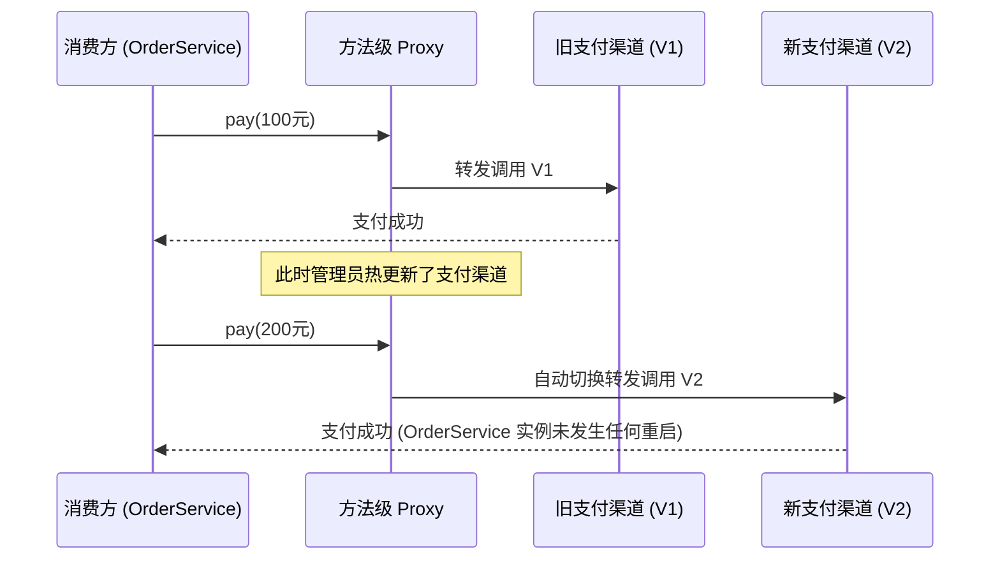
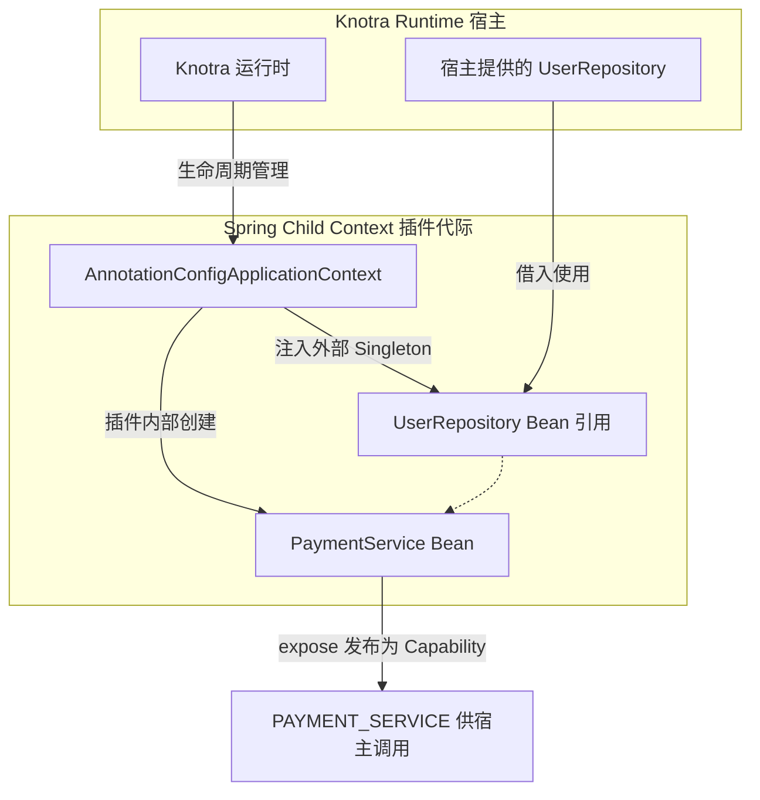
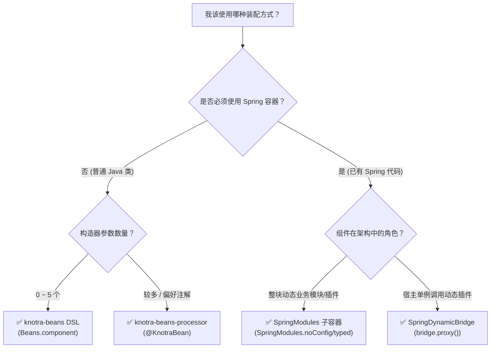

# Knotra Beans 与 Spring 集成指南

> 💡 **面向读者**：如果您熟悉 Java 和 Spring 开发，但完全不了解 Knotra，本文将从零开始，用最熟悉的 Spring 语境带您理解 Knotra 如何管理 POJO 与 Spring 模块的动态生命周期。

---

## 🧭 1. Spring 开发者 3 分钟速览

### 1.1 为什么有了 Spring，还需要 Knotra？

Spring 是优秀的依赖注入与应用容器，但其默认设计是**静态单例模型**：应用启动时初始化所有 Bean，运行期间 Bean 的引用和结构通常不再改变。

当您遇到以下**动态诉求**时，原生 Spring 会面临挑战：
1. **在线热替换业务逻辑**：在不重启 JVM 的情况下，将 `WechatPayService` 热替换为 `AlipayService`。
2. **安全排空（Drain）**：旧插件被替换时，必须等待正在处理的请求安全结束，再销毁旧容器；不能暴力直接 `close()`。
3. **依赖代际一致性**：当底层数据库连接或基础服务更新时，依赖它的上层组件必须自动原子重建，绝不允许上层持有失效的旧连接。

**Knotra 与 Spring 的分工**：
- **Spring** 负责组织组件内部复杂的 Bean 依赖图与生态支持（如 `@Transactional`、MVC 等）；
- **Knotra** 负责在外部作为**“动态运行时调度器”**，管理 Spring 子容器或 POJO 组件的加载、热重载、依赖代际传播与安全排空。

```mermaid
graph TB
    subgraph Knotra 运行时 [Knotra 动态运行时 (Runtime)]
        direction TB
        K[Knotra 事务与生命周期调度]

        subgraph 模式 A: 纯 POJO 模式
            P[POJO Bean: 零外部依赖]
        end

        subgraph 模式 B: Spring 子容器模式
            SC[Spring Child Context: 独立 Spring 容器]
            SC --> B1[Service]
            SC --> B2[Repository]
        end

        subgraph 模式 C: 宿主动态桥模式
            SDB[SpringDynamicBridge 智能代理]
        end
    end

    HostSpring[宿主 Spring Boot 单例 Service] -->|注入代理| SDB
    SDB -->|动态路由| SC
```

---

### 1.2 核心术语人话对照字典

| Knotra 术语 | Spring 对应概念 / 通俗比喻 | 含义解释 |
|---|---|---|
| **`CapabilityKey<T>`** | 接口契约标识符（类似带类型的 Bean Name） | 用名称 + Java `Class<T>` 唯一标识一项服务接口。 |
| **`ComponentHandle<C>`** | 永久插座（固定挂载点） | 组件在系统中的永久挂载点，热替换期间该句柄保持稳定不变。 |
| **`Activation`** | 当前运行的一代实例（运行中的灯泡） | 某一次实际运行的 Bean 实例或 Spring 容器。依赖变更时，旧 Activation 销毁，新 Activation 启动。 |
| **`PINNED` 依赖** | 普通 `@Autowired` 依赖（固定注入） | 启动时注入具体对象；一旦被注入的对象被替换，消费方组件会自动**整机重启（重新 new）**以获取新依赖。 |
| **`DYNAMIC` 依赖** | 智能动态代理（Proxy） | 注入一个智能代理，每次方法调用时自动路由到最新实现，**消费方无需重启**。 |
| **`External Singleton`** | 外部借入的单例 | Knotra 把宿主提供的对象借给 Spring 子容器使用，Spring 销毁时**绝不会**自作主张把它 close 掉。 |
| **`LifecycleScope`** | 资源清理清单（LIFO 顺序） | 记录该代实例申请的所有连接、线程和资源，销毁时按严格后进先出释放。 |

---

## 📦 2. Maven 依赖引入

在项目的 `pom.xml` 中引入 BOM 对齐版本：

```xml
<properties>
  <knotra.version>0.1.0-SNAPSHOT</knotra.version>
</properties>

<dependencyManagement>
  <dependencies>
    <dependency>
      <groupId>io.knotra</groupId>
      <artifactId>knotra-bom</artifactId>
      <version>${knotra.version}</version>
      <type>pom</type>
      <scope>import</scope>
    </dependency>
  </dependencies>
</dependencyManagement>

<dependencies>
  <!-- 普通 Java 应用引入 starter -->
  <dependency>
    <groupId>io.knotra</groupId>
    <artifactId>knotra-starter</artifactId>
  </dependency>

  <!-- Spring 应用引入 spring-starter -->
  <dependency>
    <groupId>io.knotra</groupId>
    <artifactId>knotra-spring-starter</artifactId>
  </dependency>
</dependencies>
```

---

## 🚀 3. 模式一：纯 POJO 业务组件装配（`knotra-beans`）

很多时候，插件或业务策略根本不需要引入庞大的 Spring 容器。`knotra-beans` 提供了一个流畅的 DSL，让**普通的 Java POJO 也能享受类型安全的依赖注入与热重载**。

### 3.1 编写干净的业务类（零框架依赖）

```java
// 1. 业务接口
public interface Greeting {
    String greet(String name);
}

// 2. 纯 Java 实现（无需实现 Knotra 的任何接口）
public final class GreetingBean implements Greeting, AutoCloseable {
    @Override
    public String greet(String name) {
        return "Hello, " + name;
    }

    @Override
    public void close() {
        System.out.println("GreetingBean 资源已安全释放！");
    }
}
```

### 3.2 装配与启动

```java
import io.knotra.*;
import io.knotra.beans.*;

// 1. 定义 Capability 契约 Key
static final CapabilityKey<Greeting> GREETING =
        CapabilityKey.of("app.greeting", Greeting.class);

// 2. 使用 DSL 定义 Bean
BeanDefinition<NoConfig, GreetingBean> factory = Beans.component("greeting")
        .create(GreetingBean::new)      // 构造函数
        .provide(GREETING)              // 对外发布的能力
        .build();

// 3. 挂载并启动
try (KnotraRuntime runtime = KnotraRuntime.create()) {
    ComponentHandle<NoConfig> handle = Beans.mount(runtime, factory);
    handle.requireActive(); // 确保组件启动成功
}
```

### 3.3 依赖注入：Required 与 Optional

当组件需要依赖其他服务时，使用 `with(...)` 进行声明：

```java
static final CapabilityKey<UserRepository> USERS =
        CapabilityKey.of("app.users", UserRepository.class);
static final CapabilityKey<Metrics> METRICS =
        CapabilityKey.of("app.metrics", Metrics.class);
static final CapabilityKey<UserService> USER_SERVICE =
        CapabilityKey.of("app.user-service", UserService.class);

// UserService 构造函数接收 UserRepository 和 Optional<Metrics>
BeanDefinition<NoConfig, UserService> userDef = Beans.component("user-service")
        .with(
                Beans.required(USERS),    // 必需依赖：缺失则等待
                Beans.optional(METRICS)   // 可选依赖：收到 Optional<Metrics>
        )
        .create((users, metrics) -> new UserService(users, metrics))
        .provide(USER_SERVICE)
        .build();
```

| 依赖申明方式 | 构造函数收到的参数类型 | 当依赖提供者被热替换时 |
|---|---|---|
| `Beans.required(KEY)` | `T` | **自动重载消费方**（PINNED 语义：重新 new UserService） |
| `Beans.optional(KEY)` | `Optional<T>` | **自动重载消费方**（注入最新的 Optional） |
| `Beans.dynamicProxyRequired(KEY)` | `T` (智能代理) | **消费方不重载**，调用时自动路由到最新 Provider |
| `Beans.dynamicRequired(KEY)` | `DynamicCapability<T>` | **消费方不重载**，通过 `call()` 块固定单次调用的 Provider |

---

### 3.4 动态依赖（Dynamic）：热替换时不重启消费方

如果您希望 Provider 替换时，消费方完全不需要重建（适合无状态服务或高频调用的网关），使用 **动态代理**：



```java
static final CapabilityKey<PaymentGateway> PAYMENT =
        CapabilityKey.of("app.payment", PaymentGateway.class);

BeanDefinition<NoConfig, CheckoutService> checkoutDef = Beans.component("checkout")
        .with(Beans.dynamicProxyRequired(PAYMENT)) // 注入动态代理
        .create(CheckoutService::new)
        .build();
```

---

## ⚡ 4. 模式二：编译期注解驱动（`knotra-beans-processor`）

如果您不想手写 `Beans.component()` DSL，Knotra 提供了**编译期注解处理器**。它在 `javac` 编译时直接生成 Java 代码，**零反射、启动极快**。

### 4.1 配置 Maven Compiler Plugin

```xml
<build>
  <plugins>
    <plugin>
      <groupId>org.apache.maven.plugins</groupId>
      <artifactId>maven-compiler-plugin</artifactId>
      <configuration>
        <annotationProcessorPaths>
          <path>
            <groupId>io.knotra</groupId>
            <artifactId>knotra-beans-processor</artifactId>
            <version>${knotra.version}</version>
          </path>
        </annotationProcessorPaths>
      </configuration>
    </plugin>
  </plugins>
</build>
```

### 4.2 像写 Spring 组件一样标注注解

```java
package com.example.service;

import io.knotra.beans.annotation.*;
import java.util.Optional;

@KnotraBean(id = "order-service")
@KnotraOutput(name = "app.order-service", contract = OrderService.class)
public final class DefaultOrderService implements OrderService {

    private final UserRepository users;
    private final Optional<Metrics> metrics;
    private final PaymentGateway payment;

    @KnotraConstructor
    DefaultOrderService(
            @KnotraRequire("app.users") UserRepository users,
            @KnotraOptional("app.metrics") Optional<Metrics> metrics,
            @KnotraDynamicProxy("app.payment") PaymentGateway payment) {
        this.users = users;
        this.metrics = metrics;
        this.payment = payment;
    }

    @KnotraInit
    void init() {
        System.out.println("订单服务启动初始化！");
    }

    @KnotraDestroy
    public void close() {
        System.out.println("订单服务销毁清理！");
    }
}
```

编译后，Processor 会自动在同一包下生成 `DefaultOrderService_KnotraFactory.java`，直接使用即可：

```java
DefaultOrderService_KnotraFactory factory = new DefaultOrderService_KnotraFactory();
ComponentHandle<NoConfig> handle = Beans.mount(runtime, factory.definition());
handle.requireActive();
```

---

## 🍃 5. 模式三：Spring 子容器动态插拔（`SpringModules`）

这是**将一整套 Spring 模块（包含多个 `@Service`、`@Repository`、`@Configuration`）打包为动态插件**的核心模式。

### 5.1 工作机制图解



### 5.2 完整上手步骤

#### 第一步：编写插件内部的 Spring `@Configuration`

```java
package com.example.plugin;

import org.springframework.context.annotation.Bean;
import org.springframework.context.annotation.Configuration;

@Configuration
public class PluginSpringConfig {

    // UserRepository 是从宿主环境注入进来的
    @Bean
    public PaymentService paymentService(UserRepository users) {
        return new WechatPaymentService(users);
    }
}
```

#### 第二步：用 `SpringModules` 定义子容器

```java
import io.knotra.spring.SpringModules;

ComponentFactory<NoConfig> pluginFactory = SpringModules.noConfig("payment-plugin")
        // 1. 扫描插件的 Spring 配置类
        .annotatedClasses(PluginSpringConfig.class)
        // 2. 声明需要从 Knotra 借入的依赖，并指定在 Spring 容器中的 Bean Name
        .required("users", USER_REPOSITORY_KEY)
        // 3. 声明把插件内部的哪个 Spring Bean 暴露为外部 Capability
        .expose(PAYMENT_SERVICE_KEY, "paymentService")
        .build();

// 挂载并启动 Spring 子容器
ComponentHandle<NoConfig> pluginHandle = runtime.mount("payment-plugin", pluginFactory);
pluginHandle.requireActive();
```

> 🔍 **发生了什么？**
> 1. Knotra 自动为该插件创建独立的 `AnnotationConfigApplicationContext`；
> 2. 将外部借入的 `UserRepository` 注册为 Spring 单例；
> 3. 调用 `context.refresh()` 启动容器；
> 4. 获取名为 `paymentService` 的 Bean 并发布到 Knotra 运行时中；
> 5. 当外部 `USER_REPOSITORY_KEY` 发生热替换时，Knotra 会**自动优雅关闭当前 Spring 容器，并重新创建一个新的 Spring 容器**！

---

## 🌉 6. 模式四：Spring 宿主动态桥（`SpringDynamicBridge`）

### 6.1 场景：在宿主 Spring Boot 单例中无感知调用动态插件

在典型的 Spring Boot 宿主应用中，您的 Controller 或 Service 是单例的，无法随意重启。但它又需要调用某个可能会动态热更新的插件接口。

`SpringDynamicBridge` 会为 Spring 主容器提供一个**永不失效的动态代理对象**：

```java
@Configuration
public class HostSpringConfiguration {

    @Bean
    public SpringDynamicBridge<PaymentGateway> paymentBridge(KnotraRuntime runtime) {
        return SpringDynamicBridge.mount(
                runtime,
                "payment-bridge",
                DYNAMIC_PAYMENT_KEY,      // 插件实际发布的 Key
                SPRING_PAYMENT_KEY        // 暴露给 Spring 宿主的 Key
        );
    }

    // 将 Bridge 生成的代理对象直接暴露为 Spring Bean
    @Bean
    public PaymentGateway paymentGateway(SpringDynamicBridge<PaymentGateway> bridge) {
        return bridge.proxy();
    }
}
```

在您的 Spring 业务代码中直接像普通 Bean 一样使用：

```java
@Service
public class OrderController {

    @Autowired
    private PaymentGateway paymentGateway; // 这是一个智能代理

    public void checkout(Order order) {
        // 无论底层插件如何升级替换，这里的调用都会自动路由到当前最新可用的插件实现！
        paymentGateway.charge(order);
    }
}
```

---

## 🛠️ 7. 常见场景选型决策指南



---

## ⚠️ 8. 避坑与核心原则

1. **不要在 Spring 子容器中重复扫描宿主的 Bean**：
   - Spring 子容器应该保持精简，只包含插件自身的 `@Configuration`。外部依赖一律通过 `.required("name", KEY)` 显式借入。
2. **外部借入对象的所有权（External Singleton）**：
   - 从宿主借入的依赖对象不归 Spring 子容器所有。Spring 子容器销毁时，**不会**调用这些借入对象的 `@PreDestroy` 或 `close()`。
3. **多方法事务请使用显式 `withCurrent`**：
   - 动态代理（Proxy）的方法调用是**单方法独立路由**的。如果您需要连续执行多步操作（例如 `begin() -> charge() -> commit()`）且必须落在同一个插件实例上，请使用：
   ```java
   bridge.withCurrent(gateway -> {
       gateway.begin();
       gateway.charge(order);
       gateway.commit();
       return null;
   });
   ```
