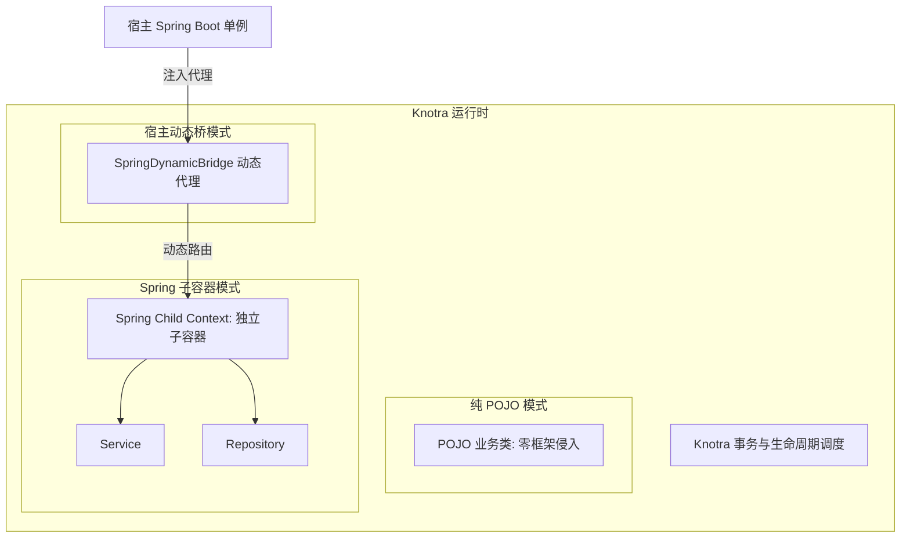
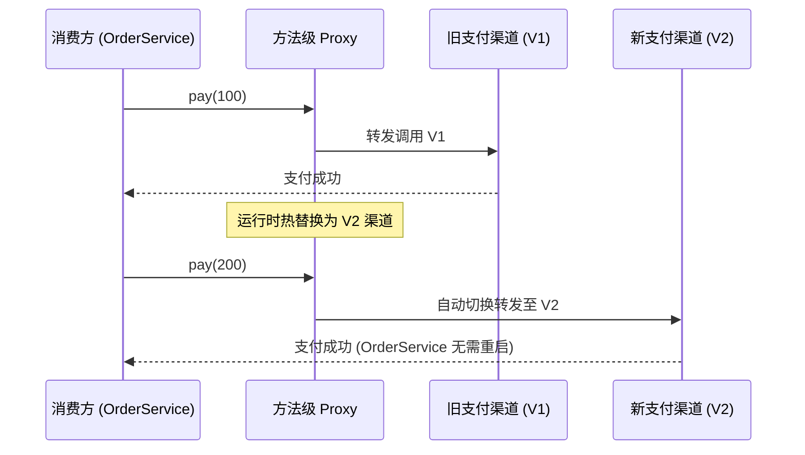
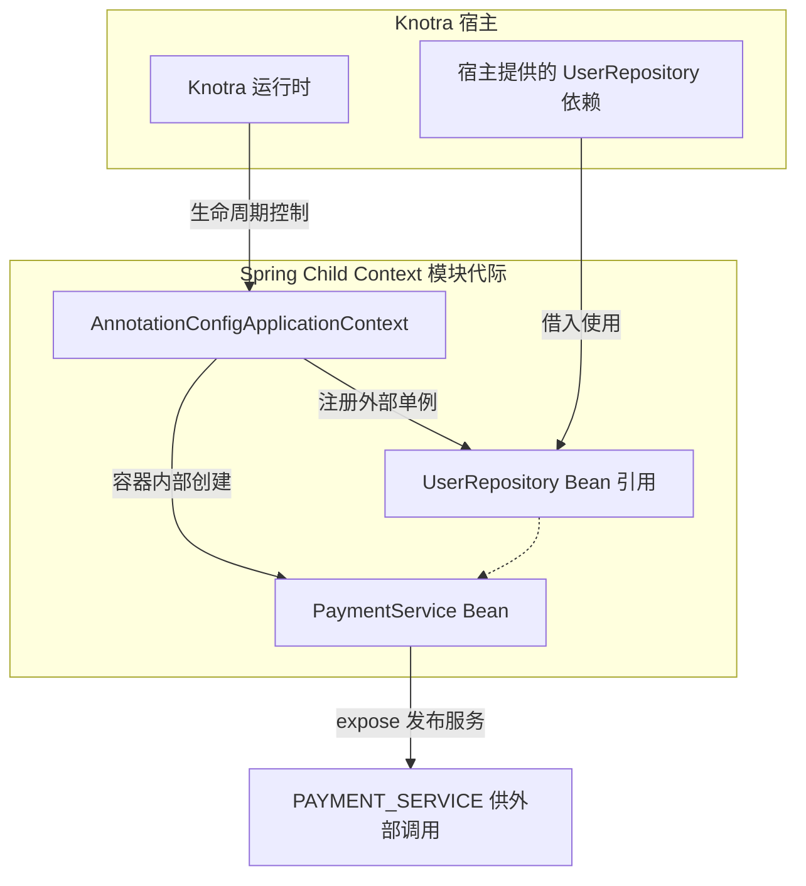
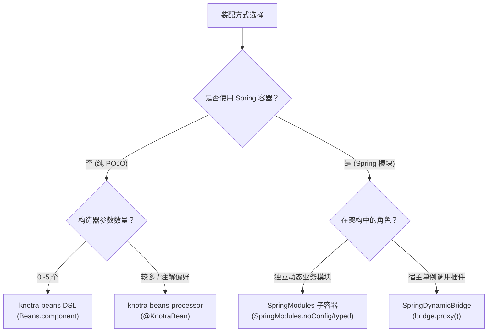

# Knotra Beans 与 Spring 集成指南

> 面向 Java 与 Spring 开发者，介绍如何使用 Knotra 管理普通 POJO 对象图以及 Spring 模块的动态生命周期。

---

## 架构定位与职责划分

Spring 容器是静态单例模型的代表：容器在应用启动时构建完整的 Bean 依赖图，运行期间 Bean 的引用和结构通常不再改变。当业务需要在线热替换某个实现、动态加载外部插件或局部重建故障模块时，原生 Spring 无法提供在途请求排空和依赖代际隔离的保证。

Knotra 与 Spring 采用分层协作架构：

- **Spring**：负责模块内部的 Bean 装配、AOP 增强、事务管理以及生态集成。
- **Knotra**：作为外层动态调度器，负责管理 Spring 子容器或纯 POJO 组件的挂载、热重载、依赖代际传播与安全排空。



---

## 核心概念对照

| Knotra 概念 | Spring 对应物 / 映射 | 机制与职责 |
|---|---|---|
| **`CapabilityKey<T>`** | 类型化 Bean 标识 | 由名称与 Java `Class<T>` 唯一定义的服务契约，跨模块共享。 |
| **`ComponentHandle<C>`** | 稳定挂载点句柄 | 逻辑挂载点，热替换期间句柄身份保持不变。 |
| **`Activation`** | 容器运行代际（代际实例） | 某一次实际运行的 Bean 实例或 Spring 容器；依赖更新时旧代际销毁、新代际启动。 |
| **`PINNED` 依赖** | 静态注入（类似普通 `@Autowired`） | 启动时固化依赖；当被依赖方替换时，消费方整机重建以加载新依赖。 |
| **`DYNAMIC` 依赖** | 动态代理注入 | 注入方法级代理，每次调用解析最新实现，底层替换时消费方不重启。 |
| **`External Singleton`** | 外部借入单例 | 宿主借给 Spring 子容器使用的对象；子容器销毁时不会触发其释放逻辑。 |
| **`LifecycleScope`** | 资源作用域（LIFO） | 托管该代际创建的所有底层资源，销毁时按后进先出严格逆序释放。 |

---

## Maven 依赖配置

在多模块工程的 `pom.xml` 中引入 BOM 与对应模块：

```xml
<properties>
  <knotra.version>0.1.0-SNAPSHOT</knotra.version>
</properties>

<dependencyManagement>
  <dependencies>
    <dependency>
      <groupId>io.knotra</groupId>
      <artifactId>knotra-bom</artifactId>
      <version>${knotra.version}</version>
      <type>pom</type>
      <scope>import</scope>
    </dependency>
  </dependencies>
</dependencyManagement>

<dependencies>
  <!-- 普通 POJO 装配引入 starter -->
  <dependency>
    <groupId>io.knotra</groupId>
    <artifactId>knotra-starter</artifactId>
  </dependency>

  <!-- Spring 子容器与桥接引入 spring-starter -->
  <dependency>
    <groupId>io.knotra</groupId>
    <artifactId>knotra-spring-starter</artifactId>
  </dependency>
</dependencies>
```

---

## 纯 POJO 业务组件装配（`knotra-beans`）

无需引入 Spring 容器即可实现类型安全的依赖注入与动态热重载。

### 基础组件装配与挂载

业务类保持标准的 Java 对象结构，无需实现 Knotra 专有接口：

```java
package com.example.demo;

import io.knotra.*;
import io.knotra.beans.*;

// 业务接口
public interface Greeting {
    String greet(String name);
}

// 业务实现类
public final class GreetingBean implements Greeting, AutoCloseable {
    @Override
    public String greet(String name) {
        return "Hello, " + name;
    }

    @Override
    public void close() {
        System.out.println("GreetingBean 资源已释放");
    }
}
```

通过 `Beans.component` DSL 声明依赖、构造方式以及对外暴露的能力：

```java
package com.example.demo;

import io.knotra.*;
import io.knotra.beans.*;

public class PojoDemo {
    // 声明能力契约 Key
    public static final CapabilityKey<Greeting> GREETING =
            CapabilityKey.of("app.greeting", Greeting.class);

    public static void main(String[] args) {
        // 定义组件工厂
        BeanDefinition<NoConfig, GreetingBean> definition = Beans.component("greeting")
                .create(GreetingBean::new)
                .provide(GREETING)
                .build();

        try (KnotraRuntime runtime = KnotraRuntime.create()) {
            // 挂载组件并等待就绪
            ComponentHandle<NoConfig> handle = Beans.mount(runtime, definition);
            handle.requireActive();

            Greeting greeting = runtime.root().view().require(GREETING);
            System.out.println(greeting.greet("Knotra"));
        }
    }
}
```

### 依赖注入：Required 与 Optional

当组件依赖外部服务时，先定义相关接口与对应的 `CapabilityKey`，再通过 `with(...)` 注入构造函数：

```java
package com.example.demo;

import io.knotra.CapabilityKey;
import java.util.Optional;

// 依赖接口
public interface UserRepository {
    String findUserName(long id);
}

public interface Metrics {
    void record(String metricName);
}

// 消费方业务类
public final class UserService {
    private final UserRepository userRepository;
    private final Optional<Metrics> metrics;

    public UserService(UserRepository userRepository, Optional<Metrics> metrics) {
        this.userRepository = userRepository;
        this.metrics = metrics;
    }

    public String getUserInfo(long id) {
        metrics.ifPresent(m -> m.record("user.query"));
        return "User: " + userRepository.findUserName(id);
    }
}
```

在装配层声明契约并完成构造器注入：

```java
package com.example.demo;

import io.knotra.*;
import io.knotra.beans.*;

public class UserServiceAssembly {
    public static final CapabilityKey<UserRepository> USERS =
            CapabilityKey.of("app.users", UserRepository.class);
    public static final CapabilityKey<Metrics> METRICS =
            CapabilityKey.of("app.metrics", Metrics.class);
    public static final CapabilityKey<UserService> USER_SERVICE =
            CapabilityKey.of("app.user-service", UserService.class);

    public static BeanDefinition<NoConfig, UserService> createDefinition() {
        return Beans.component("user-service")
                .with(
                        Beans.required(USERS),    // 必需依赖：缺失时组件保持 WAITING
                        Beans.optional(METRICS)   // 可选依赖：构造函数接收 Optional<Metrics>
                )
                .create((users, metrics) -> new UserService(users, metrics))
                .provide(USER_SERVICE)
                .build();
    }
}
```

| 依赖声明语法 | 构造函数参数类型 | 提供方替换时的运行时行为 |
|---|---|---|
| `Beans.required(KEY)` | `T` | 默认 PINNED 模式：自动销毁旧实例，重新执行构造函数重建消费方。 |
| `Beans.optional(KEY)` | `Optional<T>` | 默认 PINNED 模式：注入最新 Optional，自动触发消费方重建。 |
| `Beans.dynamicProxyRequired(KEY)` | `T` (动态代理) | DYNAMIC 模式：消费方不重启，每次方法调用穿透到最新提供方。 |
| `Beans.dynamicRequired(KEY)` | `DynamicCapability<T>` | DYNAMIC 模式：消费方不重启，通过代码块显式获取调用租约。 |

---

### 动态依赖：调用时不重启消费方

当注入无状态服务或高频调用的网关接口时，使用 `dynamicProxyRequired`。底层替换提供方时，消费方实例不会重建：



业务类与契约定义：

```java
package com.example.demo;

import io.knotra.CapabilityKey;

public interface PaymentGateway {
    String charge(String orderId, double amount);
}

public final class CheckoutService {
    private final PaymentGateway paymentGateway; // 注入动态代理

    public CheckoutService(PaymentGateway paymentGateway) {
        this.paymentGateway = paymentGateway;
    }

    public void checkout(String orderId, double amount) {
        paymentGateway.charge(orderId, amount);
    }
}
```

装配层注入动态代理：

```java
package com.example.demo;

import io.knotra.*;
import io.knotra.beans.*;

public class CheckoutAssembly {
    public static final CapabilityKey<PaymentGateway> PAYMENT_GATEWAY =
            CapabilityKey.of("app.payment-gateway", PaymentGateway.class);
    public static final CapabilityKey<CheckoutService> CHECKOUT_SERVICE =
            CapabilityKey.of("app.checkout-service", CheckoutService.class);

    public static BeanDefinition<NoConfig, CheckoutService> createDefinition() {
        return Beans.component("checkout-service")
                .with(Beans.dynamicProxyRequired(PAYMENT_GATEWAY))
                .create(CheckoutService::new)
                .provide(CHECKOUT_SERVICE)
                .build();
    }
}
```

---

## 编译期注解驱动（`knotra-beans-processor`）

对于构造参数较多或偏好注解声明的项目，可以使用编译期注解处理器在 `javac` 阶段生成无反射的工厂类。

### 配置编译器插件

```xml
<build>
  <plugins>
    <plugin>
      <groupId>org.apache.maven.plugins</groupId>
      <artifactId>maven-compiler-plugin</artifactId>
      <configuration>
        <annotationProcessorPaths>
          <path>
            <groupId>io.knotra</groupId>
            <artifactId>knotra-beans-processor</artifactId>
            <version>${knotra.version}</version>
          </path>
        </annotationProcessorPaths>
      </configuration>
    </plugin>
  </plugins>
</build>
```

### 标注业务类

```java
package com.example.service;

import com.example.demo.Metrics;
import com.example.demo.PaymentGateway;
import com.example.demo.UserRepository;
import io.knotra.beans.annotation.*;
import java.util.Optional;

// 业务接口
public interface OrderService {
    void processOrder(String orderId);
}

// 业务实现与注解标注
@KnotraBean(id = "order-service")
@KnotraOutput(name = "app.order-service", contract = OrderService.class)
public final class DefaultOrderService implements OrderService {

    private final UserRepository users;
    private final Optional<Metrics> metrics;
    private final PaymentGateway payment;

    @KnotraConstructor
    DefaultOrderService(
            @KnotraRequire("app.users") UserRepository users,
            @KnotraOptional("app.metrics") Optional<Metrics> metrics,
            @KnotraDynamicProxy("app.payment-gateway") PaymentGateway payment) {
        this.users = users;
        this.metrics = metrics;
        this.payment = payment;
    }

    @Override
    public void processOrder(String orderId) {
        payment.charge(orderId, 99.0);
    }

    @KnotraInit
    void init() {
        // 初始化逻辑：此时资源清理已登记，输出尚未对外发布
    }

    @KnotraDestroy
    public void close() {
        // 幂等清理逻辑
    }
}
```

编译期处理器会在同包下生成 `DefaultOrderService_KnotraFactory.java`，直接调用即可完成挂载：

```java
package com.example.service;

import io.knotra.*;
import io.knotra.beans.*;

public class AnnotationDemo {
    public static void main(String[] args) {
        try (KnotraRuntime runtime = KnotraRuntime.create()) {
            DefaultOrderService_KnotraFactory factory = new DefaultOrderService_KnotraFactory();
            ComponentHandle<NoConfig> handle = Beans.mount(runtime, factory.definition());
            handle.requireActive();
        }
    }
}
```

---

## Spring 子容器动态插拔（`SpringModules`）

将一组包含多个 `@Service`、`@Repository` 的 Spring 配置作为独立模块在运行时动态加载与卸载。

### 架构机制



### 完整装配示例

首先声明跨边界的契约接口与能力 Key：

```java
package com.example.contracts;

import io.knotra.CapabilityKey;

public interface UserRepository {
    String findUserAddress(String userId);
}

public interface PaymentService {
    String pay(String orderId, double amount);
}

public final class AppContracts {
    public static final CapabilityKey<UserRepository> USER_REPOSITORY =
            CapabilityKey.of("app.user-repository", UserRepository.class);
    public static final CapabilityKey<PaymentService> PAYMENT_SERVICE =
            CapabilityKey.of("app.payment-service", PaymentService.class);
}
```

编写插件子模块内部的 Spring 配置与 Bean：

```java
package com.example.plugin;

import com.example.contracts.PaymentService;
import com.example.contracts.UserRepository;
import org.springframework.context.annotation.Bean;
import org.springframework.context.annotation.Configuration;

public final class WechatPaymentService implements PaymentService {
    private final UserRepository userRepository;

    public WechatPaymentService(UserRepository userRepository) {
        this.userRepository = userRepository;
    }

    @Override
    public String pay(String orderId, double amount) {
        String address = userRepository.findUserAddress("user-101");
        return "WechatPay success for order " + orderId + " shipped to " + address;
    }
}

@Configuration
public class PluginSpringConfig {

    // UserRepository 由 Knotra 从外部借入并作为 External Singleton 注册进容器
    @Bean
    public PaymentService paymentService(UserRepository userRepository) {
        return new WechatPaymentService(userRepository);
    }
}
```

宿主环境组装与运行：

```java
package com.example.host;

import com.example.contracts.*;
import com.example.plugin.PluginSpringConfig;
import io.knotra.*;
import io.knotra.spring.SpringModules;

public class SpringChildContextDemo {
    public static void main(String[] args) {
        try (KnotraRuntime runtime = KnotraRuntime.create()) {

            // 1. 宿主提供基础能力
            runtime.provide(AppContracts.USER_REPOSITORY, userId -> "北京市朝阳区");

            // 2. 声明 Spring 子容器组件
            ComponentFactory<NoConfig> pluginFactory = SpringModules.noConfig("payment-plugin")
                    .annotatedClasses(PluginSpringConfig.class)
                    // 从宿主借入 UserRepository 并以 "userRepository" 为名注入 Spring 容器
                    .required("userRepository", AppContracts.USER_REPOSITORY)
                    // 将 Spring 容器内名为 "paymentService" 的 Bean 暴露为 Knotra 能力
                    .expose(AppContracts.PAYMENT_SERVICE, "paymentService")
                    .build();

            // 3. 挂载子容器并消费服务
            ComponentHandle<NoConfig> pluginHandle = runtime.mount("payment-plugin", pluginFactory);
            pluginHandle.requireActive();

            PaymentService paymentService = runtime.root().view().require(AppContracts.PAYMENT_SERVICE);
            System.out.println(paymentService.pay("ORD-999", 50.0));
        }
    }
}
```

运行时机制：
- Knotra 为该组件独立创建 `AnnotationConfigApplicationContext`。
- 将外部借入的 `UserRepository` 注册为 Spring 单例（External Singleton）。
- 执行 `refresh()` 启动容器，并将内部创建的 `paymentService` 发布为 Knotra 能力。
- 当外部依赖 `USER_REPOSITORY` 替换时，Knotra 会优雅关闭当前子容器并创建新代际。

---

## Spring 宿主动态桥（`SpringDynamicBridge`）

### 在宿主单例中调用动态插件

在 Spring Boot 宿主应用中，Controller 与 Service 属于静态单例。通过 `SpringDynamicBridge` 可以向 Spring 宿主注入一个永久有效的动态代理：

首先定义接口与契约 Key：

```java
package com.example.bridge;

import io.knotra.CapabilityKey;

public interface NotificationGateway {
    void sendNotification(String userId, String message);
}

public final class BridgeContracts {
    // 动态插件实际注册的 Key
    public static final CapabilityKey<NotificationGateway> DYNAMIC_NOTIFICATION =
            CapabilityKey.of("plugin.notification", NotificationGateway.class);

    // 暴露给 Spring 宿主使用的 Key
    public static final CapabilityKey<NotificationGateway> SPRING_NOTIFICATION =
            CapabilityKey.of("spring.notification", NotificationGateway.class);
}
```

在 Spring 宿主配置中挂载桥接组件并将代理对象注册为 Spring Bean：

```java
package com.example.bridge;

import io.knotra.KnotraRuntime;
import io.knotra.spring.SpringDynamicBridge;
import org.springframework.context.annotation.Bean;
import org.springframework.context.annotation.Configuration;

@Configuration
public class HostSpringConfiguration {

    @Bean
    public SpringDynamicBridge<NotificationGateway> notificationBridge(KnotraRuntime runtime) {
        return SpringDynamicBridge.mount(
                runtime,
                "notification-bridge",
                BridgeContracts.DYNAMIC_NOTIFICATION,  // 来源动态 Key
                BridgeContracts.SPRING_NOTIFICATION   // 目标宿主 Key
        );
    }

    @Bean
    public NotificationGateway notificationGateway(SpringDynamicBridge<NotificationGateway> bridge) {
        return bridge.proxy(); // 返回稳定的动态代理对象
    }
}
```

在宿主业务代码中正常注入使用：

```java
package com.example.bridge;

import org.springframework.beans.factory.annotation.Autowired;
import org.springframework.stereotype.Service;

@Service
public class OrderNotificationService {

    @Autowired
    private NotificationGateway notificationGateway; // 注入动态代理

    public void notifyCustomer(String orderId, String userId) {
        // 底层插件热替换时，调用自动路由至当前最新可用的通知插件实现
        notificationGateway.sendNotification(userId, "Your order " + orderId + " has shipped!");
    }
}
```

---

## 常见场景选型决策



---

## 边界与核心避坑原则

- **避免子容器扫描宿主 Bean**：子容器配置类应保持独立，外部依赖必须通过 `.required("name", KEY)` 显式借入。
- **外部单例所有权隔离**：借入的 External Singleton 由宿主或外层提供方拥有，Spring 子容器销毁时不会触发它们的 `@PreDestroy` 或 `close()`。
- **多方法调用需使用显式租约**：动态代理仅保证单方法调用的原子路由。涉及多方法组合（如 `begin() -> process() -> commit()`）时，必须使用显式租约代码块：
  ```java
  bridge.withCurrent(gateway -> {
      gateway.sendNotification("user-1", "msg 1");
      gateway.sendNotification("user-2", "msg 2");
      return null;
  });
  ```
