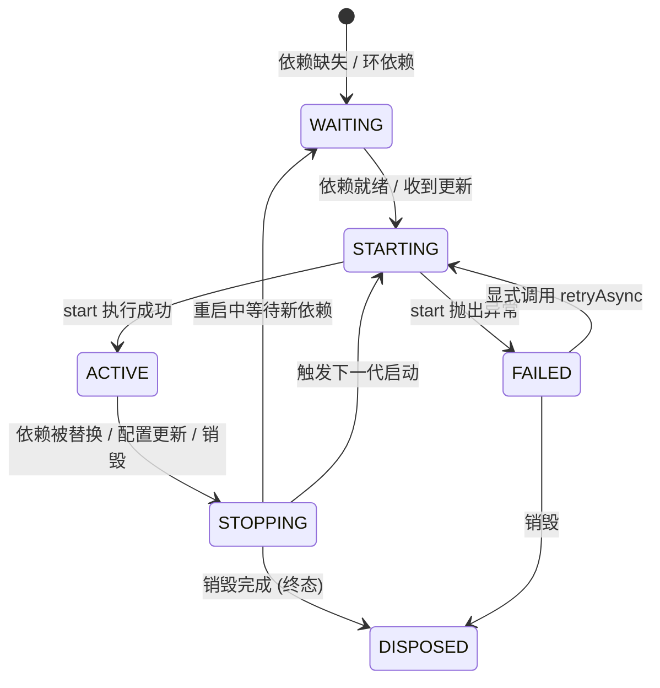

# Knotra FAQ 与排障指南

> 面向运维与开发排障，提供针对组件卡顿、调用异常与类加载器泄漏的标准化处置路径。

---

## 排查入口与观察方法

系统发生异常时，首先采集不可变运行时快照并定位非正常状态组件：

```java
package com.example.troubleshoot;

import io.knotra.*;

public class DiagnosticHelper {
    public static void printDiagnostics(KnotraRuntime runtime) {
        RuntimeSnapshot snapshot = runtime.snapshot();

        // 打印所有异常诊断码
        snapshot.diagnostics().forEach(diag -> {
            System.err.printf("[告警] 错误码: %s, 说明: %s, 关联路径: %s%n",
                    diag.code(), diag.message(), diag.path());
        });

        // 过滤处于异常或过渡状态的组件
        snapshot.components().stream()
                .filter(c -> c.state() != ComponentState.ACTIVE)
                .forEach(c -> {
                    System.err.printf("[异常组件] ID: %s, 当前状态: %s, 目标: %s%n",
                            c.componentId(), c.state(), c.goal());
                });
    }
}
```

---

## 状态机速查

### 组件状态流转



| 组件状态 | 状态语义 | 产生原因 | 应对措施 |
|---|---|---|---|
| **`WAITING`** | 等待依赖 | 必需依赖（REQUIRED）缺失、存在依赖环或配置不满足。 | 确认缺少的能力契约并发布对应提供方。 |
| **`STARTING`** | 启动中 | 组件 `start()` 逻辑执行耗时或子挂载尚未就绪。 | 检查 `start()` 中是否存在长时间阻塞调用。 |
| **`ACTIVE`** | 正常运行 | 组件启动成功且对外提供能力。 | 正常状态。 |
| **`STOPPING`** | 正在停止 | 正在等待在途动态调用租约归零或异步清理未完成。 | 等待任务排空，或排查是否存在卡死连接。 |
| **`FAILED`** | 失败保留 | 启动抛出异常或清理钩子执行失败。 | 查阅诊断原因，修复后调用 `retryAsync()`。 |
| **`DISPOSED`** | 已销毁 | 组件及其名下资源已彻底卸载。 | 终态，无需处理。 |

---

## 常见诊断码与处置方案

| 诊断码 (Enum) | 触发根因 | 处置措施 |
|---|---|---|
| **`MISSING_CAPABILITY`** | 必需依赖未满足，当前上下文中找不到对应提供方。 | 检查该能力是否已通过 `provide` 发布，核对 Key 的名称与 Class 对象是否一致。 |
| **`BINDING_CYCLE`** | 组件间存在循环依赖路径。 | 重构解耦，打破环路，或将其中一方调整为动态代理依赖。 |
| **`INVALID_CONFIG`** | 类型化配置对象为 null 或配置校验器（normalizer）抛出校验异常。 | 检查传入的 Config 对象格式，修正 normalizer 规则。 |
| **`ACTIVATION_FAILED`** | 组件的 `start()` 方法或构造函数执行时抛出异常。 | 查看异常根因并修复业务代码，随后调用 `handle.retryAsync()`。 |
| **`CLEANUP_FAILED`** | 组件销毁时已登记的清理钩子抛出异常。 | 确保清理逻辑具备幂等性；修复后调用 `handle.retryAsync()` 重新执行失败条目。 |
| **`CAPABILITY_SLOT_OCCUPIED`** | 同一个上下文内尝试重复发布同名能力。 | 避免重复调用 `provide()`；如需替换，使用 `Provided.replace()`。 |

---

## 常见场景排查

### 组件挂载后保持 WAITING 状态

检查快照中未就绪的依赖项：

```java
package com.example.troubleshoot;

import io.knotra.*;

public class WaitingComponentInspector {
    public static void inspect(KnotraRuntime runtime) {
        RuntimeSnapshot snapshot = runtime.snapshot();
        if (snapshot.components().isEmpty()) {
            return;
        }

        ComponentSnapshot comp = snapshot.components().get(0);
        comp.requirements().forEach(req -> {
            System.out.printf("依赖 [%s], 模式: %s, 是否已绑定: %s%n",
                    req.capability().name(), req.mode(), req.binding());
        });

        // 查找缺失能力诊断
        snapshot.diagnostics().stream()
                .filter(diag -> diag.code() == DiagnosticCode.MISSING_CAPABILITY
                        && diag.targetId().equals(comp.handleId()))
                .forEach(diag -> System.out.println("缺失能力: " + diag.message()));
    }
}
```

常见原因：
- **依赖未发布**：组件声明了 `Beans.required(KEY)`，但环境中尚未存在对应的 `runtime.provide(KEY, ...)`。
- **类加载器隔离导致类型不匹配**：虽然 Key 名称相同，但宿主与插件分别由不同 ClassLoader 加载了同名接口 Class。
- **上下文层级隔离**：子上下文中的组件无法访问平级或子级上下文中的注册。

---

### 调用 replace 后下游组件未立即生效

`replace()` 的事务提交是同步的，但下游依赖方组件的重载由内核虚拟线程异步驱动。需要同步确认下游就绪时，必须等待收敛 Future：

```java
package com.example.troubleshoot;

import io.knotra.*;
import io.knotra.beans.Beans;

public class ReplaceWaitDemo {
    public interface Greeting {
        String greet(String name);
    }

    public static final CapabilityKey<Greeting> GREETING =
            CapabilityKey.of("app.greeting", Greeting.class);

    public static void replaceAndWait(KnotraRuntime runtime, ComponentHandle<NoConfig> greeterHandle, Provided<Greeting> greeting) {
        // 原子替换并获取新句柄
        Provided<Greeting> v2 = greeting.replace(name -> "v2: " + name);

        // 等待下游所有受影响组件重载收敛完毕
        v2.whenSettled().toCompletableFuture().join();

        // 断言消费方组件已成功达到 ACTIVE 状态
        greeterHandle.requireActive();
    }
}
```

---

### 动态代理调用抛出 CapabilityUnavailableException

产生原因：
- 目标能力当前没有任何可用的提供方（提供方已被撤销或尚未发布）。
- 旧提供方已进入停机排空阶段（DRAINING），不再接受新请求。

处理模式：
动态代理允许服务临时缺失，业务侧应做容错降级：

```java
package com.example.troubleshoot;

import io.knotra.CapabilityUnavailableException;

public interface PaymentGateway {
    String pay(String orderId);
}

public class PaymentServiceWithFallback {
    private final PaymentGateway paymentProxy;

    public PaymentServiceWithFallback(PaymentGateway paymentProxy) {
        this.paymentProxy = paymentProxy;
    }

    public String checkout(String orderId) {
        try {
            return paymentProxy.pay(orderId);
        } catch (CapabilityUnavailableException e) {
            // 降级处理：如写入重试队列或返回降级状态
            System.err.println("支付通道正在热切换中，进入重试队列: " + e.getMessage());
            return "PENDING_RETRY";
        }
    }
}
```

---

### 组件进入 FAILED 状态后的恢复

系统遵循保留现场原则，清理失败不会伪造成功，也不会重复释放已成功的资源。修复故障后直接发起重试：

```java
package com.example.troubleshoot;

import io.knotra.ComponentHandle;
import io.knotra.ComponentState;
import io.knotra.NoConfig;

public class RetryRecoveryDemo {
    public static void recoverComponent(ComponentHandle<NoConfig> handle) {
        if (handle.state() == ComponentState.FAILED) {
            // 触发幂等重试
            handle.retryAsync()
                    .toCompletableFuture()
                    .join();

            System.out.println("重试后组件状态: " + handle.state());
        }
    }
}
```

---

### 卸载插件后 Metaspace 内存未释放的排查

检查清单：
- **静态集合持有引用**：宿主代码中是否存在 `static Map` 或静态缓存持有了插件中加载的对象或 Class。
- **后台线程未终止**：插件内部创建的线程池未在 `LifecycleScope` 中登记 `shutdown()`。
- **ThreadLocal 未清理**：插件线程在使用完毕后未显式调用 `remove()`。
- **第三方框架全局缓存**：JSON 序列化库或日志框架缓存了插件 Class。

Knotra 的 `Snapshot`、`ComponentHandle` 与 `Diagnostic` 均为纯元数据结构，不持有任何插件 Class 或 ClassLoader 强引用。规范清理业务线程与引用后，插件类加载器可被垃圾回收。
