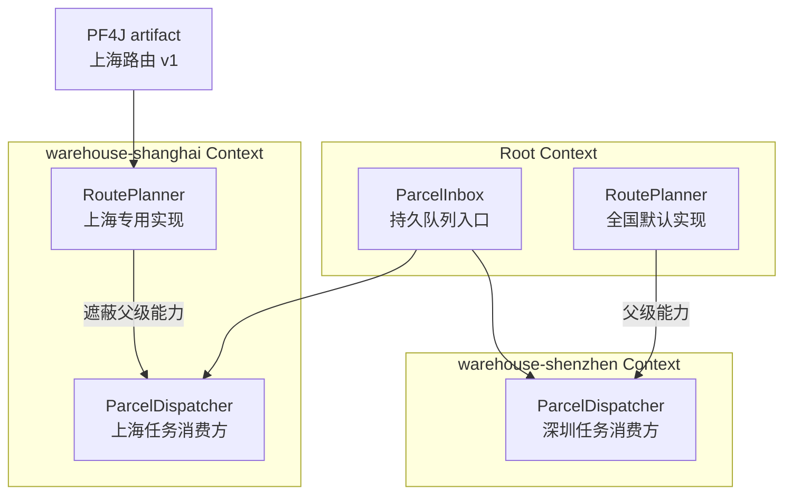
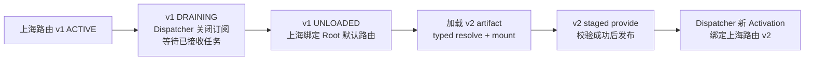

# 新 JAR 已经加载，旧路由为什么还在运行：用 Knotra 改造动态物流路由系统

分拨中心还在进件，上海仓的承运商路由插件要从 v1 换到 v2。把新 JAR 加载进 JVM 只解决代码装载；旧消费者何时停止、在途任务由谁等待、HTTP 连接和订阅何时释放、失败后哪个版本可见，仍需要一套明确的运行时语义。本文用一个示例物流系统说明 Knotra 适合解决什么，并写出从能力声明、仓库级覆盖到插件排空卸载的完整路径。

> 文中的物流系统用于解释设计，不对应某个线上项目。Knotra API 与行为以当前仓库的 `0.1.0-SNAPSHOT` 为准；文中不虚构吞吐量、延迟或生产运行结论。

## 加载器不知道谁还拿着旧对象

这套系统有一个常驻 JVM 宿主。每个包裹进入分拨中心后，路由模块根据目的地、承运商服务范围和仓库配置选择配送服务。不同仓库允许安装不同实现，承运商规则也需要在进程运行期间更新。

最常见的注册表实现只做两件事：替换当前对象，再关闭旧对象。

```java
RoutePlanner oldPlanner = registry.put("route-planner", plannerV2);
oldPlanner.close();
```

这段代码只改变后续查询。已经启动的 `ParcelDispatcher` 仍可能保存 `oldPlanner`，某个回调也可能正在调用它。此时立即关闭旧 HTTP 客户端，在途请求会失败；暂时不关，旧线程、订阅和插件 `ClassLoader` 又可能一直留在 JVM 中。

一个可控的升级流程至少要回答五个具体问题：

- **谁依赖旧注册**：需要记录消费方绑定的是哪一次 provider 注册，不能只比较对象值或接口类型。
- **启动期间发生替换怎么办**：新组件完成初始化前不应被其他组件发现；初始化依据已经过期时，本次启动需要撤销并按最新状态重试。
- **清理顺序如何确定**：消费方先停止接收任务并处理完已接收任务，提供方随后才能关闭连接、线程池和规则缓存。
- **仓库级覆盖如何恢复**：上海专用实现退出后，上海仓应重新使用全国默认实现，不应把租户判断散落到每个消费者中。
- **卸载失败如何处理**：释放器报错时要保留失败状态和诊断，修复外部资源后只重试失败项，不能把卸载标成成功。

单独使用 PF4J 时，它负责 JAR 和插件生命周期；服务注册表负责返回当前对象。依赖代际、组件重启、资源所有权和清理顺序仍要由宿主补齐。Knotra 把这些关系纳入同一个运行时模型。

## 业务结构是一棵 Context 树

示例系统把全国默认能力挂在 Root Context，各仓库使用子 Context。上海仓发布本地 `RoutePlanner` 后会遮蔽父级实现；本地注册撤销后，父级实现重新可见。深圳仓没有本地实现，始终继承默认路由。



Context 只定义能力可见性，不代表线程隔离或 `ClassLoader` 隔离。每个 `ParcelDispatcher` 在启动时解析当前可见的 `RoutePlanner`，Knotra 将对应 registration id 写入固定 `BindingSet`。本地实现出现、消失或被新注册替换，都会产生新的 Activation。

这几个对象分别对应不同职责：

| Knotra 对象 | 在物流案例中的职责 |
|---|---|
| `ContextHandle` | 表示 Root、上海仓、深圳仓等能力可见性范围；子 Context 可以遮蔽祖先中的同名能力 |
| `CapabilityKey<RoutePlanner>` | 表示带名称和精确 Java 类型的路由合约；同一 Runtime 内同名能力的合约类型固定 |
| `ComponentHandle<RouterConfig>` | 表示“上海路由”这个稳定挂载点；配置变化后 handle 不变，Activation 会换代 |
| `Activation` | 表示组件按某份配置和某组依赖运行的一代实例状态；暂存注册只在验证成功后发布 |
| `LifecycleScope` | 拥有该代 Activation 创建的订阅、连接、线程池和释放器，并按 LIFO 顺序清理 |
| `Pf4jArtifactAdapter` | 管理 artifact 加载、类型化工厂解析、owned mount 排空、PF4J 停止与卸载 |

## 第一步：把跨插件合约放进共享包

PF4J 插件和宿主必须看到同一个 JVM `Class`。路由接口、配置类型和 Capability key 因此放进宿主提供的共享合约包，例如 `com.acme.logistics.contract`。以下是多个文件的节选，业务 DTO 只保留案例需要的字段。

```java
// RoutePlanner.java
package com.acme.logistics.contract;

import java.util.concurrent.CompletionStage;

public interface RoutePlanner {
    CompletionStage<Route> plan(Parcel parcel);
}

// RouterConfig.java
package com.acme.logistics.contract;

import java.net.URI;
import java.time.Duration;

public record RouterConfig(URI endpoint, Duration timeout) {}

// ParcelInbox.java
package com.acme.logistics.contract;

import java.util.concurrent.CompletionStage;
import java.util.function.Function;

public interface ParcelInbox extends AutoCloseable {
    ParcelSubscription consume(
            String warehouseId,
            Function<ParcelDelivery, CompletionStage<Void>> handler);
}

public interface ParcelSubscription {
    CompletionStage<Void> closeAsync();
}

public interface ParcelDelivery {
    Parcel parcel();

    CompletionStage<Void> complete(Route route);
}

// LogisticsCapabilities.java
package com.acme.logistics.contract;

import io.knotra.CapabilityKey;

public final class LogisticsCapabilities {
    public static final CapabilityKey<RoutePlanner> ROUTE_PLANNER =
            CapabilityKey.of("logistics.route-planner", RoutePlanner.class);

    public static final CapabilityKey<ParcelInbox> PARCEL_INBOX =
            CapabilityKey.of("logistics.parcel-inbox", ParcelInbox.class);

    private LogisticsCapabilities() {}
}
```

这里的 `ParcelInbox` 代表由持久消息系统实现的业务接口。案例约定：`closeAsync()` 等待关闭前已经交给 handler 的任务完成；尚未完成确认的任务由消息系统重新投递。这个保证来自队列实现，Knotra 不提供消息持久化。

`RoutePlanner`、`RouterConfig` 或 `ParcelInbox` 若由插件自己的 `ClassLoader` 私下加载，即使类名相同，也不是同一个 JVM 类型。`knotra-pf4j` 会拒绝这类跨 artifact 合约，避免插件私有类型进入 Runtime 的全局类型表。

## 第二步：让路由组件原子发布能力

路由组件在 `start()` 中创建 HTTP 客户端和规则刷新线程，并把它们登记到当前 Activation 的 `LifecycleScope`。以下为组件节选；`CarrierClient` 与 `HttpRoutePlanner` 是案例业务类型，Knotra 调用均来自公开 API。

```java
package com.acme.logistics.router;

import static com.acme.logistics.contract.LogisticsCapabilities.ROUTE_PLANNER;

import io.knotra.ActivationContext;
import io.knotra.Component;
import io.knotra.ComponentDescriptor;
import io.knotra.ComponentFactory;
import io.knotra.ConfigSchema;

import java.util.Optional;
import java.util.concurrent.Executors;
import java.util.concurrent.ScheduledExecutorService;

public final class RoutePlannerFactory implements ComponentFactory<RouterConfig> {
    @Override
    public String factoryId() {
        return "regional-route-planner";
    }

    @Override
    public Component<RouterConfig> create() {
        return new Component<>() {
            @Override
            public ComponentDescriptor descriptor() {
                return ComponentDescriptor.of("regional-route-planner");
            }

            @Override
            public void start(ActivationContext context, RouterConfig config)
                    throws Exception {
                CarrierClient client = context.lifecycle().manage(
                        "carrier-http-client",
                        CarrierClient.open(config.endpoint(), config.timeout()));

                ScheduledExecutorService refresher = context.lifecycle().manage(
                        "rule-refresh-executor",
                        Executors.newSingleThreadScheduledExecutor());

                RoutePlanner planner = new HttpRoutePlanner(client, refresher);
                context.provide(ROUTE_PLANNER, planner);
            }
        };
    }

    @Override
    public Optional<ConfigSchema<RouterConfig>> configSchema() {
        return Optional.of(raw -> {
            if (!(raw instanceof RouterConfig config)) {
                throw new IllegalArgumentException("RouterConfig is required");
            }
            if (config.endpoint() == null) {
                throw new IllegalArgumentException("endpoint is required");
            }
            if (config.timeout() == null
                    || config.timeout().isZero()
                    || config.timeout().isNegative()) {
                throw new IllegalArgumentException("timeout must be positive");
            }
            return config;
        });
    }
}
```

登记顺序决定释放顺序：刷新线程后登记，因此会先关闭；HTTP 客户端随后关闭。`context.provide()` 只暂存 `RoutePlanner`。`start()` 返回后，Runtime 会重新检查 Context、配置代际、依赖绑定和能力槽位；全部通过时，Activation 和 registration 才一起发布。

如果 `CarrierClient.open()` 或 `HttpRoutePlanner` 构造失败，已经登记的资源会回滚，其他组件看不到半初始化的 `RoutePlanner`。如果启动过程中配置又变了，本次候选会按过期处理，清理后使用最新配置重新收敛，不会被记录成业务启动失败。

组件对象会在同一 handle 的多次 Activation 之间复用。与某一代运行绑定的客户端、线程和订阅都应创建在 `start()` 内并交给 `LifecycleScope`，不能保存在组件字段里长期复用。

## 第三步：让消费方声明自己绑定了谁

`ParcelDispatcher` 同时依赖路由能力和持久队列入口。用途明确的 descriptor 让 Runtime 能计算 provider 变化会影响哪些组件。

```java
package com.acme.logistics.dispatcher;

import static com.acme.logistics.contract.LogisticsCapabilities.PARCEL_INBOX;
import static com.acme.logistics.contract.LogisticsCapabilities.ROUTE_PLANNER;

import com.acme.logistics.contract.ParcelInbox;
import com.acme.logistics.contract.ParcelSubscription;
import com.acme.logistics.contract.RoutePlanner;

import io.knotra.ActivationContext;
import io.knotra.CapabilityRequirement;
import io.knotra.Component;
import io.knotra.ComponentDescriptor;
import io.knotra.ComponentFactory;
import io.knotra.NoConfig;

public final class ParcelDispatcherFactory implements ComponentFactory<NoConfig> {
    @Override
    public String factoryId() {
        return "parcel-dispatcher";
    }

    @Override
    public Component<NoConfig> create() {
        return new Component<>() {
            @Override
            public ComponentDescriptor descriptor() {
                return ComponentDescriptor.of(
                        "parcel-dispatcher",
                        CapabilityRequirement.required(ROUTE_PLANNER),
                        CapabilityRequirement.required(PARCEL_INBOX));
            }

            @Override
            public void start(ActivationContext context, NoConfig config) {
                RoutePlanner planner = context.require(ROUTE_PLANNER);
                ParcelInbox inbox = context.require(PARCEL_INBOX);
                String warehouseId = context.contextInfo().name();

                ParcelSubscription subscription = inbox.consume(
                        warehouseId,
                        delivery -> planner.plan(delivery.parcel())
                                .thenCompose(delivery::complete));

                context.lifecycle().manageAsync(
                        "parcel-inbox-subscription",
                        subscription::closeAsync);
            }
        };
    }
}
```

`require()` 读取的是 Activation 开始时捕获的固定绑定。上海本地 `RoutePlanner` 的 registration id 变化后，旧 `ParcelDispatcher` Activation 会进入 STOPPING；订阅关闭并等待已接收任务完成后，新 Activation 才能使用新的绑定启动。同一个 handle 的两代运行不会并存。

这里没有把 `ActivationContext` 保存到回调中。`start()` 返回后该对象会关闭，长期回调只持有本代已经解析好的 `planner` 和由 LifecycleScope 管理的 `subscription`。

## 第四步：一次事务创建仓库结构

先用 classpath 中的工厂创建拓扑，便于看清 Core API。以下为宿主方法内的节选，import、配置构造器和 `openDurableInbox()` 省略。宿主拥有 `ParcelInbox` 的物理连接，所以资源声明顺序让 Runtime 先关闭，队列连接后关闭。

```java
record Topology(
        ContextHandle shanghai,
        ContextHandle shenzhen,
        ComponentHandle<RouterConfig> defaultRouter,
        ComponentHandle<RouterConfig> shanghaiRouter,
        ComponentHandle<NoConfig> shanghaiDispatcher,
        ComponentHandle<NoConfig> shenzhenDispatcher) {}

try (ParcelInbox inbox = openDurableInbox();
     KnotraRuntime runtime = KnotraRuntime.create()) {

    MutationResult<Topology> created = runtime.mutate(tx -> {
        ContextHandle root = runtime.rootContext();
        ContextHandle shanghai = tx.childContext(root, "warehouse-shanghai");
        ContextHandle shenzhen = tx.childContext(root, "warehouse-shenzhen");

        tx.provide(root, PARCEL_INBOX, inbox);

        ComponentHandle<RouterConfig> defaultRouter = tx.mount(
                root,
                "route-planner",
                new RoutePlannerFactory(),
                defaultRouterConfig());

        ComponentHandle<RouterConfig> shanghaiRouter = tx.mount(
                shanghai,
                "route-planner",
                new RoutePlannerFactory(),
                shanghaiRouterConfigV1());

        ComponentHandle<NoConfig> shanghaiDispatcher = tx.mount(
                shanghai,
                "parcel-dispatcher",
                new ParcelDispatcherFactory(),
                NoConfig.INSTANCE);

        ComponentHandle<NoConfig> shenzhenDispatcher = tx.mount(
                shenzhen,
                "parcel-dispatcher",
                new ParcelDispatcherFactory(),
                NoConfig.INSTANCE);

        return new Topology(
                shanghai,
                shenzhen,
                defaultRouter,
                shanghaiRouter,
                shanghaiDispatcher,
                shenzhenDispatcher);
    });

    if (!created.committed()) {
        throw new IllegalStateException(created.diagnostics().toString());
    }

    Topology topology = created.value();
    ComponentHandle<?>[] handles = {
            topology.defaultRouter(),
            topology.shanghaiRouter(),
            topology.shanghaiDispatcher(),
            topology.shenzhenDispatcher()
    };
    for (ComponentHandle<?> handle : handles) {
        ComponentState settled = handle.whenSettled()
                .toCompletableFuture()
                .get(30, TimeUnit.SECONDS);
        if (settled != ComponentState.ACTIVE) {
            throw new IllegalStateException(
                    handle.mountId() + " settled as " + settled + ": "
                            + runtime.snapshot().diagnostics());
        }
    }

    // 业务进程继续运行。
}
```

`created.committed()` 表示 Context、注册意图和挂载结构已经作为同一 Runtime generation 发布，不表示所有组件已经 ACTIVE。组件启动在协调锁外异步执行，因此还要等待目标 handle 的 `whenSettled()` 并检查返回状态。

提供方与消费方可以在同一宿主事务中挂载。消费方在所需能力发布前保持 WAITING，随后由 Runtime 调度；上海本地能力成功发布后遮蔽默认能力，深圳消费方继续绑定 Root 中的默认实现。

## 配置变化：保留 handle，创建新 Activation

承运商地址或超时配置变化时，不需要替换 factory。以下为同一宿主方法内的节选，`runtime`、`topology` 和配置构造器沿用前文；事务更新上海路由的配置，并等待同一个 handle 完成换代。

```java
MutationResult<ComponentHandle<RouterConfig>> update = runtime.mutate(tx ->
        tx.reconfigure(
                topology.shanghaiRouter(),
                shanghaiRouterConfigV2()));

if (!update.committed()) {
    throw new IllegalStateException(update.diagnostics().toString());
}

ComponentState state = topology.shanghaiRouter()
        .whenSettled()
        .toCompletableFuture()
        .get(30, TimeUnit.SECONDS);

if (state != ComponentState.ACTIVE) {
    runtime.snapshot().diagnostics().forEach(System.err::println);
}
```

旧 Activation 清理完成前，同一 handle 不会启动下一代。清理成功后，新配置产生新的 Activation；新路由 registration 发布时，绑定它的 `ParcelDispatcher` 也会重新激活。

本地 registration 暂时缺失时，上海 Context 的有效绑定会回到 Root 默认值。Dispatcher 按它观察到的最新 generation 收敛；本地实现很快恢复时，基于默认值启动的过期候选可能在提交前回滚，因此不能把父级能力理解成每次升级都会完整执行一次的流量切换协议。

## JAR 变化：先排空 owned mount，再卸载 artifact

插件需要从共享 SPI 导出带配置 token 的工厂。以下代码是插件内的 PF4J extension，`RouterConfig.class` 来自共享合约包。

```java
package com.acme.logistics.plugin;

import com.acme.logistics.contract.RouterConfig;
import com.acme.logistics.router.RoutePlannerFactory;

import io.knotra.pf4j.spi.ExportedComponentFactory;
import io.knotra.pf4j.spi.RuntimeComponentProvider;
import org.pf4j.Extension;

import java.util.Collection;
import java.util.List;

@Extension
public final class RegionalRouterProvider implements RuntimeComponentProvider {
    @Override
    public Collection<ExportedComponentFactory<?>> factories() {
        return List.of(ExportedComponentFactory.of(
                RouterConfig.class,
                new RoutePlannerFactory()));
    }
}
```

`loadArtifact()` 只加载、启动插件并登记工厂目录，不会自动创建业务组件。宿主必须用精确配置类型解析工厂，再显式挂载。

当上海路由来自插件 JAR 时，用下面的受控挂载替代前文对 `RoutePlannerFactory` 的直接 `tx.mount()`。以下为宿主方法内的节选，import、配置构造器和 topology 初始化省略；代码让 v1 完成排空，通过 Runtime snapshot 确认 Dispatcher 已绑定默认能力，再加载和挂载 v2。

```java
try (Pf4jArtifactAdapter adapter = Pf4jArtifactAdapter.create(
        Path.of("plugins"),
        runtime,
        Set.of("com.acme.logistics.contract"))) {

    ArtifactSnapshot artifactV1 = adapter.loadArtifact(
            Path.of("plugins/regional-router-v1.jar")).join();

    ArtifactFactoryHandle<RouterConfig> factoryV1 = adapter.resolver()
            .resolve("regional-route-planner", RouterConfig.class)
            .orElseThrow();

    ComponentHandle<RouterConfig> localRouter = factoryV1.mount(
            topology.shanghai(),
            "route-planner",
            shanghaiRouterConfigV1());

    ComponentState v1State = localRouter.whenSettled()
            .toCompletableFuture()
            .get(30, TimeUnit.SECONDS);
    if (v1State != ComponentState.ACTIVE) {
        throw new IllegalStateException("v1 router settled as " + v1State);
    }

    adapter.unloadArtifact(artifactV1.artifactId()).join();
    ComponentState fallbackState = topology.shanghaiDispatcher()
            .whenSettled()
            .toCompletableFuture()
            .get(30, TimeUnit.SECONDS);
    RuntimeSnapshot fallbackSnapshot = runtime.snapshot();
    if (fallbackState != ComponentState.ACTIVE
            || !isBoundToContext(
                    fallbackSnapshot,
                    topology.shanghaiDispatcher().handleId(),
                    ROUTE_PLANNER.name(),
                    runtime.rootContext().contextId())) {
        throw new IllegalStateException(
                "Shanghai dispatcher did not bind the root planner");
    }

    ArtifactSnapshot artifactV2 = adapter.loadArtifact(
            Path.of("plugins/regional-router-v2.jar")).join();

    ArtifactFactoryHandle<RouterConfig> factoryV2 = adapter.resolver()
            .resolve("regional-route-planner", RouterConfig.class)
            .orElseThrow();

    ComponentHandle<RouterConfig> upgradedRouter = factoryV2.mount(
            topology.shanghai(),
            "route-planner",
            shanghaiRouterConfigV2());

    ComponentState v2State = upgradedRouter.whenSettled()
            .toCompletableFuture()
            .get(30, TimeUnit.SECONDS);
    ComponentState upgradedDispatcherState = topology.shanghaiDispatcher()
            .whenSettled()
            .toCompletableFuture()
            .get(30, TimeUnit.SECONDS);
    RuntimeSnapshot upgradedSnapshot = runtime.snapshot();
    if (v2State != ComponentState.ACTIVE
            || upgradedDispatcherState != ComponentState.ACTIVE
            || !isBoundToContext(
                    upgradedSnapshot,
                    topology.shanghaiDispatcher().handleId(),
                    ROUTE_PLANNER.name(),
                    topology.shanghai().contextId())) {
        throw new IllegalStateException(
                "Shanghai dispatcher did not bind the v2 planner");
    }

    // 宿主继续运行；进程退出时关闭 adapter，并排空 v2。
}

private static boolean isBoundToContext(
        RuntimeSnapshot snapshot,
        String handleId,
        String capabilityName,
        String providerContextId) {
    RuntimeSnapshot.ComponentSnapshot component = snapshot.components().stream()
            .filter(item -> item.handleId().equals(handleId))
            .findFirst()
            .orElseThrow();
    if (component.currentActivationId() == null) {
        return false;
    }

    return snapshot.activations().stream()
            .filter(item -> item.activationId().equals(
                    component.currentActivationId()))
            .flatMap(item -> item.bindings().stream())
            .filter(RuntimeSnapshot.BindingSnapshot::present)
            .filter(binding -> binding.capability().name()
                    .equals(capabilityName))
            .anyMatch(binding -> snapshot.registrations().stream()
                    .anyMatch(registration ->
                            registration.registrationId().equals(
                                    binding.registrationId())
                                    && registration.contextId().equals(
                                            providerContextId)));
}
```

示例先完成 v1 卸载，再加载 v2；v1 的目录条目释放后，v2 可以继续导出同一个 `factoryId`。adapter 会拒绝两个活跃 artifact 同时登记相同 `factoryId`，因此不能依赖 resolver 在并存版本之间替宿主选择实现。

`unloadArtifact()` 会拒绝该 artifact 的新挂载，等待正在执行的挂载，释放 adapter 拥有的 component handle，再执行 PF4J stop 和 unload。只有这些步骤完成后，artifact 才进入 `UNLOADED`。Knotra 自身会释放 factory、组件和 `ClassLoader` 引用；宿主或业务代码保留的额外引用仍需由宿主清理。

升级状态可以压缩成下面这条流程：



## 一个包裹在升级期间会经历什么

把流程落到单个包裹，边界会更清楚：

- **关闭前已经交给 handler 的包裹**：`ParcelSubscription.closeAsync()` 等它处理完成；`ParcelDispatcher` 的 LifecycleScope 未完成清理前，旧路由 provider 不会抢先关闭它依赖的资源。
- **尚未交给 handler 的包裹**：消息仍留在持久队列中，Dispatcher 新 Activation 建立订阅后继续获取；这是 `ParcelInbox` 实现的交付保证。
- **上海插件暂时缺失时到达的包裹**：上海 Context 重新看到 Root 默认 `RoutePlanner`，Dispatcher 收敛到该 registration 后可以继续处理。
- **v2 成功发布后的包裹**：本地 registration 再次遮蔽默认能力，Dispatcher 结束当前 Activation，并以新的 `BindingSet` 启动。
- **v2 启动失败时到达的包裹**：半初始化的本地能力不会发布；默认能力仍可见。若 Dispatcher 自己的旧订阅清理失败，它会停在 FAILED，父级能力不会绕过这次失败强行启动第二代。

Knotra 保证的是组件代际、依赖顺序和资源清理。持续进件依赖持久队列；严格零停顿还需要双实例切换、请求级版本路由或外部负载均衡。单个 `ComponentHandle` 的 Activation 串行运行，设计目标包含避免新旧实例重叠，不包含并行蓝绿切换。

## EventBus 能放在哪一层

`knotra-events` 适合进程内通知，例如路由完成后刷新统计面板。以下为消费方 `start()` 方法的节选，`ROUTE_FINISHED` 事件定义和 `metrics` 业务对象省略；订阅仍应交给消费方的 LifecycleScope，关闭时会等待关闭请求前已接受的 dispatch。

```java
EventSubscription subscription = bus.onSerial(ROUTE_FINISHED, event ->
        metrics.record(event).thenApply(ignored -> true));

context.lifecycle().manageAsync(
        "route-finished-listener",
        subscription::closeAsync);
```

这段登记让 provider 替换或 artifact 卸载等待已接受的监听回调完成。EventBus 没有持久化语义；分拣任务入口仍应使用消息队列，不能用进程内事件总线推导“升级期间任务不会丢失”。

## 失败会停在哪个状态

动态系统最危险的行为是失败后继续假装成功。Knotra 为几类失败保留了不同恢复入口：

| 失败位置 | 可观察状态 | 恢复动作 |
|---|---|---|
| 组件 `start()` 抛错 | handle 进入 `FAILED`，暂存能力不发布，已登记资源执行回滚 | 修复外部条件后调用 `ComponentHandle.retry()` |
| Activation 清理器抛错 | handle 保留失败 Activation；已成功清理项不会重放 | 修复资源后调用 `retry()`，只重试失败 entry |
| PF4J stop、unload 或 owned mount 清理失败 | artifact 进入 `DRAIN_FAILED`，ownership 与诊断保留 | 读取 `adapter.artifact(id)` 和 `adapter.diagnostic(id)`，修复后调用 `retryDrain(id)` |
| REQUIRED capability 缺失 | 消费方保持 `WAITING`，goal 仍为 RUNNING | 发布可见 provider，Runtime 会重新调度 |
| Loader 批量装配失败 | 本批新增项回滚，结果携带路径级诊断 | 修正完整期望树后再次 `reconcile`；FAILED 条目使用 `loader.retry(path)` |

`MutationResult.committed()`、`ArtifactState.UNLOADED`、`ComponentState.ACTIVE` 分别描述结构事务、artifact 和组件三层状态，不能互相替代。运行时诊断从 `runtime.snapshot()` 读取；artifact 状态从 `adapter.artifact(id)` 读取，操作诊断通过 `adapter.diagnostic(id)` 查询。`RuntimeSnapshot` 与 `ArtifactSnapshot` 只含稳定数据，不会因为监控代码长期保存快照而钉住插件 `ClassLoader`。

## 和常见组合相比，Knotra 多管了什么

Knotra 没有取代 Spring、PF4J 或消息队列。它管理运行期间会变化的组件结构，组件内部仍可使用熟悉的依赖注入、HTTP 客户端和存储库。

| 工程问题 | `Map` / Service Locator + PF4J 通常需要宿主补充 | Knotra 提供的语义 |
|---|---|---|
| 当前对象被替换后，谁需要重启 | 自行维护消费者列表或广播变更事件 | `BindingSet` 记录 registration identity，直接和间接依赖按图重新激活 |
| provider 启动一半时能否被查询 | 自行设计临时状态、锁和发布时机 | Activation 暂存 provide，乐观校验通过后原子发布 |
| 旧消费方和旧 provider 谁先释放 | 每个插件约定 stop 顺序 | 消费方先于提供方清理，owned child 先于 owner 清理 |
| 清理失败后如何继续 | 自行记录执行到哪一步，防止重复 close | Lifecycle entry 保存成功、失败和尝试次数，retry 跳过成功项 |
| 每个仓库使用不同实现 | 在查询端传 tenant id，或维护多套注册表 | Context 父链查找、子级遮蔽和撤销后恢复父级绑定 |
| JAR 何时可以物理卸载 | PF4J 能停插件，但业务 mount 和依赖需要宿主跟踪 | adapter 拥有受控 mount，drain 后再 stop、unload，并保留失败状态 |

如果应用的组件集合固定、配置变化可以靠重启解决、资源释放只有一个总开关，普通依赖注入容器已经足够。Knotra 的成本来自显式 descriptor、共享合约、生命周期登记和异步状态处理；只有动态组合属于运行需求时，这些成本才有回报。

## 适用边界

采用前应确认以下限制能够接受：

- **Knotra 不提供零停顿切换**：同一 handle 的旧 Activation 清理完成后才启动新 Activation；需要无缝流量迁移时，应在框架外设计双运行和路由协议。
- **Knotra 不提供消息持久化**：EventBus 只等待已接受的进程内 dispatch；任务可靠性要由数据库、日志或消息系统保证。
- **Knotra 不强制回收外部引用**：业务代码把插件对象、`Class` 或 `ClassLoader` 交给未托管代码后，Runtime 无法替它释放。
- **Loader 不监听文件系统**：配置中心、目录 watcher 或发布平台发现变化后，需要显式调用 `reconcile`。
- **清理可能需要重启 JVM**：PF4J stop/unload 半失败、native 资源无法释放或外部强引用无法消除时，`DRAIN_FAILED` 可以重试，但 JVM 重启仍是最终恢复边界。
- **当前版本尚未发布到远端仓库**：`0.1.0-SNAPSHOT` 需要 Java 21+、Maven 3.9+，应在同一 Maven reactor 中引用，或先安装到本机 Maven 缓存。

## 从一个 provider 和一个 consumer 开始

现有插件宿主不必一次迁移全部组件。最小接入可以按六步推进：

1. **选一个经常变化的 provider**：例如上海 `RoutePlanner`，同时选出一个直接消费方 `ParcelDispatcher`，先验证依赖换代是否符合预期。
2. **移动共享合约**：把接口、配置 record、事件类型和 Capability key 放到宿主共享包，确认插件不再携带这些类的私有副本。
3. **声明依赖和资源**：消费方在 descriptor 中列出 REQUIRED/OPTIONAL；连接、订阅、线程池和临时文件全部登记到 `LifecycleScope`。
4. **加入父级默认能力**：Root 挂默认实现，单个仓库 Context 挂本地实现，测试本地出现、撤销和启动失败三种情况。
5. **接入 artifact adapter**：把插件工厂改为 `RuntimeComponentProvider` 导出，宿主只通过 typed resolve 和 controlled mount 使用它。
6. **把失败写进验收测试**：阻塞一个在途任务后发起 unload，确认 drain 会等待；让 cleanup 首次失败，确认状态停在 FAILED/DRAIN_FAILED，retry 不重复释放成功资源。

Knotra 仓库本身可以在根目录执行下面的命令验证 Core、Events、PF4J adapter、Loader 和跨模块集成测试：

```bash
mvn clean verify
```

## 结尾

动态插件系统的难处很少出在 `Class.forName()`。代码进入 JVM 后，依赖旧注册的组件如何退出、在途工作如何等待、半初始化能力如何隐藏、清理失败如何重试、插件类型何时可以释放，这些规则决定了系统能否长期运行。

Knotra 适合把这些规则变成可观察的 Runtime 状态。对于需要按租户或仓库组合组件、在运行期替换实现、并严格管理资源归属的 JVM 宿主，这比再增加一个全局注册表更接近完整答案。

## 延伸阅读

- [Knotra API 与集成指南](./Knotra%20API%20与集成指南.md)：公开 API、关闭顺序、PF4J typed bridge 和常见错误。
- [Knotra 运行时设计文档](./Knotra%20运行时设计文档.md)：Activation 提交、依赖闭包、LifecycleScope 和 artifact drain 的完整语义。
- [LifecycleAndDependencyTest](../knotra-core/src/test/java/io/knotra/LifecycleAndDependencyTest.java)：消费方先于提供方清理、异步释放和失败重试的可执行测试。
- [EventBusIntegrationTest](../knotra-integration-tests/src/test/java/io/knotra/it/EventBusIntegrationTest.java)：插件监听器阻塞 artifact drain、卸载后释放 `ClassLoader` 的跨模块测试。
