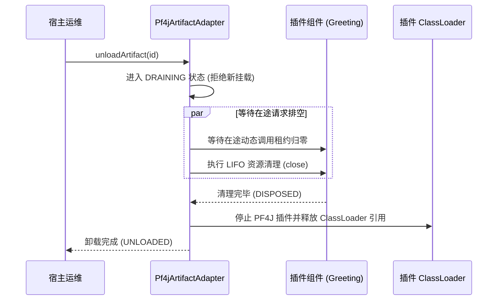

# Knotra 插件工程化手册

> 面向插件化系统架构师与开发者，介绍如何构建可加载、可挂载、可安全排空与可卸载的 PF4J 插件。

---

## 插件体系三层架构设计

为确保类加载器隔离与干净卸载，工程必须拆分为三个独立模块：

```mermaid
graph TD
    subgraph contract_mod ["共享合约模块 (contract)"]
        C["接口定义: Greeting.java<br/>配置模型: GreetingConfig.java<br/>(宿主与插件共同可见)"]
    end

    subgraph host_mod ["宿主应用工程 (host-app)"]
        H["宿主业务 + Knotra 运行时<br/>(compile 依赖 contract)"]
    end

    subgraph plugin_mod ["插件实现工程 (greeting-plugin)"]
        P["插件实现: GreetingImpl.java<br/>(provided 依赖 contract & knotra-core)"]
    end

    H -->|依赖| C
    P -.->|provided 依赖 (不打入 JAR)| C
    H ==>|动态加载 JAR| P
```

### 推荐目录结构

```text
my-plugin-project/
├── my-contract/             # 共享契约模块（普通 Maven JAR）
│   ├── pom.xml
│   └── src/main/java/com/example/contract/
│       ├── Greeting.java
│       └── GreetingConfig.java
├── my-host-app/             # 宿主应用
│   ├── pom.xml
│   └── src/main/java/com/example/host/
│       └── Application.java
└── my-greeting-plugin/      # 插件工程（打包为独立 JAR）
    ├── pom.xml
    └── src/main/java/com/example/plugin/
        ├── GreetingImpl.java
        └── GreetingProvider.java
```

---

## 插件工程构建

### 定义共享合约模块

合约模块仅包含共享接口与数据契约，由宿主和插件共同引用：

```java
package com.example.contract;

import io.knotra.CapabilityKey;

public interface Greeting {
    String greet(String name);
}
```

```java
package com.example.contract;

import io.knotra.CapabilityKey;

public final class GreetingContracts {
    public static final CapabilityKey<Greeting> GREETING =
            CapabilityKey.of("plugin.greeting", Greeting.class);
}
```

---

### 配置插件 POM 依赖边界

宿主已有的类库（Knotra 核心、共享合约、PF4J）在插件 POM 中必须声明为 `provided`，严禁打包进插件 JAR。否则会导致同名类被多个类加载器重复加载并引发 `ClassCastException`。

```xml
<project xmlns="http://maven.apache.org/POM/4.0.0">
  <modelVersion>4.0.0</modelVersion>
  <groupId>com.example</groupId>
  <artifactId>my-greeting-plugin</artifactId>
  <version>1.0.0</version>

  <dependencies>
    <!-- 共享合约：必须 provided -->
    <dependency>
      <groupId>com.example</groupId>
      <artifactId>my-contract</artifactId>
      <version>1.0.0</version>
      <scope>provided</scope>
    </dependency>

    <!-- Knotra 核心与 SPI：必须 provided -->
    <dependency>
      <groupId>io.knotra</groupId>
      <artifactId>knotra-core</artifactId>
      <version>0.1.0-SNAPSHOT</version>
      <scope>provided</scope>
    </dependency>
    <dependency>
      <groupId>io.knotra</groupId>
      <artifactId>knotra-pf4j-spi</artifactId>
      <version>0.1.0-SNAPSHOT</version>
      <scope>provided</scope>
    </dependency>
    <dependency>
      <groupId>org.pf4j</groupId>
      <artifactId>pf4j</artifactId>
      <version>3.12.0</version>
      <scope>provided</scope>
    </dependency>
  </dependencies>

  <build>
    <plugins>
      <!-- 打包插件 JAR 并注入 PF4J 元数据 -->
      <plugin>
        <groupId>org.apache.maven.plugins</groupId>
        <artifactId>maven-jar-plugin</artifactId>
        <configuration>
          <archive>
            <manifestEntries>
              <Plugin-Id>greeting-plugin</Plugin-Id>
              <Plugin-Version>1.0.0</Plugin-Version>
              <Plugin-Provider>Acme Corp</Plugin-Provider>
              <Plugin-Class></Plugin-Class>
            </manifestEntries>
          </archive>
        </configuration>
      </plugin>
    </plugins>
  </build>
</project>
```

---

### 编写插件实现与 SPI 导出

```java
package com.example.plugin;

import com.example.contract.Greeting;

public final class GreetingImpl implements Greeting, AutoCloseable {
    @Override
    public String greet(String name) {
        return "Hello from PF4J Plugin: " + name;
    }

    @Override
    public void close() {
        // 插件内部清理
    }
}
```

通过实现 `RuntimeComponentProvider` 并在类上添加 PF4J 的 `@Extension` 注解向宿主导出工厂：

```java
package com.example.plugin;

import com.example.contract.GreetingContracts;
import io.knotra.beans.Beans;
import io.knotra.pf4j.spi.ExportedComponentFactory;
import io.knotra.pf4j.spi.RuntimeComponentProvider;
import org.pf4j.Extension;

import java.util.Collection;
import java.util.List;

@Extension
public final class GreetingProvider implements RuntimeComponentProvider {

    @Override
    public Collection<ExportedComponentFactory<?>> factories() {
        return List.of(
                ExportedComponentFactory.noConfig(
                        Beans.component("greeting-component")
                                .create(GreetingImpl::new)
                                .provide(GreetingContracts.GREETING)
                                .build()
                )
        );
    }
}
```

---

## 宿主加载与生命周期管理

```java
import io.knotra.*;
import io.knotra.pf4j.*;
import java.nio.file.Path;
import java.util.Set;

public class HostApplication {
    public static void main(String[] args) throws Exception {
        try (KnotraRuntime runtime = KnotraRuntime.create()) {

            try (Pf4jArtifactAdapter adapter = Pf4jArtifactAdapter.create(
                    Path.of("plugins"),
                    runtime,
                    Set.of("com.example.contract"))) {

                // 加载插件 JAR
                ArtifactSnapshot artifact = adapter.loadArtifact(
                        Path.of("plugins/my-greeting-plugin-1.0.0.jar"));

                // 解析并挂载组件
                ArtifactFactoryHandle<NoConfig> factoryHandle = adapter.factories()
                        .resolve("greeting-component", NoConfig.class)
                        .orElseThrow();

                ComponentHandle<NoConfig> component = factoryHandle.mount(
                        runtime.root(), "greeting-service");
                component.requireActive();

                // 消费能力
                Greeting greeting = runtime.root().view().require(GreetingContracts.GREETING);
                System.out.println(greeting.greet("Tom"));

                // 安全排空并卸载
                adapter.unloadArtifact(artifact.artifactId());
            }
        }
    }
}
```

---

## 插件安全卸载与排空机制



---

## 防类加载器泄漏工程规范

在动态插件架构中，Metaspace 内存溢出通常源于未释放的类加载器引用。开发中应严格遵循以下准则：

- **共享契约全量 `provided`**：插件内部不得包含共享契约包中的任何 Class。
- **杜绝静态集合缓存插件对象**：宿主应用禁止通过静态 Map 或 List 长期持有由插件类加载器生成的对象或 Class 引用。
- **线程资源登记释放**：插件内创建的任何工作线程或线程池必须在 `LifecycleScope` 中登记 `close()` 并在销毁时 `shutdown()`。未停止的线程会导致类加载器无法卸载。
- **及时清理 ThreadLocal**：插件处理线程任务如使用 `ThreadLocal`，在调用结束后必须调用 `remove()`。
- **CI 引入 GC 弱引用回收断言**：在集成测试中通过弱引用监听类加载器并触发 `System.gc()` 断言其能被正常回收。
