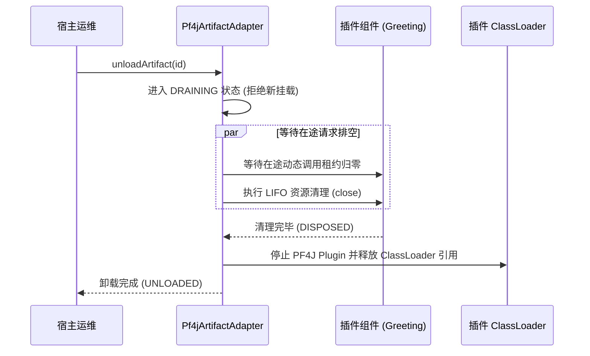

# Knotra 插件工程化手册

> **面向读者**：如果您需要构建一个“支持从外部 JAR 动态加载、安全热升级、干净卸载”的插件化系统，本文将手把手带您从零搭建多模块 Maven 工程，并遵循生产级安全规范。

---

## 插件体系架构设计

为了实现**插件的 ClassLoader 隔离与安全卸载**，必须将工程划分为三个独立模块：

```mermaid
graph TD
    subgraph contract_mod ["共享合约模块 (contract)"]
        C["接口定义: Greeting.java<br/>配置契约: GreetingConfig.java<br/>(宿主与插件共同可见)"]
    end

    subgraph host_mod ["宿主应用工程 (host-app)"]
        H["宿主业务 + Knotra 运行时<br/>(compile 依赖 contract)"]
    end

    subgraph plugin_mod ["插件实现工程 (greeting-plugin)"]
        P["插件实现: GreetingImpl.java<br/>(provided 依赖 contract & knotra-core)"]
    end

    H -->|依赖| C
    P -.->|provided 依赖 (不打包)| C
    H ==>|动态加载 JAR| P
```

### 推荐目录结构

```text
my-plugin-project/
├── my-contract/             # 共享契约模块（普通 Maven JAR）
│   ├── pom.xml
│   └── src/main/java/com/example/contract/
│       ├── Greeting.java
│       └── GreetingConfig.java
├── my-host-app/             # 宿主应用
│   ├── pom.xml
│   └── src/main/java/com/example/host/
│       └── Application.java
└── my-greeting-plugin/      # 插件工程（打包出独立 JAR）
    ├── pom.xml
    └── src/main/java/com/example/plugin/
        ├── GreetingImpl.java
        └── GreetingProvider.java
```

---

## 创建插件工程

### 定义共享合约模块

合约模块只放纯接口和配置 Record，供宿主和插件共同使用：

```java
package com.example.contract;

import io.knotra.CapabilityKey;

public interface Greeting {
    String greet(String name);
}
```

```java
package com.example.contract;

import io.knotra.CapabilityKey;

public final class GreetingContracts {
    // 双方约定好的公共 CapabilityKey
    public static final CapabilityKey<Greeting> GREETING =
            CapabilityKey.of("plugin.greeting", Greeting.class);
}
```

---

### 配置插件工程 pom.xml

> **核心原则**：所有宿主已经拥有的类（Knotra 核心库、共享合约库、PF4J）在插件中必须标记为 `<scope>provided</scope>`，**绝对不能打进插件 JAR**！否则会导致同一个 Class 被两个 ClassLoader 加载，发生 `ClassCastException`。

```xml
<project xmlns="http://maven.apache.org/POM/4.0.0">
  <modelVersion>4.0.0</modelVersion>
  <groupId>com.example</groupId>
  <artifactId>my-greeting-plugin</artifactId>
  <version>1.0.0</version>

  <dependencies>
    <!-- 共享合约：必须 provided -->
    <dependency>
      <groupId>com.example</groupId>
      <artifactId>my-contract</artifactId>
      <version>1.0.0</version>
      <scope>provided</scope>
    </dependency>

    <!-- Knotra 核心与 SPI：必须 provided -->
    <dependency>
      <groupId>io.knotra</groupId>
      <artifactId>knotra-core</artifactId>
      <version>0.1.0-SNAPSHOT</version>
      <scope>provided</scope>
    </dependency>
    <dependency>
      <groupId>io.knotra</groupId>
      <artifactId>knotra-pf4j-spi</artifactId>
      <version>0.1.0-SNAPSHOT</version>
      <scope>provided</scope>
    </dependency>
    <dependency>
      <groupId>org.pf4j</groupId>
      <artifactId>pf4j</artifactId>
      <version>3.12.0</version>
      <scope>provided</scope>
    </dependency>
  </dependencies>

  <build>
    <plugins>
      <!-- 打包插件 JAR，并在 MANIFEST.MF 中写入 PF4J 元数据 -->
      <plugin>
        <groupId>org.apache.maven.plugins</groupId>
        <artifactId>maven-jar-plugin</artifactId>
        <configuration>
          <archive>
            <manifestEntries>
              <Plugin-Id>greeting-plugin</Plugin-Id>
              <Plugin-Version>1.0.0</Plugin-Version>
              <Plugin-Provider>Acme Corp</Plugin-Provider>
              <Plugin-Class></Plugin-Class>
            </manifestEntries>
          </archive>
        </configuration>
      </plugin>
    </plugins>
  </build>
</project>
```

---

### 编写插件内部实现

```java
package com.example.plugin;

import com.example.contract.Greeting;

public final class GreetingImpl implements Greeting, AutoCloseable {
    @Override
    public String greet(String name) {
        return "Hello from PF4J Plugin: " + name;
    }

    @Override
    public void close() {
        System.out.println("插件内部资源已清理！");
    }
}
```

---

### 导出插件 Factory SPI

通过实现 `RuntimeComponentProvider` 并在类上添加 PF4J 的 `@Extension` 注解，向宿主导出该插件的能力：

```java
package com.example.plugin;

import com.example.contract.GreetingContracts;
import io.knotra.beans.Beans;
import io.knotra.pf4j.spi.ExportedComponentFactory;
import io.knotra.pf4j.spi.RuntimeComponentProvider;
import org.pf4j.Extension;

import java.util.Collection;
import java.util.List;

@Extension
public final class GreetingProvider implements RuntimeComponentProvider {

    @Override
    public Collection<ExportedComponentFactory<?>> factories() {
        // 使用 Beans DSL 装配并导出无配置组件
        return List.of(
                ExportedComponentFactory.noConfig(
                        Beans.component("greeting-component")
                                .create(GreetingImpl::new)
                                .provide(GreetingContracts.GREETING)
                                .build()
                )
        );
    }
}
```

---

## 宿主加载与运行插件

在宿主应用中，使用 `Pf4jArtifactAdapter` 加载并挂载插件：

```java
import io.knotra.*;
import io.knotra.pf4j.*;
import java.nio.file.Path;
import java.util.Set;

public class HostApplication {
    public static void main(String[] args) throws Exception {
        // 创建 Knotra Runtime
        try (KnotraRuntime runtime = KnotraRuntime.create()) {

            // 创建插件适配器，声明共享合约包名以进行类加载一致性保护
            try (Pf4jArtifactAdapter adapter = Pf4jArtifactAdapter.create(
                    Path.of("plugins"),
                    runtime,
                    Set.of("com.example.contract"))) {

                // 动态加载插件 JAR 文件
                ArtifactSnapshot artifact = adapter.loadArtifact(
                        Path.of("plugins/my-greeting-plugin-1.0.0.jar"));
                System.out.println("成功加载插件: " + artifact.artifactId());

                // 解析并挂载插件导出的组件
                ArtifactFactoryHandle<NoConfig> factoryHandle = adapter.factories()
                        .resolve("greeting-component", NoConfig.class)
                        .orElseThrow();

                ComponentHandle<NoConfig> component = factoryHandle.mount(
                        runtime.root(), "greeting-service");
                component.requireActive();

                // 消费插件服务
                Greeting greeting = runtime.root().view().require(GreetingContracts.GREETING);
                System.out.println(greeting.greet("Tom"));
                // 输出: Hello from PF4J Plugin: Tom

                // 安全卸载插件 (先自动排空在途请求，再彻底卸载 ClassLoader)
                adapter.unloadArtifact(artifact.artifactId());
                System.out.println("插件已安全卸载！");
            }
        }
    }
}
```

---

## 插件安全卸载与排空机制

Knotra 的插件卸载遵循**严格的排空流**，确保运行中的业务不受影响：



---

## 防止 ClassLoader 内存泄漏黄金军规

在 Java 动态插件开发中，**Metaspace 内存溢出（OOM）**是最常见的灾难。请严格遵守以下军规：

- **共享合约全部 `provided`**：
  - 插件不能把 `contract` 打包在自身 JAR 内部，必须由宿主统一加载。
- **切勿在静态集合中缓存插件对象**：
  - 宿主应用严禁使用 `static Map<String, Object>` 或 `static List` 长期持有插件返回的实例。
- **线程与线程池必须在 `LifecycleScope` 中登记释放**：
  - 插件内部创建的任何 `ExecutorService` 或工作线程，必须实现 `close()` 并在销毁时 `shutdown()`。未停止的线程会导致 ClassLoader 无法回收。
- **清理 `ThreadLocal`**：
  - 插件执行任务若使用了 `ThreadLocal`，在调用结束后必须显式调用 `.remove()`。
- **在 CI 中加入 GC 卸载断言测试**：
  - 使用 WeakReference 在测试用例中验证 `System.gc()` 后插件 ClassLoader 能被正常回收（详见《Knotra 测试指南》）。
