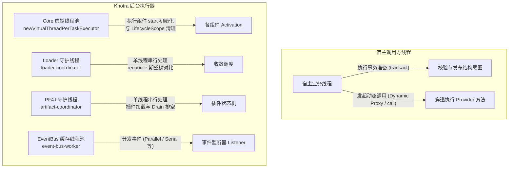

# Knotra 线程模型与生产实践

> 面向生产环境运维与高并发系统开发者，剖析 Knotra 的线程调度、虚拟线程边界、类加载器上下文切换与可观测性接入。

---

## 线程模型全景图

Knotra 基于 Java 21+ 虚拟线程与轻量守护执行器构建，不依赖庞大的全局线程池，也不存在后台定时轮询任务：



### 各层执行器与并发特性

| 执行场景 | 执行线程类型 | 线程命名规则 | 串行 / 并发规则 |
|---|---|---|---|
| **宿主结构事务** (`transact`) | 宿主调用线程 | 调用方线程 | 同步执行，仅负责结构校验与意图准备。 |
| **动态代理调用** (`call`/`proxy`) | 宿主调用线程 | 调用方线程 | 穿透调用，持有动态租约，无线程切换开销。 |
| **组件生命周期** (`start`/`close`) | Java 21 虚拟线程 | 未命名虚拟线程 | 同一挂载点的生命周期过渡串行；不同组件可并发。 |
| **Loader 期望树收敛** | 专属单线程守护执行器 | `loader-<id>-coordinator` | 单个 Loader 实例的收敛动作严格串行。 |
| **PF4J 插件状态变更** | 专属单线程守护执行器 | `knotra-pf4j-artifact-coordinator` | 插件的 load、drain、unload 状态变更串行。 |
| **EventBus 事件分发** | 专属缓存线程池 | `event-bus-<N>-worker` | `Parallel` 并发；`Serial`/`Bail`/`Waterfall` 顺序执行。 |

---

## 组件生命周期执行边界

- **`start()` 在虚拟线程执行**：网络连接建立、远程配置拉取等慢操作可安全在 `start()` 中执行，不会阻塞协调器锁，也不会卡住宿主事务。
- **避免 Carrier 线程被 Pin 住**：避免在 `start()` 中长时间持有原生 `synchronized` 块；对于耗时锁竞争，优先使用 `ReentrantLock`。
- **`ActivationContext` 禁止逃逸**：`ActivationContext` 仅在 `start()` 方法执行期间有效，返回后继续调用将直接报错。
- **组件外壳必须无状态**：`ComponentFactory.create()` 创建的外壳跨多次 Activation 复用。禁止在成员变量中缓存具体的业务对象、数据库连接或依赖引用。

---

## 线程上下文类加载器（TCCL）自动切换

许多 Java 类库（如 SPI `ServiceLoader`、Jackson、Log4j 等）强依赖 `Thread.currentThread().getContextClassLoader()`。当宿主线程调用插件代码时，TCCL 默认仍为宿主类加载器，会导致插件内部资源解析失败。


Knotra 在执行组件 `start()`、EventBus 监听器、Spring 子容器启动及自定义清理钩子时，均会自动将 TCCL 切换为目标组件的类加载器，并在执行结束后恢复原状。

---

## 生产环境优雅停机

在应用停机或接收到终止信号时，推荐遵循标准的异步等待流程：

```java
public void shutdownGracefully() {
    try {
        if (loader != null) {
            loader.closeAsync().toCompletableFuture().get(30, TimeUnit.SECONDS);
        }

        if (plugins != null) {
            plugins.closeAsync().toCompletableFuture().get(30, TimeUnit.SECONDS);
        }

        if (runtime != null) {
            runtime.closeAsync().toCompletableFuture().get(30, TimeUnit.SECONDS);
        }

        System.out.println("Knotra 运行时已安全退出。");
    } catch (Exception e) {
        System.err.println("优雅停机过程中发生异常，保留现场并记录快照。");
    }
}
```

---

## 生产监控指标接入

Knotra 的 `RuntimeSnapshot` 为纯数据结构，可安全集成至 Prometheus 或 Micrometer 监控体系：

```java
public void collectMetrics(MeterRegistry registry) {
    RuntimeSnapshot snapshot = runtime.snapshot();

    long activeCount = snapshot.components().stream()
            .filter(c -> c.state() == ComponentState.ACTIVE).count();
    long waitingCount = snapshot.components().stream()
            .filter(c -> c.state() == ComponentState.WAITING).count();
    long failedCount = snapshot.components().stream()
            .filter(c -> c.state() == ComponentState.FAILED).count();

    Gauge.builder("knotra.components.active", () -> activeCount).register(registry);
    Gauge.builder("knotra.components.waiting", () -> waitingCount).register(registry);
    Gauge.builder("knotra.components.failed", () -> failedCount).register(registry);

    Gauge.builder("knotra.diagnostics.count", () -> snapshot.diagnostics().size())
            .register(registry);
}
```
