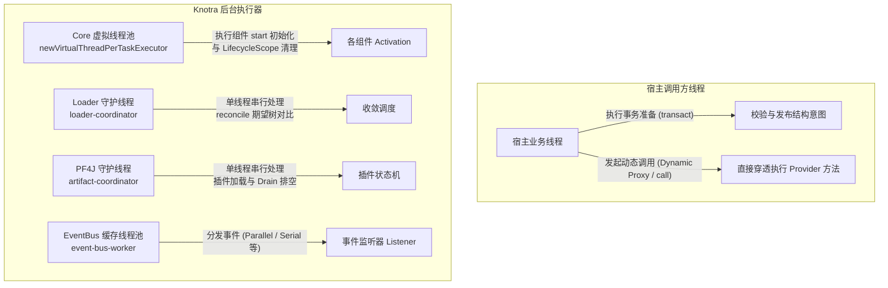
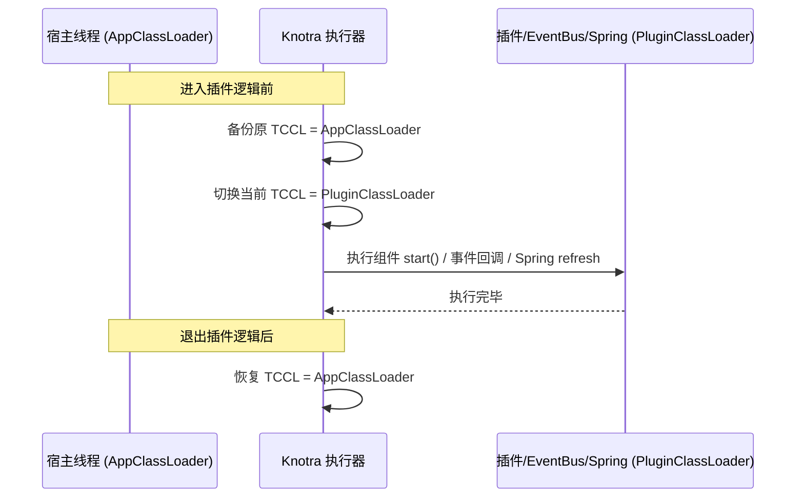

# Knotra 线程模型与生产实践

> **面向读者**：本文深入剖析 Knotra 运行时的线程调度机制、阻塞边界、类加载器（TCCL）切换规则以及生产环境运维落地的最佳实践。

---

## 线程模型全景图

Knotra 基于 Java 21+ 虚拟线程与轻量守护线程构建，**没有笨重的全局线程池，也没有常驻的定时轮询线程**。



### 各层执行器与并发规则速查表

| 模块 / 场景 | 执行线程 | 命名规则 | 串行 / 并发特性 |
|---|---|---|---|
| **宿主结构事务** (`transact`) | **宿主调用线程** | 调用方线程 | 同步执行，仅做结构意图准备与校验。 |
| **动态代理调用** (`call`/`proxy`) | **宿主调用线程** | 调用方线程 | 穿透调用，持有在途租约，不引入线程切换开销。 |
| **组件生命周期** (`start`/`close`) | **Java 21 虚拟线程** | 未命名虚拟线程 | 同一挂载点的生命周期过渡串行；不同组件可并发。 |
| **Loader 期望树收敛** | 专属单线程守护执行器 | `loader-<id>-coordinator` | 单个 Loader 实例的收敛动作严格串行。 |
| **PF4J 插件状态变更** | 专属单线程守护执行器 | `knotra-pf4j-artifact-coordinator` | 插件的 load、drain、unload 状态变更串行。 |
| **EventBus 事件分发** | 专属缓存线程池 | `event-bus-<N>-worker` | `Parallel` 并发；`Serial`/`Bail`/`Waterfall` 顺序执行。 |

---

## 组件初始化与生命周期清理规则

- **`start()` 运行在虚拟线程上**：
  - 慢操作（如初始化数据库连接池、拉取远程配置）可以安全地在 `start()` 中执行，**绝不会阻塞 Knotra 内部协调器锁**，也不会卡住宿主事务。
- **虚拟线程友好性（Pinning 防范）**：
  - 避免在 `start()` 中长时间持有原生的 `synchronized` 同步块；对于耗时锁，优先使用 `java.util.concurrent.locks.ReentrantLock`。
- **不可将 `ActivationContext` 逃逸保存**：
  - `ActivationContext` 仅在 `start()` 执行期间有效。`start()` 返回后，若继续调用其 `require()` 或 `provide()` 会直接抛错。
- **组件外壳必须无状态**：
  - `ComponentFactory.create()` 创建的组件外壳跨多次 Activation 复用。**严禁在外壳的成员变量中缓存业务对象、数据库连接或依赖引用**。业务对象必须每次在 `start()` 中新建。

---

## 类加载器上下文（TCCL）自动切换

在 Java 中，许多框架（如 SPI `ServiceLoader`、Jackson、Log4j、Spring XML 等）重度依赖 `Thread.currentThread().getContextClassLoader()`。

如果宿主线程调用插件代码，而 TCCL 依然是宿主的 AppClassLoader，插件内部的 SPI 或资源加载就会失败。



> **Knotra 机制**：
> Knotra 在执行组件 `start()`、EventBus 监听器、Spring 子容器初始化与自定义清理钩子时，**均会自动将 TCCL 切换为目标组件自身的 ClassLoader，并在执行完毕后严格恢复**。

---

## 生产环境优雅停机指南

在应用准备停机（如接收到 `SIGTERM` 或应用上下文关闭）时，建议遵循以下标准的异步等待模式：

```java
public void shutdownGracefully() {
    try {
        // 关闭 Loader（停止接收新的期望配置）
        if (loader != null) {
            loader.closeAsync().toCompletableFuture().get(30, TimeUnit.SECONDS);
        }

        // 关闭 PF4J 插件适配器（排空在途请求并卸载插件）
        if (plugins != null) {
            plugins.closeAsync().toCompletableFuture().get(30, TimeUnit.SECONDS);
        }

        // 关闭 Knotra Runtime（清理核心 Context 与所有残留组件）
        if (runtime != null) {
            runtime.closeAsync().toCompletableFuture().get(30, TimeUnit.SECONDS);
        }

        System.out.println("Knotra 运行时已安全退出。");
    } catch (Exception e) {
        System.err.println("优雅停机过程中发生异常，保留现场并打印快照：");
        printDiagnostics();
    }
}
```

---

## 生产环境可观测性与监控指标接入

Knotra 的 `RuntimeSnapshot` 是完全无副作用的纯数据结构（DTO），可安全用于 Prometheus / Micrometer 指标采集：

```java
// 定时或在 Actuator 端点中采集指标
public void collectMetrics(MeterRegistry registry) {
    RuntimeSnapshot snapshot = runtime.snapshot();

    // 统计各状态组件数量
    long activeCount = snapshot.components().stream()
            .filter(c -> c.state() == ComponentState.ACTIVE).count();
    long waitingCount = snapshot.components().stream()
            .filter(c -> c.state() == ComponentState.WAITING).count();
    long failedCount = snapshot.components().stream()
            .filter(c -> c.state() == ComponentState.FAILED).count();

    Gauge.builder("knotra.components.active", () -> activeCount).register(registry);
    Gauge.builder("knotra.components.waiting", () -> waitingCount).register(registry);
    Gauge.builder("knotra.components.failed", () -> failedCount).register(registry);

    // 统计诊断告警数
    Gauge.builder("knotra.diagnostics.count", () -> snapshot.diagnostics().size())
            .register(registry);
}
```
