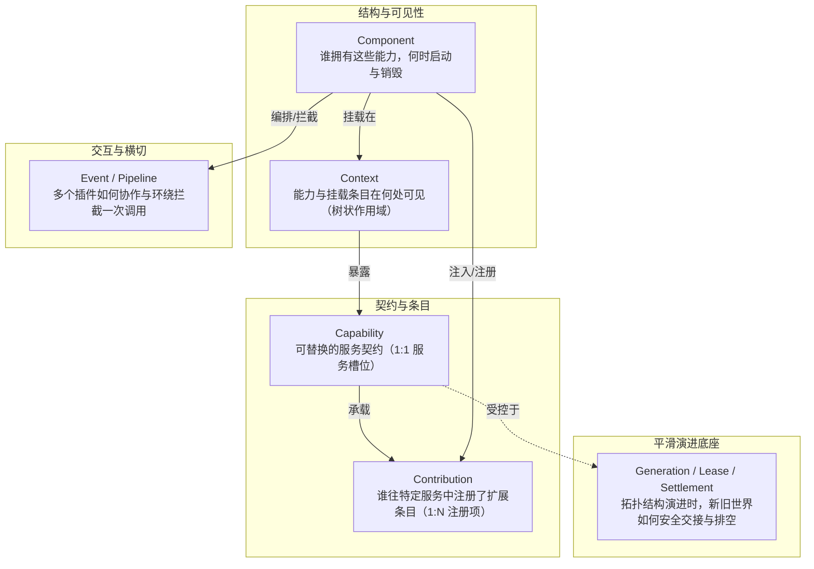
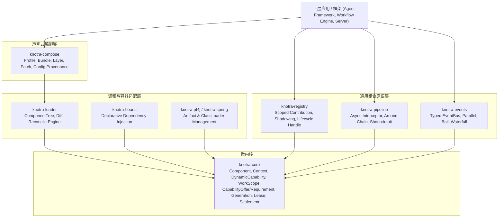
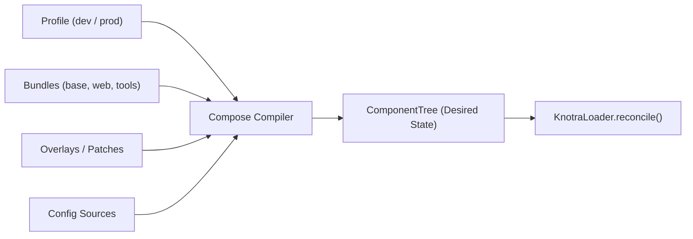

# Knotra 通用运行时架构演进设计文档

## 背景

Knotra 目前已经具备基于代际绑定（Generation Binding）、双重租约（Dynamic Lease）、排空收敛（Drain / Settlement）和原子结构事务（`RuntimeTransaction`）的微内核能力。通过 `Component`、`Context`、`Capability`、`Publication`、`Registration` 与 `MountHandle`，Knotra 在单向演进与安全热更方面建立了坚实的内核基础。

然而，在支撑如复杂 Agent 编排框架（以 `deepseek-harness` 为代表的插件树架构）、复杂工作流引擎或多租户模块化服务等高阶场景时，Knotra 暴露出底层调用语义与上层组合原语两个维度的关键断层：

1. **长生命周期与流式调用的 Lease 断层**：现有 `DynamicCapabilityImpl.java` 的动态代理仅对 `CompletionStage<?>` 延迟释放租约；对于 `Flow.Publisher<T>`、`Stream<T>`、长连接或会话句柄，方法返回时立即释放 `DynamicLease`，导致旧组件在流消费期间即可完成 Drain 和 ClassLoader 物理卸载，引发下游调用崩溃。
2. **静态能力输出（Offer）元数据缺失**：`ComponentDescriptor` 仅支持声明入边（`CapabilityRequirement`），无法静态表达出边（`CapabilityOffer`），导致启动前拓扑推演、缺失依赖诊断和 Dry-Run 校验无法在不实际调用 `start()` 的情况下完成。
3. **扩展点组合原语（Contribution Registry）缺失**：现有 `Capability` 仅支持 1:1 的单服务契约绑定。上层框架若存在多插件向同一服务贡献条目（如 Tools、Commands、Models、Routes）的诉求，必须由上层自行实现注册表，且无法天然利用 Knotra 的 Context 树级联、遮蔽（Shadowing）与生命周期自动注销能力。
4. **环绕拦截管道（Around Pipeline）缺失**：现有 `knotra-events` 的 `WATERFALL` 模式仅支持线性的单向数据变换（$T \to T$），无法实现具备完整控制权传递、短路、资源包裹（`try-finally`）与异常重试能力的洋葱中间件（`Interceptor`）。
5. **声明式配置编排层（Compose）缺失**：`knotra-loader` 的 `KnotraLoader.reconcile()` 是纯粹的期望树调和引擎，缺少类似 Profile、Bundle、Layer 与 Patch 的上层配置编译器，导致复杂系统装配成本高。

本次改造的目标是保持 `knotra-core` 作为高可靠微内核的纯粹性，修复 Core 中的长生命周期语义与补充 Offer 元数据，并在 Core 之上独立构建 `knotra-registry`、`knotra-pipeline` 与 `knotra-compose` 三个通用组合原语模块，使 Knotra 能够作为各类复杂应用框架的通用基础设施。

建议分支：`feature/runtime-evolution-primitives`

---

## 整体设计

### 1. 核心概念模型

演进后的 Knotra 运行时由六个高度正交的基础概念构成：



* **Component**：生命周期与物理实现的宿主。
* **Context**：能力与挂载点的树状隔离与继承边界。
* **Capability**：稳定的单一服务契约抽象（如 `HttpClient`、`ToolRegistry`）。
* **Contribution**：插件向某一 Capability 贡献的条目（如单个 `Tool`、单个 `Command`），随提供方 Lifecycle 自动注销。
* **Event / Pipeline**：广播通知与洋葱拦截机制。
* **Generation / Lease / Settlement**：保证任何结构变化时流量平滑切换、在途任务安全排空与拓扑一致性收敛。

### 2. 模块分层与依赖架构



---

## 详细设计

### 一、 Core 内核增强

#### 1. Long-lived Lease 与流式/作用域支持

**现状分析**：
在 `DynamicCapabilityImpl.java` 中，动态代理的 `invokeProxy` 在方法返回时根据结果类型决定是否释放 Lease：
```java
// 现有代码
if (result instanceof CompletionStage<?> stage) {
    return attachAsyncLease(stage, lease);
}
lease.close();
return result;
```
若方法返回 `Flow.Publisher<T>` 或 `Stream<T>`，Lease 在方法返回时立即释放，`ProviderLeaseRuntime` 计数归零，重载事务可直接触发并在流消费结束前完成 Settlement 与 ClassLoader 卸载。

**目标设计**：
在 `DynamicCapabilityImpl.java` 中引入对流式类型、可关闭资源与显式工作作用域（`WorkScope`）的完整支持：

1. **自动流式代理包装**：
   * 对 `Flow.Publisher<?>`：返回包装后的 `LeasedPublisher`。当下游调用 `subscribe(Subscriber)` 时，包装 `Subscriber`，在 `onComplete()`、`onError()` 或 `Subscription.cancel()` 时通过 CAS 释放 `DynamicLease`。
   * 对 `java.util.stream.Stream<?>`：通过 `stream.onClose(lease::close)` 绑定释放钩子。
   * 对 `AutoCloseable` 返回值：返回包装代理，在调用 `close()` 时触发 `lease.close()`。
2. **显式 `WorkScope` / `use()` API**：
   在 `DynamicCapability<T>` 接口中扩展显式持有租约的高阶函数：
   ```java
   public interface DynamicCapability<T> {
       // 现有接口
       <R> R call(DynamicOperation<? super T, ? extends R> operation);
       <R> CompletionStage<R> callAsync(AsyncDynamicOperation<? super T, ? extends R> operation);
       T proxy();

       // 新增显式租约作用域
       <R> R use(ScopedOperation<? super T, ? extends R> operation);
       Leased<T> acquireLease();
   }
   ```
   `Leased<T>` 继承 `AutoCloseable`，包含 `T provider()` 与显式 `close()`。
3. **租约防泄漏与 TTL 机制**：
   为避免客户端订阅后既不消费也不取消导致的挂起，`ProviderLeaseRuntime` 支持设置默认的 Lease 最大闲置/存活超时（可通过 `MountOptions` 配置）。超时后打出 Diagnostic 告警并强制释放。

#### 2. 静态 Capability Offer 声明

**现状分析**：
`ComponentDescriptor` 仅包含 `Set<CapabilityRequirement> requirements`。组件在启动前无法对外宣告自身可能输出的 Capability，导致静态分析器无法校验拓扑闭包。

**目标设计**：
扩展 `ComponentDescriptor`，新增 `CapabilityOffer` 集合（采用向后兼容的元数据模式）：

```java
public record CapabilityOffer(
        CapabilityKey<?> key,
        int priority,
        Map<String, String> attributes) implements Comparable<CapabilityOffer> {

    public CapabilityOffer {
        Objects.requireNonNull(key, "key");
        attributes = attributes == null ? Map.of() : Map.copyOf(attributes);
    }

    public static CapabilityOffer of(CapabilityKey<?> key) {
        return new CapabilityOffer(key, 0, Map.of());
    }

    public static CapabilityOffer of(Class<?> type) {
        return of(CapabilityKey.of(type));
    }

    @Override
    public int compareTo(CapabilityOffer other) {
        return this.key.compareTo(other.key);
    }
}
```

在 `ComponentDescriptor` 中提供重载构造函数与 Builder 支持：
```java
public record ComponentDescriptor(
        String componentId,
        Set<CapabilityRequirement> requirements,
        Set<CapabilityOffer> offers)
```
* **向后兼容**：旧构造方法默认 `offers = Set.of()`。
* **校验策略（`OfferValidationPolicy`）**：
  * `PERMISSIVE`（默认）：仅作为诊断元数据，未声明 Offer 的 `context.provide()` 正常允许。
  * `STRICT`：若组件执行 `context.provide(key, value)` 时该 `key` 未在 `descriptor().offers()` 中声明，抛出 `UndeclaredCapabilityOfferException`。

---

### 二、 通用组合原语模块设计

#### 1. `knotra-registry` (Contribution Registry)

`knotra-registry` 解决 1:N 扩展条目的贡献与聚合问题，将注册项与 Knotra Context 树及 Lifecycle 强绑定。

##### 核心接口与数据结构
```java
public interface ContributionRegistry<K, V> {
    /** 向注册表贡献条目，返回与生命周期关联的 Handle */
    ContributionHandle register(K key, V value, ContributionOptions options);

    default ContributionHandle register(K key, V value) {
        return register(key, value, ContributionOptions.defaults());
    }

    /** 沿 Context 树自底向上查找条目（支持子 Context 遮蔽父 Context） */
    Optional<V> find(K key);

    /** 获取当前 Context 视图下的全部有效条目快照（已按优先级排序并完成 Shadow 处理） */
    RegistrySnapshot<K, V> snapshot();
}

public interface ContributionHandle extends AutoCloseable {
    String registrationId();
    @Override
    void close(); // 从注册表中摘除并触发快照更新
}
```

##### 机制与不变量
1. **生命周期自动解绑**：
   插件在 `ActivationContext` 中获取 `ContributionRegistry` 后，将返回的 `ContributionHandle` 直接注册至 `ctx.lifecycle().manage("contrib:" + key, handle::close)`。插件卸载或重启时，条目自动注销。
2. **Context 级联与 Shadowing（遮蔽）**：
   * 注册表支持父子 Context 继承：`RegistryView childView = registry.createChildView(childContext)`。
   * 子 Context 中注册同名 Key 的条目默认 Shadow（覆盖）父 Context 的条目；当子 Context 条目被注销后，父 Context 的条目自动恢复可见。
3. **并发性能（Copy-On-Write 零锁快照）**：
   内部使用不可变 Trie 或不可变 Map 维护当前视图。读操作（`find()` / `snapshot()`）直接读取 `volatile` 的快照引用，完全无锁；写操作（`register()` / `close()`）在局部锁内完成并原子替换快照。

#### 2. `knotra-pipeline` (Around Interceptor Pipeline)

`knotra-pipeline` 采用经典的洋葱模型（Onion Architecture），提供控制权完全可控的环绕拦截器链。

##### 核心接口
```java
@FunctionalInterface
public interface AsyncInterceptor<I, O> {
    CompletionStage<O> intercept(I input, AsyncNext<I, O> next);
}

@FunctionalInterface
public interface AsyncNext<I, O> {
    CompletionStage<O> proceed(I input);
}

public interface Pipeline<I, O> {
    /** 注册拦截器，返回注销 Handle */
    ContributionHandle use(int priority, AsyncInterceptor<I, O> interceptor);

    /** 执行管道 */
    CompletionStage<O> execute(I input, Function<I, CompletionStage<O>> terminalHandler);
}
```

##### 执行机制
* **短路与降级**：拦截器可以选择不调用 `next.proceed(input)`，直接返回降级结果或抛出异常。
* **执行环绕（Context Scoping）**：
  ```java
  pipeline.use(100, (req, next) -> {
      MDC.put("traceId", req.traceId());
      long start = System.nanoTime();
      return next.proceed(req).whenComplete((res, err) -> {
          metrics.record(System.nanoTime() - start);
          MDC.clear();
      });
  });
  ```
* **生命周期集成**：拦截器的注册句柄与 `LifecycleScope` 结合，插件卸载时拦截器自动从链中移除。

---

### 三、 声明式编排层设计 (`knotra-compose`)

`knotra-compose` 位于 `knotra-loader` 之上，负责将多维度的配置、Profile、Bundle、Layer 和 Overlay 编译为 `knotra-loader` 可识别的声明式 `ComponentTree`。



##### 核心抽象
```java
public record Profile(String name, Set<String> activeBundles, Map<String, Object> configOverrides) {}

public record Bundle(String id, List<ComponentSpec> components, List<BundleRef> imports) {}

public record OverlayPatch(String targetComponentId, PatchAction action, Map<String, Object> configPatch) {}

public interface ComposeEngine {
    ComponentTree compile(CompositionPlan plan);
}
```

* **编译期计算**：完成依赖拓扑排序、版本约束匹配、配置合并与静态 Offer/Requirement 闭包检查。
* **Reconcile 交互**：编译生成的 `ComponentTree` 被原子提交给 `KnotraLoader.reconcile(desiredTree)`，由内核完成 Diff 与状态调和。

---

## 影响分析

### 1. 兼容性与现有组件影响
* **`DynamicCapabilityImpl` 增强**：完全向后兼容。现有返回普通对象和 `CompletionStage` 的调用逻辑行为保持不变；仅对 `Publisher`、`Stream` 和 `AutoCloseable` 增加了租约延展。
* **`ComponentDescriptor` 增强**：向后兼容。既有通过 `ComponentDescriptor.of(...)` 或 `named(...)` 创建的描述符默认 `offers` 为空集，默认模式下不强制校验。
* **`knotra-events` 与 `knotra-beans`**：无破坏性改动。`knotra-events` 保持轻量级事件总线职责，`knotra-beans` 可通过注解 `@KnotraInterceptor` / `@KnotraContribution` 进一步无缝集成新原语。

### 2. 失败模式与边界处理
* **流式租约挂起**：若客户端消费 `Publisher` 时异常丢失导致既不 `complete` 也不 `cancel`，依靠 `LeaseTimeoutTracker` 在租约超时后强制打断并触发报警。
* **并发拦截器变更**：Pipeline 在执行中若发生插件重载导致的拦截器注销，当前已在途的请求使用发起时刻捕获的不可变 Pipeline 链路快照执行，新发起的请求使用重构后的链，确保在途安全性。

---

## 发布与部署

### 1. 发布分期与依赖关系

| 阶段 | 交付模块 | 内容与改动性质 |
| :--- | :--- | :--- |
| **Phase 1** | `knotra-core` (0.2.0) | 修复 Long-lived Lease 语义（Publisher/Stream 适配）；扩展 `CapabilityOffer` 与 Builder |
| **Phase 2** | `knotra-registry`<br>`knotra-pipeline` | 新增两个独立通用原语模块，包含 Context 树级联、Shadowing 及 Async 洋葱拦截链 |
| **Phase 3** | `knotra-compose` | 新增声明式编排模块，实现 Profile/Bundle/Overlay 到 `ComponentTree` 的编译输出 |

### 2. 恢复与回滚限制
* 改动均为纯 Java 运行时抽象，无持久化数据库 Schema 或外部不可逆状态变更。
* 任何模块在引入异常时均可直接通过降级依赖版本进行标准 Maven / Gradle 回退。

---

## 测试

### 关键测试用例

| 编号 | 测试场景 | 前置条件 (Given) | 执行操作 (When) | 预期结果 (Then) |
| :--- | :--- | :--- | :--- | :--- |
| **TC-01** | 流式调用下插件热重载 Lease 保护 | 组件 A 提供返回 `Flow.Publisher<String>` 的能力；消费者开始订阅并拉取第 1 个 Token | 触发组件 A 的卸载/替换事务并调用 `settlement.whenSettled()` | 在消费者拉取完全部 Token 并触发 `onComplete()` 前，Settlement 保持未完成；流消费完毕后瞬间完成 Drain 与卸载。 |
| **TC-02** | Stream 资源关闭后释放 Lease | 组件提供返回 `Stream<String>` 的动态代理调用 | 消费者获取 Stream，遍历前 2 项后调用 `stream.close()` | `DynamicLease` 随 `close()` 释放，`ProviderLeaseRuntime` 活跃计数从 1 归 0。 |
| **TC-03** | 静态 Offer 声明与描述符序列化 | 创建声明了 `offers(ModelProvider.class)` 的组件描述符 | 读取 `descriptor.offers()` 与 `sortedOffers()` | 准确返回声明的能力集合，且不影响原 `requirements` 依赖解析。 |
| **TC-04** | 注册表 Context 树级联与 Shadowing | Root Context 注册 `Tool("bash")`；Child Context 注册 `Tool("bash-restricted")` | 分别在 Root 和 Child Context 中执行 `registry.find("bash")` | Root 查出原版 `bash`；Child 查出 `bash-restricted`。注销 Child 条目后，Child 再次查询自动回退显示 Root 版 `bash`。 |
| **TC-05** | 注册表 Handle 与生命周期绑定 | 插件在 `start()` 中向 `ContributionRegistry` 注册条目并将 Handle 加入 `LifecycleScope` | 卸载或重启该插件 | 插件卸载完成后，注册表快照中该条目被自动清理，无需手动注销。 |
| **TC-06** | 洋葱模型拦截器短路与指标包裹 | 配置两个 Interceptor：A 记录耗时，B 判定权限不足直接抛出拒绝异常 | 执行 `pipeline.execute(request, handler)` | B 成功短路，终端 handler 未被调用；A 的 `finally` 块正常记录了耗时指标与 Trace 清理。 |
| **TC-07** | Compose 编译器合并与 Reconcile | 配置 Base Bundle 与 Dev Profile Overlay（覆盖部分配置） | 调用 `composeEngine.compile(plan)` 并提交 `KnotraLoader.reconcile()` | 生成结构正确的 `ComponentTree`，KnotraLoader 成功装配出符合预期的运行时代际。 |
