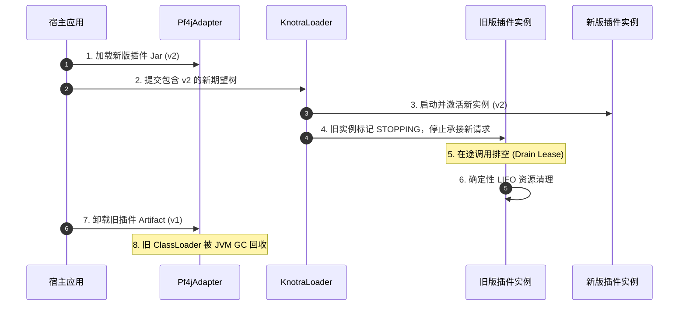

# 插件工程化手册

本手册指导如何使用 PF4J 与 Knotra 构建具备**热加载、平滑热升级、在途调用排空（Drain）与 ClassLoader 彻底回收**能力的生产级插件系统。

## 插件开发四大黄金法则

1. **共享契约下沉**：接口与配置 DTO 必须定义在独立的 contract 模块中，由宿主与插件共享 ClassLoader。
2. **只导出受控工厂**：插件只向外暴露 `ComponentFactory`，禁止将插件内部的私有类或单例实例直接注册到宿主全局上下文。
3. **加载不等于挂载**：加载插件 Jar 仅建立工厂目录（Catalog），具体挂载时机、拓扑与配置由宿主显式控制。
4. **排空后再卸载**：旧版本插件卸载前必须完成在途调用排空（Drain），确保插件 `PluginClassLoader` 能够被 JVM 垃圾回收（GC）。

## 标准三层工程结构

推荐使用如下三模块标准结构进行工程化组织：

```text
my-project/
├── platform-contract/          # 1. 共享契约模块（仅包含接口与通用 DTO）
│   └── src/main/java/com/example/contract/
│       ├── PaymentGateway.java
│       └── PaymentConfig.java
│
├── payment-plugin/             # 2. 插件实现模块（打包为独立 PF4J Jar）
│   ├── pom.xml
│   └── src/main/java/com/example/payment/
│       ├── PaymentPluginProvider.java
│       └── DefaultGatewayComponent.java
│
└── host-app/                   # 3. 宿主应用模块（负责运行 Knotra 运行时与插件加载器）
    ├── pom.xml
    └── src/main/java/com/example/host/
```

### 插件模块 pom.xml 依赖规范

插件必须将共享契约与 Knotra 核心包设置为 `provided`，避免将其重复打包进插件 Jar 中引起类加载冲突：

```xml
<dependencies>
  <!-- 共享契约：由宿主提供 -->
  <dependency>
    <groupId>com.example</groupId>
    <artifactId>platform-contract</artifactId>
    <version>${contract.version}</version>
    <scope>provided</scope>
  </dependency>

  <!-- Knotra 核心与 SPI 依赖：由宿主提供 -->
  <dependency>
    <groupId>io.knotra</groupId>
    <artifactId>knotra-core</artifactId>
    <scope>provided</scope>
  </dependency>
  <dependency>
    <groupId>io.knotra</groupId>
    <artifactId>knotra-pf4j-spi</artifactId>
    <scope>provided</scope>
  </dependency>
</dependencies>
```

## 共享契约设计规范

共享契约必须保持纯粹与稳定：

```java
package com.example.contract;

public interface PaymentGateway {
    ChargeResult charge(ChargeRequest request);
}
```

配置类同样作为共享契约暴露：

```java
package com.example.contract;

public record PaymentConfig(String channel, int timeoutMillis) {
    public PaymentConfig {
        if (channel == null || channel.isBlank()) {
            throw new IllegalArgumentException("channel 不能为空");
        }
        if (timeoutMillis <= 0) {
            throw new IllegalArgumentException("timeoutMillis 必须大于 0");
        }
    }
}
```

> **契约禁令**：禁止在共享契约的方法签名或返回值中使用插件私有类型、私有异常或第三方非共享类库。

## 插件端实现：导出受控工厂

插件通过实现 `RuntimeComponentProvider` 暴露扩展工厂：

```java
package com.example.payment;

import org.pf4j.Extension;
import io.knotra.pf4j.spi.RuntimeComponentProvider;
import io.knotra.pf4j.spi.ExportedComponentFactory;

@Extension
public final class PaymentPluginProvider implements RuntimeComponentProvider {

    @Override
    public Collection<ExportedComponentFactory<?>> factories() {
        return List.of(
                ExportedComponentFactory.of(
                        PaymentConfig.class,
                        new ConfiguredGatewayFactory())
        );
    }
}
```

### 编写组件工厂与生命周期

```java
public final class ConfiguredGatewayFactory implements ComponentFactory<PaymentConfig> {
    @Override
    public String factoryId() {
        return "payment.configured";
    }

    @Override
    public PaymentConfig normalizeConfig(PaymentConfig config) {
        return new PaymentConfig(config.channel().trim(), Math.min(config.timeoutMillis(), 5000));
    }

    @Override
    public Component<PaymentConfig> create() {
        return new Component<>() {
            @Override
            public ComponentDescriptor descriptor() {
                return ComponentDescriptor.named("payment.configured");
            }

            @Override
            public void start(ActivationContext context, PaymentConfig config) {
                PaymentGateway gateway = new RealPaymentGateway(config);
                // 1. 暴露契约实现
                context.provide(PaymentGateway.class, gateway);
                // 2. 登记销毁逻辑：在组件停止时按 LIFO 逆序自动调用
                context.lifecycle().onClose("payment-gateway", gateway::close);
            }
        };
    }
}
```

> **无状态原则**：`ComponentFactory` 必须是无状态的，不得在工厂字段中缓存某次激活的具体业务对象；业务实例必须在 `start(...)` 期间通过 `ActivationContext` 管理。

## 宿主端加载与挂载

### 1. 创建适配器并加载插件

宿主在创建 `Pf4jArtifactAdapter` 时显式声明共享包路径：

```java
try (KnotraRuntime runtime = KnotraRuntime.create();
     Pf4jArtifactAdapter adapter = Pf4jArtifactAdapter.create(
             pluginsRoot,
             runtime,
             Set.of("com.example.contract"))) { // 声明共享契约包

    // 异步加载插件 Jar
    ArtifactSnapshot artifact = adapter.loadArtifactAsync(pluginJar)
            .toCompletableFuture()
            .get(30, TimeUnit.SECONDS);

    // 加载成功后，工厂目录可见，但尚未挂载任何组件
    assertTrue(adapter.factories().find("payment.configured").isPresent());
}
```

### 2. 显式挂载组件

从工厂目录中解析目标工厂并挂载到运行时树：

```java
ArtifactFactoryHandle.Configured<PaymentConfig> factory = adapter.factories()
        .resolve("payment.configured", PaymentConfig.class)
        .orElseThrow();

// 解码配置并挂载
PaymentConfig config = factory.decodeConfig(Map.of("channel", "alipay", "timeoutMillis", 3000));
ConfiguredMountHandle<PaymentConfig> handle = factory.mount(runtime.root(), "payment-main", config);
handle.requireActive(Duration.ofSeconds(10));
```

## 声明式期望树管理 (knotra-loader)

宿主可以通过 `KnotraLoader` 声明期望的组件拓扑树，Loader 会自动计算 Diff 并执行平滑增删改：

```java
ComponentFactoryResolver resolver = Pf4jFactoryResolver.of(adapter);

try (KnotraLoader loader = KnotraLoader.owned(runtime, resolver)) {
    ComponentTree desired = ComponentTree.of(
            ComponentEntry.configured(
                    "payment.main",
                    FactoryRef.of("payment.configured", "1.0.0"),
                    Map.of("channel", "wechat", "timeoutMillis", 2000)));

    // 自动对比收敛
    ReconcileResult result = loader.reconcileAsync(desired)
            .toCompletableFuture()
            .get(30, TimeUnit.SECONDS);
    result.requireConverged();
}
```

## 热升级、在途排空与卸载时序

当需要升级插件至新版本时，标准执行时序如下：



执行代码：

```java
// 1. 加载新版本
adapter.loadArtifactAsync(newPluginJar)
        .toCompletableFuture()
        .get(30, TimeUnit.SECONDS);

// 2. 升级期望树
loader.reconcileAsync(desiredV2)
        .toCompletableFuture()
        .get(60, TimeUnit.SECONDS);

// 3. 卸载旧版本 Artifact
adapter.unloadArtifactAsync(oldArtifactId)
        .toCompletableFuture()
        .get(60, TimeUnit.SECONDS);
```

## ClassLoader 内存泄漏防护红线

为了确保插件卸载后其 `PluginClassLoader` 能够被 JVM GC 彻底回收，插件与宿主必须严格遵守以下七大红线：

1. **禁止静态字段持有实例**：插件内部不得在 `static` 字段中持久持有业务对象、线程池或 Class 引用。
2. **禁止后台线程逃逸**：组件启动的后台定时任务或线程必须登记到 `context.lifecycle()`，在销毁时显式 shutdown。
3. **禁止将私有类暴露到宿主上下文**：不得向宿主注册插件私有的 Exception、Class 或 Listener。
4. **禁止未清理的 ThreadLocal**：若使用 `ThreadLocal`，在每次请求结束时必须显式调用 `remove()`。
5. **注销第三方客户端**：JMX MBean、日志 Appender、注册中心客户端必须在 lifecycle 关闭钩子中注销。
6. **保持契约 ClassLoader 纯净**：确认共享契约是由宿主 ClassLoader 加载，禁止将其打包在插件内部。
7. **使用纯数据快照**：Knotra 的快照（`RuntimeSnapshot`）与失败详情（`FailureInfo`）均为纯数据 DTO，内部不持有 Class 引用。

## 下一步

- 运行时内核模型、高级结构事务与 Context 树：[运行时内核](runtime-kernel.md)
- 线程模型、停机诊断与测试质量保证：[生产实践与排障](production-practice.md)
- 实战案例与动态路由实践：[实战案例](case-sample.md)
