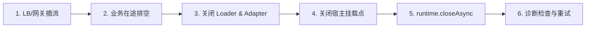

# 生产实践与排障指南

本指南汇集了 Knotra 的线程模型规范、生产优雅停机流程、挂起诊断分析、测试质量保证以及常见问题排障手册。

## 五大执行边界规范

为了保证高并发下的系统稳定性，各执行边界的工作范围界定如下：

| 执行边界 | 允许的操作 | 严格禁止的操作 |
|---|---|---|
| **事务回调（`transact`）** | 记录 `provide`、`revoke`、`childContext` 等变更意图。 | 执行 I/O 操作、等待异步结果、调用 Loader 或外部网络。 |
| **Activation 启动（`start`）** | 实例化对象、校验配置、申请资源并登记到 `LifecycleScope`。 | 提前暴露未就绪对象、执行无界耗时阻塞。 |
| **Lifecycle 销毁（`cleanup`）** | 关闭连接池、取消异步任务、释放本地资源。 | 接收新的业务请求、忽略销毁异常。 |
| **动态代理调用（`proxy`）** | 短期业务方法计算、持有短期租约。 | 在租约外启动不受控的后台脱缰任务。 |
| **业务应用线程** | 调用 Capability、带超时等待 Settlement 变更收敛。 | 直接修改或侵入 Knotra 内部状态。 |

## 超时与有界等待原则

在生产环境中，**坚决禁止任何形式的无界等待**：

```java
// 错误示例：无超时预算，一旦发生死锁或卡顿，业务线程将被永久挂起
stage.toCompletableFuture().get(); // 禁止无界 get
```

正确做法是为每一次状态等待显式配置超时预算：

```java
// 1. 等待发布变更收敛
change.awaitSettled(Duration.ofSeconds(10));

// 2. 等待挂载点进入 ACTIVE
handle.requireActive(Duration.ofSeconds(10));

// 3. 等待挂载点自身过渡
ComponentState state = handle.whenSettled()
        .toCompletableFuture()
        .get(10, TimeUnit.SECONDS);
```

### 生产超时预算推荐表

| 操作类型 | 建议超时预算 | 说明 |
|---|---|---|
| 本地 POJO Bean 激活 | 5 - 10 秒 | 仅涉及本地构造与依赖组装 |
| 外部连接型组件激活 | 10 - 30 秒 | 涉及数据库连接池、网络握手 |
| 动态策略热替换收敛 | 5 - 15 秒 | 依赖动态代理时通常可在毫秒级收敛 |
| 插件在途排空（Drain） | 30 - 60 秒 | 等待已有业务请求平滑处理完成 |
| 运行时整体停机（Close） | 30 - 60 秒 | 确保所有 LIFO 资源安全释放 |

## 生产优雅停机六步法

在容器化（K8s / Spring Boot）生产环境中，推荐的优雅停机顺序如下：



生产代码示例：

```java
// 1. 网关停止分发新流量并等待在途业务请求完成
gateway.stopTraffic();
gateway.drain(Duration.ofSeconds(30));

// 2. 关闭 Loader 与插件适配器（排空插件调用）
loader.closeAsync().toCompletableFuture().get(30, TimeUnit.SECONDS);
adapter.closeAsync().toCompletableFuture().get(30, TimeUnit.SECONDS);

// 3. 关闭运行时内核
runtime.closeAsync().toCompletableFuture().get(30, TimeUnit.SECONDS);
```

## 停机卡住时采样挂起操作

`closeAsync()` 的语义是无界排空收敛，框架不会注入隐藏超时，也不会因为读取诊断而跳过资源释放。

当带超时的 `get(...)` 发生 `TimeoutException` 时，应分别向各 owner 请求挂起操作快照并渲染输出，精准定位“还在等什么”：

```java
try {
    runtime.closeAsync().toCompletableFuture().get(30, TimeUnit.SECONDS);
} catch (TimeoutException stillPending) {
    System.err.println(runtime.advanced().pendingOperations().render());
    System.err.println(bus.pendingOperations().render());      // knotra-events
    System.err.println(adapter.pendingOperations().render());  // knotra-pf4j
    System.err.println(loader.pendingOperations().render());   // knotra-loader
}
```

四份快照彼此独立、各自 point-in-time，没有跨 owner 的全局聚合视图；空列表只代表采样瞬间没有已知挂起操作。跨层定位时使用稳定 ID 关联同一条阻塞链：

```text
# adapter.pendingOperations().render()
closeRequested=true
ARTIFACT_DRAIN|pricing-plugin|COMPONENT|PT2.134S|phase=dispose-roots, rootIds=[m-42], closureIds=[pricing-plugin]
omitted=0

# runtime.advanced().pendingOperations().render()
closeRequested=true
COMPONENT_TRANSITION|m-42|COMPONENT|PT2.134S|component dispose
LIFECYCLE_CLEANUP|entry-17|LIFECYCLE_ENTRY|PT1.921S|async pricing-listener
omitted=0

# bus.pendingOperations().render()
closeRequested=false
EVENT_DISPATCH|event-dispatch-bus-3-12|LISTENER|PT2.301S|event=OrderCreated type=com.demo.OrderCreated mode=SERIAL listeners=1
EVENT_SUBSCRIPTION_DRAIN|event-subscription-bus-3-8|DISPATCH|PT2.301S|pending dispatches=1 ids=[event-dispatch-bus-3-12]
omitted=0
```

关联排查路径：
- adapter 侧 `rootIds` 中的 `m-42` 与 core 侧 `COMPONENT_TRANSITION` 的 targetId 相同。
- 该句柄的 `LIFECYCLE_CLEANUP` 表明正在清理 `pricing-listener`。
- 事件总线侧被卡住的 `EVENT_DISPATCH` 出现在 `EVENT_SUBSCRIPTION_DRAIN` 中。
- 由此直接定位到卡住的具体监听器回调。

## 线程上下文类加载器 (TCCL) 规范

1. **禁止随意篡改**：禁止在业务逻辑中修改 `Thread.currentThread().getContextClassLoader()` 而不恢复。
2. **线程池隔离**：提交给共享线程池的任务不得隐式捕获插件私有的 ClassLoader。
3. **Spring 模块指定 Loader**：使用 `SpringModules` 挂载插件配置类时，显式传入插件专属的 `ClassLoader`。

## 监控指标与告警建议

通过 `runtime.advanced().snapshot()` 采集纯数据指标并对接到 Micrometer / Prometheus：

```java
// 1. 活跃挂载点数
Gauge.builder("knotra.mounts.active", () ->
        runtime.advanced().snapshot().mounts().stream()
                .filter(m -> m.state() == ComponentState.ACTIVE).count())
        .register(registry);

// 2. 失败挂载点数
Gauge.builder("knotra.mounts.failed", () ->
        runtime.advanced().snapshot().mounts().stream()
                .filter(m -> m.state() == ComponentState.FAILED).count())
        .register(registry);

// 3. 注册项总数
Gauge.builder("knotra.registrations", () ->
        runtime.advanced().snapshot().registrations().size())
        .register(registry);
```

### 推荐告警规则
- `knotra.mounts.failed > 0` 持续超过 1 分钟：提示有组件激活或清理失败。
- 动态代理调用抛出找不到提供方频次异常升高：提示所需服务未就绪。
- 单次 `awaitSettled(...)` 耗时超过预期阈值：提示存在耗时较长的在途请求或阻塞操作。

## 测试与质量保证指南

### 六大测试原则

1. **职责分离**：纯业务逻辑使用常规 JUnit 单元测试；涉及动态装配与热替换时才启动 `KnotraRuntime`。
2. **测试隔离**：每个测试用例创建独立的 Runtime 实例，在 `try-with-resources` 或 `@AfterEach` 中完成关闭。
3. **严格设置超时预算**：所有等待统一使用带超时的 `awaitSettled(Duration)` 或 `requireActive(Duration)`，严禁无界等待。
4. **精确断言目标状态**：操作级收敛完成不代表所有节点都处于 ACTIVE，需显式断言目标挂载点的实际状态。
5. **异常与重试可观测**：测试资源销毁失败时允许进入 FAILED，显式发起 retry 后再断言 DISPOSED。
6. **类加载器 GC 回收断言**：插件卸载测试必须验证弱引用（`WeakReference`）能够被 JVM GC 彻底回收。

### 基础测试骨架

```java
@Test
void dynamicProxyFollowsProviderReplacement() throws Exception {
    Duration timeout = Duration.ofSeconds(5);

    try (KnotraRuntime runtime = KnotraRuntime.create()) {
        // 1. 发布 v1 实现
        PublicationChange<Greeting> firstChange =
                runtime.publish(Greeting.class, new ConstantGreeting("v1"));
        Publication<Greeting> greeting = firstChange.publication();
        firstChange.awaitSettled(timeout);

        // 2. 挂载动态依赖 Greeting 的消费方
        var greetingDep = Beans.dynamic(Greeting.class);
        BeanDefinition<GreetingRenderer> definition = Beans
                .component("renderer")
                .with(greetingDep)
                .create(deps -> new GreetingRenderer(deps.get(greetingDep)))
                .provideAs(RenderedGreeting.class)
                .build();

        MountHandle handle = definition.mount(runtime);
        handle.requireActive(timeout);

        // 3. 验证 v1 输出
        assertEquals("v1: Hello, Knotra", runtime.require(RenderedGreeting.class).render("Knotra"));

        // 4. 热替换为 v2 实现
        PublicationChange<Greeting> secondChange =
                greeting.update(new ConstantGreeting("v2"));
        SettlementReport report = secondChange.awaitSettled(timeout);

        // 5. 验证消费方未失败且自动切换为 v2
        assertFalse(report.hasFailedMounts());
        handle.requireActive(timeout);
        assertEquals("v2: Hello, Knotra", runtime.require(RenderedGreeting.class).render("Knotra"));
    }
}
```

### ClassLoader GC 回收验证测试

```java
@Test
void pluginClassLoaderIsGarbageCollectedAfterUnload() throws Exception {
    WeakReference<ClassLoader> loaderRef;

    try (KnotraRuntime runtime = KnotraRuntime.create();
         Pf4jArtifactAdapter adapter = Pf4jArtifactAdapter.create(pluginsDir, runtime, Set.of("com.example.contract"))) {

        // 1. 加载插件并记录其 ClassLoader 弱引用
        ArtifactSnapshot artifact = adapter.loadArtifactAsync(pluginJar)
                .toCompletableFuture()
                .get(10, TimeUnit.SECONDS);
        ClassLoader pluginLoader = adapter.classLoaderOf(artifact.id()).orElseThrow();
        loaderRef = new WeakReference<>(pluginLoader);

        // 2. 挂载并使用
        ArtifactFactoryHandle.NoConfig factory = adapter.factories().resolveNoConfig("demo").orElseThrow();
        MountHandle mount = factory.mount(runtime.root(), "demo-mount");
        mount.requireActive(Duration.ofSeconds(5));

        // 3. 释放挂载并卸载插件
        mount.disposeAsync().toCompletableFuture().get(10, TimeUnit.SECONDS);
        adapter.unloadArtifactAsync(artifact.id()).toCompletableFuture().get(10, TimeUnit.SECONDS);
    }

    // 4. 显式触发 GC 并断言弱引用已被回收
    for (int i = 0; i < 10 && loaderRef.get() != null; i++) {
        System.gc();
        Thread.sleep(100);
    }

    assertNull(loaderRef.get(), "插件 ClassLoader 必须在卸载后被 JVM GC 完全回收");
}
```

## 高频 FAQ 与故障排查

### Q1: `awaitSettled()` 正常返回了，为什么组件不一定是 ACTIVE 状态？

**解答**：
- Publication 和结构事务返回的 **操作级收敛（Settlement）** 描述的是“本次变更引发的传播与在途排空已经收敛”。
- 若下游某个依赖此能力的组件在启动时抛出了异常，该异常会被记录到 `SettlementReport` 中，挂载点会进入 `FAILED`，但这并不妨碍本次变更操作本身的正常收敛。
- **正确做法**：检查报告中是否存在失败节点，并断言具体挂载点：

```java
SettlementReport report = change.awaitSettled(Duration.ofSeconds(10));
if (report.hasFailedMounts()) {
    System.err.println("失败挂载点: " + report.failedMounts());
}
handle.requireActive(Duration.ofSeconds(10));
```

### Q2: `hasFailedMounts()` 为 false，如何确认我的挂载点真正生效了？

**解答**：
- 如果被替换的能力仅被 `Beans.dynamic` 代理依赖，消费方无需销毁重建，此时本次变更的受影响挂载集为空（`hasAffectedMounts() == false`）。
- 空影响集下没有失败挂载，因此 `hasFailedMounts()` 也为 `false`。
- 如果需要验证具体某个挂载点是否就绪，应直接调用 `handle.requireActive(timeout)` 进行断言。

### Q3: 更新 Publication 提示 `DISPLACED` 或被拒绝是什么原因？

**解答**：
- `Publication<T>` 具有生命周期状态：
  - `PUBLISHED`：正常状态，可重复调用 `update(...)`。
  - `UNPUBLISHED`：已被显式撤销，终态不可逆。
  - `DISPLACED`：由于外部发起了替换、父级 Context 被释放或 Runtime 被关闭，槽位已被移除。
- 处于 `DISPLACED` 状态的槽位不再接受 `update(...)`，如需恢复需重新在对应 Context 中调用 `publish(...)`。

### Q4: 槽位进入终态后会复活吗？并发 update 会冲突吗？

**解答**：
- 终态（`UNPUBLISHED` / `DISPLACED`）不可逆。同一坐标重新 `runtime.publish(...)` 会创建**全新槽位**，旧 `Publication` 句柄保持终态不变。
- 并发 `update(...)` 按提交总序线性化，全部成功；并发 `unpublish(...)` 只有第一个执行真实撤销，其余幂等返回已收敛的终态结果。

### Q5: 动态代理调用抛出找不到提供方异常怎么办？

**解答**：
- 检查提供方是否被意外撤销（unpublish）。
- 检查提供方与消费方是否处于同一个 Context 或可见的父子 Context 中。
- 检查能力契约名称与 Java 类型是否完全一致（注意 ClassLoader 是否相同）。

### Q6: `closeAsync()` 有界等待超时了，怎么判断卡在哪里？

**解答**：
超时后分别调用四个 owner 的挂起操作诊断：
```java
System.err.println(runtime.advanced().pendingOperations().render());
System.err.println(bus.pendingOperations().render());
System.err.println(adapter.pendingOperations().render());
System.err.println(loader.pendingOperations().render());
```
沿稳定 ID 关联阻塞链，精确定位卡住的监听器或清理钩子。

## 诊断码 (DiagnosticCode) 速查手册

| 诊断码 | 含义 | 处置建议 |
|---|---|---|
| **MISSING_CAPABILITY** | 缺失必需的能力 | 检查提供方是否已发布，以及 Context 可见性边界。 |
| **CAPABILITY_SLOT_OCCUPIED** | 槽位冲突 | 同一 Context 下已存在同名能力，请使用 update 或指定不同名称。 |
| **CAPABILITY_TYPE_CONFLICT** | 类型冲突 | 同名能力绑定了不同的 Java Class 类型，修正类型定义。 |
| **BINDING_CYCLE** | 依赖循环 | 检查依赖图是否存在环路；将其中一侧改为 `Beans.dynamic` 即可打破硬环路。 |
| **ACTIVATION_FAILED** | 启动激活失败 | 查看 `FailureInfo` 摘要，检查构造函数、依赖项或 initializer 逻辑。 |
| **CLEANUP_FAILED** | 资源清理失败 | 检查 close 方法是否阻塞或抛错；修复后调用 `handle.retryAsync()`。 |
| **NON_CONVERGENT_RECONCILE** | 声明式调和未收敛 | 检查期望树中是否存在互相依赖振荡的配置。 |
| **INVALID_CONFIG** | 配置无效 | 配置校验（`normalizeConfig`）返回非法值或解码失败，修正输入配置。 |

## 挂载点失败恢复与幂等重试 (retryAsync)

当挂载点进入 `FAILED` 状态时，不需要盲目重启整个应用，Knotra 支持针对单个挂载点的**幂等重试（Retry）**：

```java
ComponentState state = handle.state();
if (state == ComponentState.FAILED) {
    // 修复外部环境问题后发起重试
    ComponentState nextState = handle.retryAsync()
            .toCompletableFuture()
            .get(10, TimeUnit.SECONDS);

    assertEquals(ComponentState.ACTIVE, nextState);
}
```

## 插件 ClassLoader GC 泄漏排查 7 步法

若在插件卸载后，通过 JVM Profiler 发现 `PluginClassLoader` 滞留在内存中，按以下顺序排查：

1. **检查插件状态**：确认 `Pf4jArtifactAdapter` 中该 artifact 状态已变为 `UNLOADED`。
2. **检查宿主挂载**：确认 `runtime.advanced().snapshot().mounts()` 中已无任何使用该插件 Factory 的挂载点。
3. **检查静态字段**：插件代码内是否有 `static` 变量引用了插件类或单例对象。
4. **检查逃逸线程**：插件内启动的线程池、Timer 或守护线程是否未执行 `shutdown()`。
5. **检查 ThreadLocal**：线程池中的复用工作线程是否残留了未清理的 `ThreadLocal` 变量。
6. **检查三方注册**：日志框架、JMX MBean、注册中心客户端是否在 lifecycle 钩子中注销。
7. **检查共享契约 ClassLoader**：确认 `platform-contract` 模块是由宿主 ClassLoader 加载，而非打在插件 Jar 内部。
