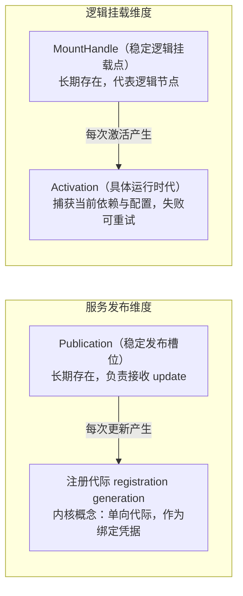
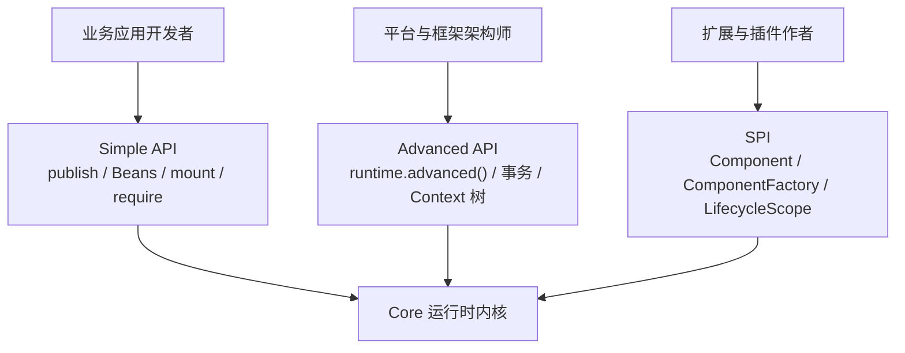

# 运行时内核架构

本指南面向框架与平台架构师，深入剖析 Knotra 的架构分层、内核领域模型、与既有方案对比、代际绑定机制、高级结构事务、Context 树以及模块分工。

---

# 架构对比与领域模型

## 与既有动态化方案对比

| 维度 | Spring 动态配置 / 策略模式 | 传统 PF4J / 自定义 ClassLoader | OSGi 规范体系 | Knotra 动态运行时 |
|---|---|---|---|---|
| **热替换粒度** | 依赖配置中心刷新 Bean 内部字段，无法热卸载/替换类 | 插件级粗粒度加载，缺乏组件间微观依赖管理 | 模块（Bundle）级，概念与配置极其繁琐 | **细粒度槽位（Publication）与挂载点（Mount）** |
| **在途流量保护** | 无原生保护，并发请求可能读到半更新状态 | 强行卸载易引发在途请求异常 | 依赖生命周期钩子，排空逻辑需自行实现 | **原生非阻塞排空（Drain Lease）**：新老流量平滑交接 |
| **依赖感知与收敛** | 需手写监听器重新注入或刷新 Context | 无法自动感知跨插件细粒度依赖变化 | 依赖解析复杂，状态转换容易卡死 | **代际依赖跟踪**：提供方更新后自动透明路由或原子重建 |
| **ClassLoader 回收** | 不涉及类卸载 | 极易发生类加载器引用泄漏导致 OOM | 机制沉重，学习曲线陡峭 | **纯数据快照与有界诊断**：框架不持久持有类引用，保证彻底 GC |
| **上手门槛** | 低 | 中 | 极高 | **低**：提供与 Spring / POJO 高度贴合的 Fluent DSL |

## 四对核心领域模型

在 JVM 动态组件运行时中，核心难题在于**如何调和“长期稳定的服务访问”与“单向演进的不可变代际”之间的矛盾**。Knotra 通过以下四对核心抽象清晰界定了生命周期边界：



### 1. Publication（发布槽位）vs 注册代际（registration generation）

* **`Publication<T>`**：一个 Context 内长期存在的**稳定逻辑槽位**（如电视频道）。业务调用方只与 Publication 打交道，槽位身份在整个运行期间保持不变。同一坐标的 `runtime.publish` 是 get-or-update 语义；终态槽位不复活，同坐标重新 publish 会创建新槽位。
* **注册代际（registration generation，内核概念，非公共 API）**：某一特定时刻已提交的**具体能力代际**（如当前播放的节目）。当通过 `publication.update(...)` 升级能力时，内核生成全新的不可变代际；被替换的旧代际失效，等待在途调用排空后平滑退场。

### 2. MountHandle（挂载点）vs Activation（激活代）

* **`MountHandle`**：一个组件附加在运行时树上的**稳定逻辑位置**（如墙上的电源插座）。挂载点的身份在多次重启、重配置或依赖更新中保持不变。
* **`Activation`**：挂载点在某一确定代际下的**一次具体启动尝试与实例**。每次激活都会精准捕获启动时的配置与依赖绑定集合；启动或清理失败只会影响当前 Activation，挂载点本身依然存在并可随时重试。

### 3. 操作级收敛（Settlement）vs 挂载点过渡（Mount Transition）

* **操作级收敛（Settlement）**：由 `Publication` 以及结构事务返回，递归覆盖本次操作触发的**受管子树与影响集**，确保变更在全局拓扑中平稳收敛。
* **挂载点自身过渡（Mount Transition）**：`MountHandle.whenSettled()` 仅等待该挂载点自身的状态过渡（返回 `ComponentState`），不等待其拥有的子节点。这种设计允许父挂载点率先进入 ACTIVE 状态，从而让子节点能够及时消费父节点输出的能力，彻底杜绝父子节点互相等待导致的死锁。

### 4. 核心概念速查表

| 核心概念 | 官方语义 | 直觉比喻 | 业务理解 |
|---|---|---|---|
| **`Capability`** | 类型化命名服务契约 | **电视频道协议** | 定义服务能力，不绑定具体实现。 |
| **`Publication<T>`** | 稳定发布槽位 | **电视机频道** | 长期存在的稳定槽位，支持随时推送新版本。 |
| **注册代际（registration generation）** | 内核已提交的具体能力代际 | **当前播放的具体节目** | `Publication.update` 推进代际；旧代际随排空退场。 |
| **`MountHandle`** | 稳定的逻辑挂载点 | **墙上的多功能插座** | 业务逻辑挂载的位置，多次重启或重配置身份不变。 |
| **`Activation`** | 一次运行时的激活尝试 | **通电运转的电器** | 每次启动产生的具体实例，捕获当时的依赖与配置。 |
| **`Settlement`** | 单次操作的传播与排空收敛 | **变更平滑生效并稳定** | 描述单次变更引起的依赖传播、排空与子树初始化全部完成。 |
| **`Beans.dynamic()`** | 动态接口代理注入 | **前台总机电话** | 自动路由到最新实现；提供方升级时消费方无需重启。 |
| **`Beans.fixed()`** | 固定代际依赖注入 | **签署固定版本合同** | 绑定提供方特定代际；提供方升级时消费方安全重建。 |

---

# API 三层分层体系



| 层次 | 目标使用者 | 核心类与入口 | 设计边界与原则 |
|---|---|---|---|
| **Simple API** | 日常业务开发 | `KnotraRuntime`、`Publication`、`Beans`、`MountHandle` | 零事务概念、无原始代际操纵、无底层配置占位类型，开箱即用。 |
| **Advanced API** | 平台与框架架构师 | `runtime.advanced()` | 支持多操作结构事务、多租户 Context 树与全量纯数据快照。注册代际是内核概念；发布走 `Publication`，事务内暂存走 `tx.provide`。 |
| **SPI** | 插件与扩展开发者 | `Component`、`ComponentFactory`、`ActivationContext` | 直接实现底层生命周期，管理原生资源并遵循 ClassLoader 隔离规则。 |

---

# 模块分工全景

| 模块名 | 职责与定位 | 核心特性 |
|---|---|---|
| `knotra-bom` | 版本依赖集中管理 BOM | 统一定义组件依赖版本 |
| `knotra-starter` | 普通应用快速接入 Starter | 聚合 Core 与 Beans 模块 |
| `knotra-core` | 运行时内核 | Publication、Mount、事务、生命周期与快照 |
| `knotra-beans` | POJO 声明式装配 Fluent DSL | 6 种依赖模式、生命周期钩子、配置型 Bean |
| `knotra-beans-processor` | 编译期注解处理器 | 编译期生成工厂代码，零运行时反射 |
| `knotra-events` | 进程内类型化事件总线 | 5 种分发模式（Sync/Parallel/Serial/Bail/Waterfall）、在途排空 |
| `knotra-spring` | Spring 容器集成适配器 | 独立子容器隔离挂载、宿主单例动态桥接 |
| `knotra-spring-starter` | Spring 应用快速接入 Starter | 聚合 Starter 与 Spring 适配 |
| `knotra-pf4j-spi` | 插件受控工厂 SPI | 插件导出组件工厂契约 |
| `knotra-pf4j` | PF4J 插件动态加载与隔离 | 插件加载、在途排空、ClassLoader 隔离与回收 |
| `knotra-loader` | 声明式期望树调和器 | 期望组件拓扑树 Diff 与原子收敛 |
| `knotra-pf4j-loader` | PF4J 插件目录桥接 | 插件目录解析至 Loader 期望树 |
| `knotra-pf4j-starter` | 插件化应用一站式 Starter | 聚合 PF4J 与 Loader 模块 |
| `knotra-integration-tests` | 跨模块全链路集成测试 | 验证跨模块端到端协同与并发排空 |
| `knotra-docs-examples` | 文档示例代码与权威规范守卫测试 | 保证文档代码即真源，通过单元测试防护 |

---

# 进阶功能实战

## 高级结构事务

当需要**一次性原子提交多个结构变更**（例如同时撤销旧服务并注册两个新服务）时，通过 `runtime.advanced().transact()` 执行结构事务：

```java
TransactionReceipt<StagedRegistration<Message>> receipt =
        runtime.advanced().transact(transaction -> {
            // 1. 撤销旧代际
            transaction.revoke(previousStaged);
            // 2. 在子 Context 中注册新能力
            ContextHandle child = transaction.childContext(runtime.root(), "tenant-a");
            return transaction.provide(child, Message.class, new CommittedMessage("v2"));
        });

StagedRegistration<Message> staged = receipt.value();
SettlementReport report = receipt.awaitSettled(Duration.ofSeconds(10));
```

`StagedRegistration<T>` 的生命周期规则：
- 在事务记录阶段携带强类型信息。
- 事务提交成功后，作为只读不透明句柄供后续事务执行 `tx.revoke(staged)`。
- 提交失败时随事务自动失效，绝不会静默升级为内核中已提交的注册代际。

## Context 树与能力遮蔽 (Shadowing)

Knotra 支持树状的 Context 层次结构。子 Context 可以继承父 Context 的能力，也可以注册同名能力实现**局部遮蔽（Shadowing）**，非常适用于多租户隔离与灰度发布：

```java
// 1. 创建子 Context
ContextHandle tenantA = runtime.advanced()
        .transact(tx -> tx.childContext(runtime.root(), "tenant-a"))
        .value();

// 2. 在子 Context 下发布特定租户的实现
runtime.publish(tenantA, Message.class, new TenantMessage("A"))
        .awaitSettled(Duration.ofSeconds(10));

// 3. 租户视角读取到的是专属实现，根上下文仍保持全局实现
Message message = tenantA.view().require(Message.class);
```

当释放子 Context 时，其中发布的所有槽位自动进入 `DISPLACED` 状态，不会污染全局根上下文。

## 全量纯数据快照 (RuntimeSnapshot)

平台监控或控制台可以通过快照查看运行时内部全景：

```java
RuntimeSnapshot snapshot = runtime.advanced().snapshot();

snapshot.mounts().forEach(mount -> {
    System.out.printf("挂载点: %s, 组件: %s, 状态: %s%n",
            mount.mountId(), mount.componentId(), mount.state());
});
```

> **内存安全保证**：`RuntimeSnapshot` 为完全去引用的纯数据 DTO，内部不持有任何业务组件实例、异常对象或 `ClassLoader` 引用。持有快照绝不会阻碍插件的 GC 回收。

## 进程内事件总线 (knotra-events)

`knotra-events` 提供了类型化、支持在途排空的进程内事件分发机制：

```java
try (KnotraRuntime runtime = KnotraRuntime.create()) {
    MountHandle bus = runtime.mount("event-bus", new EventBusFactory());
    bus.requireActive(Duration.ofSeconds(10));

    EventBus eventBus = runtime.root().view().require(EventCapabilities.EVENT_BUS);
    EventDefinition.Sync<OrderCreated> definition =
            EventDefinition.sync(OrderCreated.class);

    // 订阅事件
    EventSubscription subscription = eventBus.subscribe(
            definition, event -> processOrder(event.orderId()));

    try (subscription) {
        // 分发事件
        eventBus.dispatch(definition, new OrderCreated("ORDER-1001"));
    }
}
```

### 五种事件分发模式

| 模式 | 语义与行为 |
|---|---|
| **Sync** | 在调用方线程内按订阅顺序依次同步执行。 |
| **Parallel** | 同一次分发的所有监听器并发执行，统一等待收敛。 |
| **Serial** | 异步监听器按顺序串行执行，前一个完成后才触发下一个。 |
| **Bail** | 责任链模式：首个返回非空结果的监听器立即中止后续链路。 |
| **Waterfall** | 流水线模式：前一个监听器的返回值作为下一个监听器的输入。 |

## 原生底层 SPI 开发

原生组件通过实现 `MountFactory` 与 `Component<C>` 接入生命周期：

```java
final class ToolBoxFactory implements MountFactory {
    @Override
    public String factoryId() {
        return "tool-box";
    }

    @Override
    public Component<NoConfig> create() {
        return new Component<>() {
            private final ComponentDescriptor descriptor = ComponentDescriptor.named(
                    "tool-box", CapabilityRequirement.required(Tool.class));

            @Override
            public ComponentDescriptor descriptor() {
                return descriptor;
            }

            @Override
            public void start(ActivationContext context, NoConfig config) {
                Tool tool = context.require(Tool.class);
                context.provide(ToolBox.class, new ToolBox(tool));

                // 登记销毁资源：LIFO 逆序自动释放
                context.lifecycle().onClose("tool-box", tool::release);
            }
        };
    }
}
```

## 下一步

- 执行边界、超时预算、停机诊断与排障手册：[生产实践与排障](production-practice.md)
- 营销折扣引擎与一致性租约实战：[实战案例](case-sample.md)
